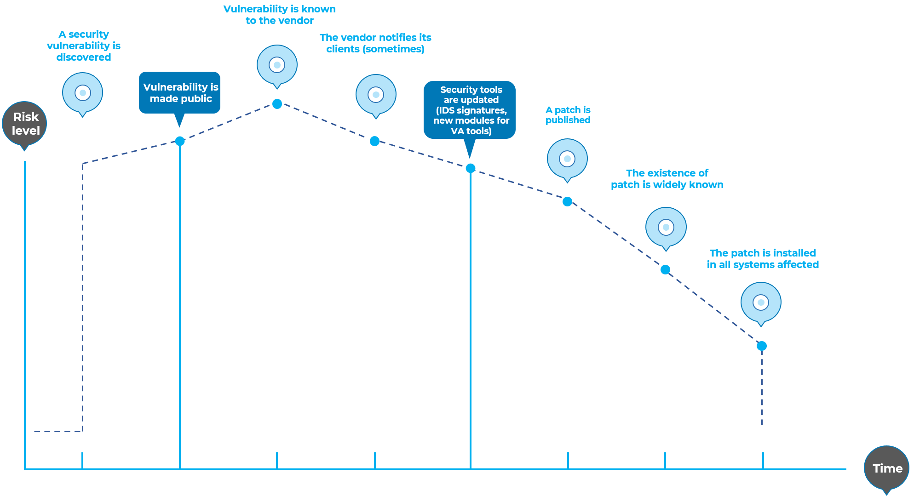
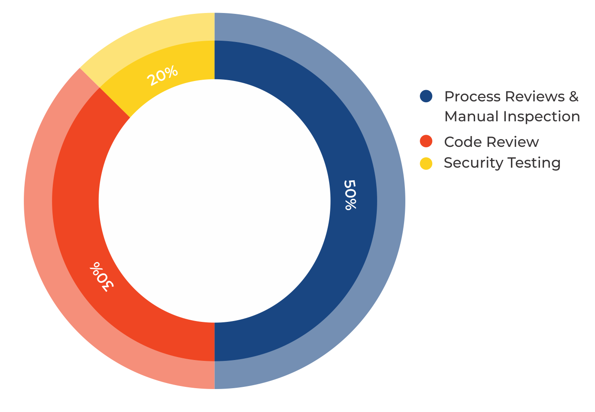
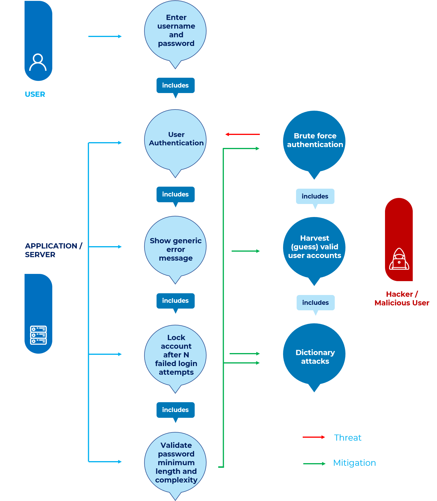

# Introduction

## Le projet de test OWASP

Le projet de test OWASP est en développement depuis de nombreuses années. L'objectif du projet est d'aider les gens à comprendre *quoi*, *pourquoi*, *quand*, *où* et *comment* tester des applications Web. Le projet a fourni un cadre de test complet, pas simplement une simple liste de contrôle ou une prescription de problèmes à résoudre. Les lecteurs peuvent utiliser ce cadre comme modèle pour créer leurs propres programmes de test ou pour qualifier les processus d'autres personnes. Le guide de test décrit en détail à la fois le cadre général de test et les techniques requises pour mettre en œuvre le cadre dans la pratique.

La rédaction du guide de test s'est avérée être une tâche difficile. C'était un défi d'obtenir un consensus et de développer un contenu permettant aux gens d'appliquer les concepts décrits dans le guide, tout en leur permettant de travailler dans leur propre environnement et culture. C'était également un défi de changer l'orientation des tests d'applications Web des tests d'intrusion vers des tests intégrés dans le cycle de vie du développement logiciel.

Cependant, le groupe est très satisfait des résultats du projet. De nombreux experts du secteur et professionnels de la sécurité, dont certains sont responsables de la sécurité logicielle dans certaines des plus grandes entreprises du monde, valident le cadre de test. Ce cadre aide les organisations à tester leurs applications Web afin de créer des logiciels fiables et sécurisés. Le cadre ne se contente pas de mettre en évidence les points faibles, bien que ce soit certainement un sous-produit de nombreux guides et listes de contrôle de l'OWASP. En tant que tel, des décisions difficiles ont dû être prises quant à la pertinence de certaines techniques et technologies de test. Le groupe comprend parfaitement que tout le monde ne sera pas d'accord avec toutes ces décisions. Cependant, l'OWASP est capable de prendre les devants et de changer la culture au fil du temps grâce à la sensibilisation et à l'éducation, basées sur le consensus et l'expérience.

Le reste de ce guide est organisé comme suit : cette introduction couvre les prérequis des tests d'applications Web et la portée des tests. Il couvre également les principes des tests réussis et des techniques de test, les meilleures pratiques pour les rapports et les analyses de rentabilisation pour les tests de sécurité. Le chapitre 3 présente le cadre de test OWASP et explique ses techniques et tâches en relation avec les différentes phases du cycle de vie du développement logiciel. Le chapitre 4 explique comment tester des vulnérabilités spécifiques (par exemple, l'injection SQL) par l'inspection du code et les tests de pénétration.

### Mesurer la sécurité : l'économie des logiciels non sécurisés

Un principe de base du génie logiciel est résumé dans une citation de [Controlling Software Projects: Management, Measurement, and Estimates](https://isbnsearch.org/isbn/9780131717114) par [Tom DeMarco](https://en.wikiquote.org/wiki/Tom_DeMarco) :

> Vous ne pouvez pas contrôler ce que vous ne pouvez pas mesurer.

Les tests de sécurité ne sont pas différents. Malheureusement, mesurer la sécurité est un processus notoirement difficile.

Un aspect qui doit être souligné est que les mesures de sécurité concernent à la fois les problèmes techniques spécifiques (par exemple, la prévalence d'une certaine vulnérabilité) et la manière dont ces problèmes affectent l'économie des logiciels. La plupart des techniciens comprendront au moins les problèmes de base, ou ils auront peut-être une compréhension plus approfondie des vulnérabilités. Malheureusement, peu sont capables de traduire ces connaissances techniques en termes monétaires et de quantifier le coût potentiel des vulnérabilités pour l'entreprise du propriétaire de l'application. Jusqu'à ce que cela se produise, les DSI ne seront pas en mesure de développer un retour précis sur l'investissement en sécurité et, par la suite, d'affecter des budgets appropriés à la sécurité logicielle.

Bien que l'estimation du coût des logiciels non sécurisés puisse sembler une tâche ardue, il y a eu beaucoup de travail dans cette direction. En 2018, le Consortium pour la qualité des logiciels informatiques [résumé](https://www.it-cisq.org/the-cost-of-poor-quality-software-in-the-us-a-2018-report/The-Cost-of-Poor-Quality-Software-in-the-US-2018-Report.pdf) :

> ...le coût des logiciels de mauvaise qualité aux États-Unis en 2018 est d'environ 2,84 billions de dollars...

Le cadre décrit dans ce document encourage les gens à mesurer la sécurité tout au long du processus de développement. Ils peuvent ensuite lier le coût des logiciels non sécurisés à l'impact qu'ils ont sur l'entreprise, et par conséquent développer des processus métier appropriés et affecter des ressources pour gérer le risque. N'oubliez pas que la mesure et le test des applications Web sont encore plus critiques que pour d'autres logiciels, car les applications Web sont exposées à des millions d'utilisateurs via Internet.

### Qu'est-ce que le test ?

De nombreux éléments doivent être testés au cours du cycle de développement d'une application Web, mais que signifie réellement tester ? Le dictionnaire définit le mot "test" comme suit :

> **test** (nom) : procédure destinée à établir la qualité, la performance ou la fiabilité de quelque chose, notamment avant sa généralisation.

Pour les besoins de ce document, le test est un processus de comparaison de l'état d'un système ou d'une application par rapport à un ensemble de critères. Dans l'industrie de la sécurité, les gens testent fréquemment par rapport à un ensemble de critères mentaux qui ne sont ni bien définis ni complets. En conséquence, de nombreux étrangers considèrent les tests de sécurité comme un art noir. L'objectif de ce document est de changer cette perception et de permettre aux personnes sans connaissances approfondies en matière de sécurité de faire une différence dans les tests.

### Pourquoi effectuer des tests ?

Ce document est conçu pour aider les organisations à comprendre ce qui comprend un programme de test et pour les aider à identifier les étapes à suivre pour créer et exploiter un programme de test d'applications Web modernes. Le guide donne une vue d'ensemble des éléments requis pour créer un programme complet de sécurité des applications Web. Ce guide peut être utilisé comme référence et comme méthodologie pour aider à déterminer l'écart entre les pratiques existantes et les meilleures pratiques de l'industrie. Ce guide permet aux organisations de se comparer à leurs homologues du secteur, de comprendre l'ampleur des ressources nécessaires pour tester et maintenir les logiciels, ou de se préparer à un audit. Ce chapitre n'entre pas dans les détails techniques de la façon de tester une application, car l'intention est de fournir un cadre organisationnel de sécurité typique. Les détails techniques sur la façon de tester une application, dans le cadre d'un test d'intrusion ou d'une revue de code, seront couverts dans les parties restantes de ce document.

### Quand tester ?

Aujourd'hui, la plupart des gens ne testent pas un logiciel tant qu'il n'a pas été créé et qu'il n'est pas dans la phase de déploiement de son cycle de vie (c'est-à-dire que le code a été créé et instancié dans une application Web fonctionnelle). Il s'agit généralement d'une pratique très inefficace et d'un coût prohibitif. L'une des meilleures méthodes pour empêcher l'apparition de bogues de sécurité dans les applications de production consiste à améliorer le cycle de vie du développement logiciel (SDLC) en incluant la sécurité dans chacune de ses phases. Un SDLC est une structure imposée au développement d'artefacts logiciels. Si un SDLC n'est pas actuellement utilisé dans votre environnement, il est temps d'en choisir un ! La figure suivante montre un modèle SDLC générique ainsi que le coût croissant (estimé) de la correction des bogues de sécurité dans un tel modèle.

\
*Figure 2-1 : Modèle SDLC générique*

Les entreprises doivent inspecter leur SDLC global pour s'assurer que la sécurité fait partie intégrante du processus de développement. Les SDLC doivent inclure des tests de sécurité pour garantir que la sécurité est correctement couverte et que les contrôles sont efficaces tout au long du processus de développement.

### Que tester ?

Il peut être utile de considérer le développement de logiciels comme une combinaison de personnes, de processus et de technologie. Si ce sont les facteurs qui "créent" le logiciel, alors il est logique que ce soient les facteurs qui doivent être testés. Aujourd'hui, la plupart des gens testent généralement la technologie ou le logiciel lui-même.

Un programme de test efficace doit avoir des composants qui testent les éléments suivants :

- **Personnes** – pour s'assurer qu'il y a une éducation et une sensibilisation adéquates ;
- **Processus** - pour s'assurer qu'il existe des politiques et des normes adéquates et que les gens savent comment suivre ces politiques ;
- **Technologie** - pour s'assurer que le processus a été efficace dans sa mise en œuvre.

À moins d'adopter une approche holistique, tester uniquement la mise en œuvre technique d'une application ne permettra pas de découvrir les vulnérabilités de gestion ou opérationnelles qui pourraient être présentes. En testant les personnes, les politiques et les processus, une organisation peut détecter les problèmes qui se manifesteraient plus tard par des défauts dans la technologie, éliminant ainsi les bogues tôt et identifiant les causes profondes des défauts. De même, tester uniquement certains des problèmes techniques qui peuvent être présents dans un système entraînera une évaluation incomplète et inexacte de la posture de sécurité.

Denis Verdon, responsable de la sécurité de l'information chez [Fidelity National Financial](https://www.fnf.com), a présenté une excellente analogie pour cette idée fausse lors de la conférence OWASP AppSec 2004 à New York :

> Si les voitures étaient construites comme des applications... les tests de sécurité supposeraient uniquement un impact frontal. Les voitures ne seraient pas testées en roulis ou testées pour la stabilité dans les manœuvres d'urgence, l'efficacité des freins, les chocs latéraux et la résistance au vol.

### Comment référencer les scénarios WSTG

Chaque scénario a un identifiant au format `WSTG-<category>-<number>`, où : 'category' est une chaîne de 4 caractères majuscules qui identifie le type de test ou de faiblesse, et 'number' est un zéro rempli valeur numérique de 01 à 99. Par exemple : 'WSTG-INFO-02' est le deuxième test de collecte d'informations.

Les identifiants peuvent changer entre les versions, il est donc préférable que d'autres documents, rapports ou outils utilisent le format : `WSTG-<version>-<category>-<number>`, où : 'version' est la balise de version sans ponctuation . Par exemple : `WSTG-v42-INFO-02` serait compris comme signifiant spécifiquement le deuxième test de collecte d'informations de la version 4.2.

Si les identifiants sont utilisés sans inclure l'élément `<version>`, ils doivent être supposés faire référence au dernier contenu du guide de test de sécurité Web. De toute évidence, à mesure que le guide grandit et change, cela devient problématique, c'est pourquoi les rédacteurs ou les développeurs doivent inclure l'élément de version.

#### Mise en relation

La liaison aux scénarios du guide de test de sécurité Web doit être effectuée à l'aide de liens versionnés non "stables" ou "derniers" qui changeront certainement avec le temps. Cependant, l'intention de l'équipe du projet est que les liens versionnés ne changent pas. Par exemple : `https://owasp.org/www-project-web-security-testing-guide/v42/4-Web_Application_Security_Testing/01-Information_Gathering/02-Fingerprint_Web_Server`. Remarque : l'élément `v42` fait référence à la version 4.2.

### Commentaires et commentaires

Comme pour tous les projets OWASP, nous apprécions les commentaires et les réactions. Nous aimons particulièrement savoir que notre travail est utilisé et qu'il est efficace et précis.

## Principes de test

Il existe certaines idées fausses courantes lors du développement d'une méthodologie de test pour trouver des bogues de sécurité dans les logiciels. Ce chapitre couvre certains des principes de base que les professionnels doivent prendre en compte lors de la réalisation de tests de sécurité sur des logiciels.

### Il n'y a pas de solution miracle

Bien qu'il soit tentant de penser qu'un scanner de sécurité ou un pare-feu d'application fournira de nombreuses défenses contre les attaques ou identifiera une multitude de problèmes, en réalité il n'y a pas de solution miracle au problème des logiciels non sécurisés. Les logiciels d'évaluation de la sécurité des applications, bien qu'utiles comme première passe pour trouver des fruits à portée de main, sont généralement immatures et inefficaces pour une évaluation approfondie ou pour fournir une couverture de test adéquate. Rappelez-vous que la sécurité est un processus et non un produit.

### Pensez stratégiquement, pas tactiquement

Les professionnels de la sécurité en sont venus à réaliser l'erreur du modèle patch-and-penetrate qui était omniprésent dans la sécurité de l'information dans les années 1990. Le modèle patch-and-penetrate implique la correction d'un bogue signalé, mais sans enquête appropriée sur la cause première. Ce modèle est généralement associé à la fenêtre de vulnérabilité, également appelée fenêtre d'exposition, illustrée dans la figure ci-dessous. L'évolution des vulnérabilités des logiciels courants utilisés dans le monde a montré l'inefficacité de ce modèle. Pour plus d'informations sur les fenêtres d'exposition, voir [Schneier on Security](https://www.schneier.com/crypto-gram/archives/2000/0915.html).

Des études de vulnérabilité telles que [Symantec's Internet Security Threat Report](https://www.symantec.com/security-center/threat-report) ont montré qu'avec le temps de réaction des attaquants dans le monde entier, la fenêtre typique de vulnérabilité ne fournit pas suffisamment temps d'installation des correctifs, car le temps entre la découverte d'une vulnérabilité et le développement et la publication d'une attaque automatisée contre celle-ci diminue chaque année.

Il existe plusieurs hypothèses incorrectes dans le modèle patch-and-penetrate. De nombreux utilisateurs pensent que les correctifs interfèrent avec les opérations normales ou peuvent casser les applications existantes. Il est également incorrect de supposer que tous les utilisateurs sont au courant des correctifs récemment publiés. Par conséquent, tous les utilisateurs d'un produit n'appliqueront pas de correctifs, soit parce qu'ils pensent que les correctifs peuvent interférer avec le fonctionnement du logiciel, soit parce qu'ils ne connaissent pas l'existence du correctif.

\
*Figure 2-2 : Fenêtre de vulnérabilité*

Il est essentiel d'intégrer la sécurité dans le cycle de vie du développement logiciel (SDLC) pour éviter que des problèmes de sécurité ne se reproduisent au sein d'une application. Les développeurs peuvent intégrer la sécurité dans le SDLC en développant des normes, des politiques et des directives qui s'intègrent et fonctionnent dans la méthodologie de développement. La modélisation des menaces et d'autres techniques doivent être utilisées pour aider à affecter les ressources appropriées aux parties d'un système qui sont les plus à risque.

### Le SDLC est roi

Le SDLC est un processus bien connu des développeurs. En intégrant la sécurité dans chaque phase du SDLC, il permet une approche holistique de la sécurité des applications qui tire parti des procédures déjà en place au sein de l'organisation. Sachez que si les noms des différentes phases peuvent changer en fonction du modèle SDLC utilisé par une organisation, chaque phase conceptuelle de l'archétype SDLC sera utilisée pour développer l'application (c'est-à-dire définir, concevoir, développer, déployer, maintenir). Chaque phase a des considérations de sécurité qui devraient faire partie du processus existant, pour assurer un programme de sécurité rentable et complet.

Il existe plusieurs cadres SDLC sécurisés qui fournissent des conseils à la fois descriptifs et prescriptifs. Le fait qu'une personne prenne des conseils descriptifs ou prescriptifs dépend de la maturité du processus SDLC. Essentiellement, les conseils prescriptifs montrent comment le SDLC sécurisé doit fonctionner, et les conseils descriptifs montrent comment il est utilisé dans le monde réel. Les deux ont leur place. Par exemple, si vous ne savez pas par où commencer, un cadre normatif peut fournir un menu de contrôles de sécurité potentiels pouvant être appliqués dans le SDLC. Des conseils descriptifs peuvent ensuite aider à orienter le processus de décision en présentant ce qui a bien fonctionné pour d'autres organisations. Les SDLC sécurisés descriptifs incluent BSIMM ; et les SDLC sécurisés prescriptifs incluent [Open Software Assurance Maturity Model](https://www.opensamm.org/) (OpenSAMM) de l'OWASP et [ISO/IEC 27034](https://www.iso27001security.com/html/27034.html) Parties 1 à 7, toutes publiées (sauf la partie 4).

### Testez tôt et testez souvent

Lorsqu'un bogue est détecté tôt dans le SDLC, il peut être résolu plus rapidement et à moindre coût. Un bogue de sécurité n'est pas différent d'un bogue fonctionnel ou basé sur les performances à cet égard. Une étape clé pour rendre cela possible consiste à former les équipes de développement et d'assurance qualité aux problèmes de sécurité courants et aux moyens de les détecter et de les prévenir. Bien que de nouvelles bibliothèques, outils ou langages puissent aider à concevoir des programmes avec moins de bogues de sécurité, de nouvelles menaces surgissent constamment et les développeurs doivent être conscients des menaces qui affectent les logiciels qu'ils développent. La formation aux tests de sécurité aide également les développeurs à acquérir l'état d'esprit approprié pour tester une application du point de vue d'un attaquant. Cela permet à chaque organisation de considérer les questions de sécurité comme faisant partie de ses responsabilités existantes.

### Automatisation des tests

Dans les méthodologies de développement modernes telles que (mais sans s'y limiter) : agile, devops/devsecops ou développement rapide d'applications (RAD), il convient de prendre en compte l'intégration de tests de sécurité dans les workflows d'intégration/déploiement continu (CI/CD) afin de tenir à jour les informations/analyses de sécurité de base et identifier les faiblesses de type « fruits à portée de main ». Cela peut être fait en tirant parti des tests de sécurité des applications dynamiques (DAST), des tests de sécurité des applications statiques (SAST) et de l'analyse de la composition logicielle (SCA) ou des outils de suivi des dépendances pendant les workflows de publication automatisés standard ou sur une base régulière.

### Comprendre l'étendue de la sécurité

Il est important de savoir combien de sécurité un projet donné nécessitera. Les actifs à protéger doivent recevoir une classification indiquant comment ils doivent être traités (par exemple, confidentiel, secret, top secret). Des discussions doivent avoir lieu avec un conseiller juridique pour s'assurer que toutes les exigences de sécurité spécifiques seront respectées. Aux États-Unis, les exigences peuvent provenir de réglementations fédérales, telles que la [Loi Gramm-Leach-Bliley](https://www.ftc.gov/business-guidance/privacy-security/gramm-leach-bliley-act), ou des lois des États, telles que la [California SB-1386](https://leginfo.legislature.ca.gov/faces/billTextClient.xhtml?bill_id=200120020SB1386). Pour les organisations basées dans les pays de l'UE, la réglementation spécifique au pays et les directives de l'UE peuvent s'appliquer. Par exemple, la [directive 96/46/CE4](https://ec.europa.eu/info/policies/justice-and-fundamental-rights_en) et le [règlement (UE) 2016/679 (Règlement Général sur la Protection des Données)] (https://gdpr-info.eu/) rendent obligatoire le traitement des données personnelles dans les applications avec la diligence requise, quelle que soit l'application. Les organisations non membres de l'UE, dans certaines circonstances, peuvent également être tenues de se conformer au règlement général sur la protection des données.

### Développer le bon état d'esprit

Pour tester avec succès une application à la recherche de vulnérabilités de sécurité, il faut sortir des sentiers battus. Les cas d'utilisation normaux testeront le comportement normal de l'application lorsqu'un utilisateur l'utilise de la manière attendue. Un bon test de sécurité nécessite d'aller au-delà de ce qui est attendu et de penser comme un attaquant qui essaie de casser l'application. La pensée créative peut aider à déterminer quelles données inattendues peuvent entraîner l'échec d'une application de manière non sécurisée. Cela peut également aider à trouver toutes les hypothèses faites par les développeurs Web qui ne sont pas toujours vraies, et comment ces hypothèses peuvent être renversées. L'une des raisons pour lesquelles les outils automatisés font un mauvais travail de test des vulnérabilités est que les outils automatisés ne pensent pas de manière créative. La réflexion créative doit être menée au cas par cas, car la plupart des applications Web sont développées de manière unique (même en utilisant des cadres communs).

### Comprendre le sujet

L'une des premières initiatives majeures de tout bon programme de sécurité devrait être d'exiger une documentation précise de l'application. L'architecture, les diagrammes de flux de données, les cas d'utilisation, etc. doivent être enregistrés dans des documents formels et mis à disposition pour examen. Les spécifications techniques et les documents d'application doivent inclure des informations qui répertorient non seulement les cas d'utilisation souhaités, mais également tous les cas d'utilisation spécifiquement interdits. Enfin, il est bon d'avoir au moins une infrastructure de sécurité de base qui permet la surveillance et la tendance des attaques contre les applications et le réseau d'une organisation (par exemple, les systèmes de détection d'intrusion).

### Utilisez les bons outils

Bien que nous ayons déjà déclaré qu'il n'y a pas d'outil miracle, les outils jouent un rôle essentiel dans le programme de sécurité global. Il existe une gamme d'outils Open Source et commerciaux qui peuvent automatiser de nombreuses tâches de sécurité de routine. Ces outils peuvent simplifier et accélérer le processus de sécurité en assistant le personnel de sécurité dans leurs tâches. Cependant, il est important de comprendre exactement ce que ces outils peuvent et ne peuvent pas faire afin qu'ils ne soient pas survendus ou utilisés de manière incorrecte.

### Le diable est dans les détails

Il est essentiel de ne pas effectuer un examen de sécurité superficiel d'une application et de la considérer comme complète. Cela instillera un faux sentiment de confiance qui peut être aussi dangereux que de ne pas avoir effectué d'examen de sécurité en premier lieu. Il est essentiel d'examiner attentivement les résultats et d'éliminer tout faux positif qui pourrait rester dans le rapport. Le signalement d'un résultat de sécurité incorrect peut souvent saper le message valide du reste d'un rapport de sécurité. Il convient de veiller à vérifier que chaque section possible de la logique d'application a été testée et que chaque scénario de cas d'utilisation a été exploré pour détecter d'éventuelles vulnérabilités.

### Utiliser le code source lorsqu'il est disponible

Bien que les résultats des tests d'intrusion en boîte noire puissent être impressionnants et utiles pour démontrer comment les vulnérabilités sont exposées dans un environnement de production, ils ne constituent pas le moyen le plus efficace ou le plus efficient de sécuriser une application. Il est difficile pour les tests dynamiques de tester l'intégralité de la base de code, en particulier s'il existe de nombreuses instructions conditionnelles imbriquées. Si le code source de l'application est disponible, il doit être remis au personnel de sécurité pour l'aider lors de son examen. Il est possible de découvrir des vulnérabilités au sein de la source d'application qui seraient manquées lors d'un engagement de boîte noire.

### Développer des métriques

Une partie importante d'un bon programme de sécurité est la capacité de déterminer si les choses s'améliorent. Il est important de suivre les résultats des engagements de test et de développer des métriques qui révéleront les tendances de sécurité des applications au sein de l'organisation.

De bons indicateurs montreront :

- Si plus d'éducation et de formation sont nécessaires ;
- S'il existe un mécanisme de sécurité particulier qui n'est pas clairement compris par l'équipe de développement ;
- Si le nombre total de problèmes liés à la sécurité détectés diminue.

Des mesures cohérentes pouvant être générées de manière automatisée à partir du code source disponible aideront également l'organisation à évaluer l'efficacité des mécanismes introduits pour réduire les bogues de sécurité dans le développement de logiciels. Les métriques ne sont pas faciles à développer, donc l'utilisation d'une norme telle que celle fournie par l'[IEEE](https://ieeexplore.ieee.org/document/237006) est un bon point de départ.

### Documenter les résultats du test

Pour conclure le processus de test, il est important de produire un enregistrement formel des actions de test qui ont été prises, par qui, quand elles ont été effectuées et des détails sur les résultats du test. Il est sage de convenir d'un format acceptable pour le rapport qui est utile à toutes les parties concernées, qui peuvent inclure les développeurs, la gestion de projet, les propriétaires d'entreprise, le service informatique, l'audit et la conformité.

Le rapport doit clairement indiquer au propriétaire de l'entreprise où existent des risques importants, et le faire d'une manière suffisante pour obtenir son soutien pour les mesures d'atténuation ultérieures. Le rapport doit également être clair pour le développeur en identifiant la fonction exacte qui est affectée par la vulnérabilité et les recommandations associées pour résoudre les problèmes dans un langage que le développeur comprendra. Le rapport doit également permettre à un autre testeur de sécurité de reproduire les résultats. La rédaction du rapport ne doit pas être trop lourde pour le testeur de sécurité lui-même. Les testeurs de sécurité ne sont généralement pas réputés pour leurs compétences en rédaction créative, et s'entendre sur un rapport complexe peut conduire à des cas où les résultats des tests ne sont pas correctement documentés. L'utilisation d'un modèle de rapport de test de sécurité peut faire gagner du temps et garantir que les résultats sont documentés avec précision et cohérence, et dans un format adapté au public.

## Techniques de test expliquées

Cette section présente un aperçu de haut niveau des différentes techniques de test qui peuvent être utilisées lors de la création d'un programme de test. Il ne présente pas de méthodologies spécifiques pour ces techniques, car ces informations sont couvertes au chapitre 3. Cette section est incluse pour fournir un contexte pour le cadre présenté dans le chapitre suivant et pour mettre en évidence les avantages ou les inconvénients de certaines des techniques qui doivent être prises en compte. . En particulier, nous aborderons :

- Inspections et révisions manuelles
- Modélisation des menaces
- Révision des codes
- Tests de pénétration

## Inspections et révisions manuelles

### Aperçu

Les inspections manuelles sont des examens humains qui testent généralement les implications de sécurité des personnes, des politiques et des processus. Les inspections manuelles peuvent également inclure l'inspection des décisions technologiques telles que les conceptions architecturales. Ils sont généralement menés en analysant la documentation ou en réalisant des entretiens avec les concepteurs ou les propriétaires du système.

Bien que le concept d'inspections manuelles et d'examens humains soit simple, ils peuvent être parmi les techniques les plus puissantes et les plus efficaces disponibles. En demandant à quelqu'un comment quelque chose fonctionne et pourquoi il a été implémenté d'une manière spécifique, le testeur peut rapidement déterminer si des problèmes de sécurité sont susceptibles d'être évidents. Les inspections et examens manuels sont l'un des rares moyens de tester le processus du cycle de vie du développement logiciel lui-même et de s'assurer qu'une politique ou un ensemble de compétences adéquat est en place.

Comme pour beaucoup de choses dans la vie, lors de la réalisation d'inspections et d'examens manuels, il est recommandé d'adopter un modèle de confiance mais de vérification. Tout ce que le testeur est montré ou dit ne sera pas exact. Les examens manuels sont particulièrement utiles pour tester si les personnes comprennent le processus de sécurité, ont été sensibilisées à la politique et possèdent les compétences appropriées pour concevoir ou mettre en œuvre des applications sécurisées.

Les autres activités, y compris l'examen manuel de la documentation, les politiques de codage sécurisé, les exigences de sécurité et les conceptions architecturales, doivent toutes être réalisées à l'aide d'inspections manuelles.

### Avantages

- Ne nécessite aucune technologie de support
- Peut être appliqué à une variété de situations
- Flexible
- Favorise le travail d'équipe
- Au début du SDLC

### Inconvénients

- Peut prendre du temps
- Matériel de support pas toujours disponible
- Nécessite une réflexion et des compétences humaines importantes pour être efficace

## Modélisation des menaces

### Aperçu

La modélisation des menaces est devenue une technique populaire pour aider les concepteurs de systèmes à réfléchir aux menaces de sécurité auxquelles leurs systèmes et applications pourraient être confrontés. Par conséquent, la modélisation des menaces peut être considérée comme une évaluation des risques pour les applications. Il permet au concepteur de développer des stratégies d'atténuation des vulnérabilités potentielles et les aide à concentrer leurs ressources et leur attention inévitablement limitées sur les parties du système qui en ont le plus besoin. Il est recommandé que toutes les applications aient un modèle de menace développé et documenté. Les modèles de menace doivent être créés le plus tôt possible dans le SDLC et doivent être revus au fur et à mesure que l'application évolue et que le développement progresse.

Pour développer un modèle de menace, nous vous recommandons d'adopter une approche simple qui suit la norme [NIST 800-30](https://csrc.nist.gov/publications/detail/sp/800-30/rev-1/final) pour l'évaluation des risques. Cette approche implique :

- Décomposition de l'application - utilisez un processus d'inspection manuelle pour comprendre le fonctionnement de l'application, ses actifs, ses fonctionnalités et sa connectivité.
- Définir et classer les actifs - classer les actifs en actifs corporels et incorporels et les classer en fonction de leur importance commerciale.
- Explorer les vulnérabilités potentielles - qu'elles soient techniques, opérationnelles ou managériales.
- Exploration des menaces potentielles - développez une vue réaliste des vecteurs d'attaque potentiels du point de vue d'un attaquant en utilisant des scénarios de menace ou des arbres d'attaque.
- Créer des stratégies d'atténuation - développer des contrôles d'atténuation pour chacune des menaces jugées réalistes.

Le résultat d'un modèle de menace lui-même peut varier, mais il s'agit généralement d'un ensemble de listes et de diagrammes. Divers projets Open Source et produits commerciaux prennent en charge les méthodologies de modélisation des menaces d'application qui peuvent être utilisées comme référence pour tester les applications afin de détecter d'éventuelles failles de sécurité dans la conception de l'application. Il n'y a pas de bonne ou de mauvaise façon de développer des modèles de menace et d'effectuer des évaluations des risques liés aux informations sur les applications.

### Avantages

- Vue pratique de l'attaquant du système
- Flexible
- Au début du SDLC

### Inconvénients

- De bons modèles de menace ne signifient pas automatiquement un bon logiciel

## Examen du code source

### Aperçu

La révision du code source est le processus de vérification manuelle du code source d'une application Web pour les problèmes de sécurité. De nombreuses vulnérabilités de sécurité graves ne peuvent être détectées par aucune autre forme d'analyse ou de test. Comme le dit le dicton populaire "si vous voulez savoir ce qui se passe vraiment, allez directement à la source". Presque tous les experts en sécurité s'accordent à dire qu'il n'y a pas de substitut à l'examen du code. Toutes les informations permettant d'identifier les problèmes de sécurité se trouvent dans le code, quelque part. Contrairement aux tests de logiciels fermés tels que les systèmes d'exploitation, lors du test d'applications Web (en particulier si elles ont été développées en interne), le code source doit être mis à disposition à des fins de test.

De nombreux problèmes de sécurité non intentionnels mais importants sont extrêmement difficiles à découvrir avec d'autres formes d'analyse ou de test, comme les tests d'intrusion. Cela fait de l'analyse du code source la technique de choix pour les tests techniques. Avec le code source, un testeur peut déterminer avec précision ce qui se passe (ou est censé se passer) et supprimer le travail de conjecture des tests de boîte noire.

Les exemples de problèmes particulièrement susceptibles d'être détectés par le biais d'examens de code source incluent les problèmes de concurrence, la logique métier défectueuse, les problèmes de contrôle d'accès et les faiblesses cryptographiques, ainsi que les portes dérobées, les chevaux de Troie, les œufs de Pâques, les bombes à retardement, les bombes logiques et d'autres formes de code malicieux. Ces problèmes se manifestent souvent comme les vulnérabilités les plus nuisibles dans les applications Web. L'analyse du code source peut également être extrêmement efficace pour trouver des problèmes d'implémentation tels que des endroits où la validation des entrées n'a pas été effectuée ou où des procédures de contrôle d'ouverture en cas de panne peuvent être présentes. Les procédures opérationnelles doivent également être revues, car le code source déployé peut ne pas être le même que celui analysé ici. [Discours du Prix Turing de Ken Thompson](https://ia600903.us.archive.org/11/items/pdfy-Qf4sZZSmHKQlHFfw/p761-thompson.pdf) décrit une manifestation possible de ce problème.

### Avantages

- Complétude et efficacité
- Précision
- Rapide (pour les examinateurs compétents)

### Inconvénients

- Nécessite des développeurs hautement qualifiés et conscients de la sécurité
- Peut manquer des problèmes dans les bibliothèques compilées
- Impossible de détecter facilement les erreurs d'exécution
- Le code source réellement déployé peut différer de celui en cours d'analyse

Pour en savoir plus sur la révision du code, consultez le [projet de révision du code OWASP](https://wiki.owasp.org/index.php/Category:OWASP_Code_Review_Project).

## Tests de pénétration

### Aperçu

Les tests d'intrusion sont une technique couramment utilisée pour tester la sécurité du réseau depuis des décennies. Il est également connu sous le nom de test de boîte noire ou de piratage éthique. Les tests d'intrusion sont essentiellement «l'art» de tester un système ou une application à distance pour trouver des vulnérabilités de sécurité, sans connaître le fonctionnement interne de la cible elle-même. En règle générale, l'équipe de test d'intrusion est en mesure d'accéder à une application comme s'il s'agissait d'utilisateurs. Le testeur agit comme un attaquant et tente de trouver et d'exploiter les vulnérabilités. Dans de nombreux cas, le testeur recevra un ou plusieurs comptes valides sur le système.

Alors que les tests d'intrusion se sont avérés efficaces dans la sécurité du réseau, la technique ne se traduit pas naturellement dans les applications. Lorsque des tests d'intrusion sont effectués sur des réseaux et des systèmes d'exploitation, la majorité du travail consiste à trouver, puis à exploiter, des vulnérabilités connues dans des technologies spécifiques. Comme les applications Web sont presque exclusivement sur mesure, les tests d'intrusion dans le domaine des applications Web s'apparentent davantage à de la recherche pure. Certains outils de test d'intrusion automatisés ont été développés, mais compte tenu de la nature sur mesure des applications Web, leur efficacité à elle seule peut être médiocre.

De nombreuses personnes utilisent les tests de pénétration des applications Web comme principale technique de test de sécurité. Bien qu'elle ait certainement sa place dans un programme de test, nous ne pensons pas qu'elle doive être considérée comme la principale ou la seule technique de test. Comme Gary McGraw l'a écrit dans [Software Penetration Testing](https://www.garymcgraw.com/wp-content/uploads/2015/11/bsi6-pentest.pdf), "En pratique, un test d'intrusion ne peut identifier qu'un petit échantillon représentatif de tous les risques de sécurité possibles dans un système." Cependant, des tests d'intrusion ciblés (c'est-à-dire des tests qui tentent d'exploiter les vulnérabilités connues détectées dans les revues précédentes) peuvent être utiles pour détecter si certaines vulnérabilités spécifiques sont réellement corrigées dans le code source déployé.

### Avantages

- Peut être rapide (et donc pas cher)
- Nécessite un ensemble de compétences relativement inférieur à la révision du code source
- Teste le code qui est réellement exposé

### Inconvénients

- Trop tard dans le SDLC
- Test d'impact frontal uniquement

## La nécessité d'une approche équilibrée

Avec autant de techniques et d'approches pour tester la sécurité des applications Web, il peut être difficile de comprendre quelles techniques utiliser ou quand les utiliser. L'expérience montre qu'il n'y a pas de bonne ou de mauvaise réponse à la question de savoir exactement quelles techniques doivent être utilisées pour construire un cadre de test. En fait, toutes les techniques doivent être utilisées pour tester tous les domaines qui doivent être testés.

Bien qu'il soit clair qu'il n'existe pas de technique unique pouvant être utilisée pour couvrir efficacement tous les tests de sécurité et s'assurer que tous les problèmes ont été résolus, de nombreuses entreprises n'adoptent qu'une seule approche. La seule approche utilisée a toujours été les tests d'intrusion. Les tests d'intrusion, bien qu'utiles, ne peuvent pas résoudre efficacement bon nombre des problèmes qui doivent être testés. C'est simplement "trop ​​peu trop tard" dans le SDLC.

L'approche correcte est une approche équilibrée qui comprend plusieurs techniques, des examens manuels aux tests techniques, en passant par les tests intégrés CI/CD. Une approche équilibrée devrait couvrir les tests dans toutes les phases du SDLC. Cette approche s'appuie sur les techniques disponibles les plus appropriées, en fonction de la phase SDLC actuelle.

Bien sûr, il y a des moments et des circonstances où une seule technique est possible. Par exemple, considérons un test d'une application Web qui a déjà été créée, mais où la partie testeuse n'a pas accès au code source. Dans ce cas, les tests d'intrusion sont clairement mieux que pas de test du tout. Cependant, les parties testeuses doivent être encouragées à remettre en question les hypothèses, telles que le fait de ne pas avoir accès au code source, et à explorer la possibilité de tests plus complets.

Une approche équilibrée varie en fonction de nombreux facteurs, tels que la maturité du processus de test et la culture d'entreprise. Il est recommandé qu'un cadre de test équilibré ressemble à quelque chose comme les représentations illustrées dans la figure 3 et la figure 4. La figure suivante montre une représentation proportionnelle typique superposée sur le SLDC. Conformément à la recherche et à l'expérience, il est essentiel que les entreprises mettent davantage l'accent sur les premières étapes du développement.

\
*Figure 2-3 : Proportion d'effort de test dans SDLC*

La figure suivante montre une représentation proportionnelle typique superposée aux techniques de test.

\
*Figure 2-4 : Proportion de l'effort de test selon la technique de test*

### Une note sur les scanners d'applications Web

De nombreuses organisations ont commencé à utiliser des scanners d'applications Web automatisés. Bien qu'ils aient sans aucun doute une place dans un programme de test, certaines questions fondamentales doivent être soulignées sur les raisons pour lesquelles on pense que l'automatisation des tests de boîte noire n'est pas (et ne sera jamais) complètement efficace. Cependant, la mise en évidence de ces problèmes ne doit pas décourager l'utilisation d'analyseurs d'applications Web. L'objectif est plutôt de s'assurer que les limites sont comprises et que les cadres de test sont planifiés de manière appropriée.

Il est utile de comprendre l'efficacité et les limites des outils automatisés de détection des vulnérabilités. À cette fin, le [projet OWASP Benchmark](https://owasp.org/www-project-benchmark/) est une suite de tests conçue pour évaluer la vitesse, la couverture et la précision des outils et services de détection automatisée des vulnérabilités logicielles. L'analyse comparative peut aider à tester les capacités de ces outils automatisés et à rendre leur utilité explicite.

Les exemples suivants montrent pourquoi les tests automatisés de type boîte noire peuvent ne pas être efficaces.

### Exemple 1 : Paramètres magiques

Imaginez une application Web simple qui accepte une paire nom-valeur de "magique", puis la valeur. Pour simplifier, la requête GET peut être : `http://www.host/application?magic=value`

Pour simplifier davantage l'exemple, les valeurs dans ce cas ne peuvent être que des caractères ASCII a - z (majuscules ou minuscules) et des entiers 0 - 9.

Les concepteurs de cette application ont créé une porte dérobée administrative lors des tests, mais l'ont masquée pour empêcher l'observateur occasionnel de la découvrir. En soumettant la valeur sf8g7sfjdsurtsdieerwqredsgnfg8d (30 caractères), l'utilisateur sera alors connecté et présentera un écran d'administration avec un contrôle total de l'application. La requête HTTP est maintenant : `http://www.host/application?magic=sf8g7sfjdsurtsdieerwqredsgnfg8d`

Étant donné que tous les autres paramètres étaient de simples champs à deux et trois caractères, il n'est pas possible de commencer à deviner des combinaisons à environ 28 caractères. Un scanner d'application Web devra forcer brutalement (ou deviner) l'intégralité de l'espace clé de 30 caractères. Cela représente jusqu'à 30\^28 permutations, ou des billions de requêtes HTTP. C'est un électron dans une botte de foin numérique.

Le code de cet exemple de vérification des paramètres magiques peut ressembler à ceci :

```java
public void doPost( HttpServletRequest request, HttpServletResponse response) {
  String magic = "sf8g7sfjdsurtsdieerwqredsgnfg8d";
  boolean admin = magic.equals( request.getParameter("magic"));
  if (admin) doAdmin( request, response);
  else … // traitement normal
}
```

En regardant dans le code, la vulnérabilité saute pratiquement de la page comme un problème potentiel.

### Exemple 2 : mauvaise cryptographie

La cryptographie est largement utilisée dans les applications Web. Imaginez qu'un développeur décide d'écrire un algorithme de cryptographie simple pour connecter automatiquement un utilisateur du site A au site B. Dans sa sagesse, le développeur décide que si un utilisateur est connecté au site A, il générera une clé à l'aide d'une fonction de hachage MD5 qui comprend : `Hash { username : date }`

Lorsqu'un utilisateur est transmis au site B, il enverra la clé de la chaîne de requête au site B dans une redirection HTTP. Le site B calcule indépendamment le hachage et le compare au hachage transmis sur la demande. S'ils correspondent, le site B connecte l'utilisateur en tant qu'utilisateur qu'il prétend être.

Au fur et à mesure que le schéma est expliqué, les insuffisances peuvent être résolues. Quiconque comprend le schéma (ou est informé de son fonctionnement, ou télécharge les informations de Bugtraq) peut se connecter en tant qu'utilisateur quelconque. Une inspection manuelle, telle qu'un examen ou une inspection du code, aurait permis de découvrir rapidement ce problème de sécurité. Un scanner d'applications Web en boîte noire n'aurait pas découvert la vulnérabilité. Il aurait vu un hachage de 128 bits qui changeait avec chaque utilisateur et, de par la nature des fonctions de hachage, ne changeait pas de manière prévisible.

### Une note sur les outils de révision du code source statique

De nombreuses organisations ont commencé à utiliser des scanners de code source statiques. Bien qu'ils aient sans aucun doute une place dans un programme de test complet, il est nécessaire de souligner certaines questions fondamentales sur les raisons pour lesquelles cette approche n'est pas efficace lorsqu'elle est utilisée seule. L'analyse statique du code source ne peut à elle seule identifier les problèmes dus à des défauts de conception, car elle ne peut pas comprendre le contexte dans lequel le code est construit. Les outils d'analyse du code source sont utiles pour déterminer les problèmes de sécurité dus aux erreurs de codage, mais un effort manuel important est nécessaire pour valider les résultats.

## Dérivation des exigences de test de sécurité

Pour avoir un programme de test réussi, il faut savoir quels sont les objectifs du test. Ces objectifs sont précisés par les exigences de sécurité. Cette section explique en détail comment documenter les exigences pour les tests de sécurité en les dérivant des normes et réglementations applicables, des exigences d'application positives (spécifiant ce que l'application est censée faire) et des exigences d'application négatives (spécifiant ce que l'application ne doit pas faire) . Il explique également comment les exigences de sécurité pilotent efficacement les tests de sécurité pendant le SDLC et comment les données des tests de sécurité peuvent être utilisées pour gérer efficacement les risques de sécurité logicielle.

### Objectifs de test

L'un des objectifs des tests de sécurité est de valider que les contrôles de sécurité fonctionnent comme prévu. Ceci est documenté via des "exigences de sécurité" qui décrivent la fonctionnalité du contrôle de sécurité. À un niveau élevé, cela signifie prouver la confidentialité, l'intégrité et la disponibilité des données ainsi que du service. L'autre objectif est de valider que les contrôles de sécurité sont mis en œuvre avec peu ou pas de vulnérabilités. Il s'agit de vulnérabilités courantes, telles que le [OWASP Top Ten](https://owasp.org/www-project-top-ten/), ainsi que de vulnérabilités qui ont été précédemment identifiées lors d'évaluations de sécurité lors du SDLC, telles que modélisation des menaces, analyse du code source et test de pénétration.

### Documentation sur les exigences de sécurité

La première étape de la documentation des exigences de sécurité consiste à comprendre les "exigences métier". Un document d'exigence métier peut fournir des informations initiales de haut niveau sur les fonctionnalités attendues de l'application. Par exemple, l'objectif principal d'une application peut être de fournir des services financiers aux clients ou de permettre l'achat de biens à partir d'un catalogue en ligne. Une section de sécurité des exigences commerciales doit souligner la nécessité de protéger les données des clients ainsi que de se conformer à la documentation de sécurité applicable, telle que les réglementations, les normes et les politiques.

Une liste de contrôle générale des réglementations, normes et politiques applicables constitue une bonne analyse préliminaire de la conformité de la sécurité pour les applications Web. Par exemple, les réglementations de conformité peuvent être identifiées en vérifiant les informations sur le secteur d'activité et le pays ou l'état où l'application fonctionnera. Certaines de ces directives et réglementations de conformité peuvent se traduire par des exigences techniques spécifiques pour les contrôles de sécurité. Par exemple, dans le cas des applications financières, la conformité avec le Federal Financial Institutions Examination Council (FFIEC) [Cybersecurity Assessment Tool & Documentation](https://www.ffiec.gov/cyberassessmenttool.htm) exige que les institutions financières mettent en œuvre des applications qui Atténuez les risques d'authentification faible avec des contrôles de sécurité multicouches et une authentification multifacteur.

Les normes applicables de l'industrie en matière de sécurité doivent également être saisies dans la liste de vérification des exigences générales en matière de sécurité. Par exemple, dans le cas d'applications qui traitent les données des cartes de crédit des clients, la conformité à la norme de sécurité des données [PCI Security Standards Council](https://www.pcisecuritystandards.org/pci_security/) interdit le stockage des codes PIN et CVV2 et exige que le commerçant protège les données de la bande magnétique lors du stockage et de la transmission par cryptage et affichées par masquage. Ces exigences de sécurité PCI DSS pourraient être validées via l'analyse du code source.

Une autre section de la liste de contrôle doit appliquer les exigences générales de conformité aux normes et politiques de sécurité de l'information de l'organisation. Du point de vue des exigences fonctionnelles, les exigences relatives au contrôle de sécurité doivent correspondre à une section spécifique des normes de sécurité de l'information. Un exemple d'une telle exigence peut être : "une complexité de mot de passe de dix caractères alphanumériques doit être appliquée par les contrôles d'authentification utilisés par l'application". Lorsque les exigences de sécurité correspondent aux règles de conformité, un test de sécurité peut valider l'exposition aux risques de conformité. Si une violation des normes et des politiques de sécurité de l'information est constatée, cela entraînera un risque qui peut être documenté et que l'entreprise doit gérer ou traiter. Étant donné que ces exigences de conformité en matière de sécurité sont exécutoires, elles doivent être bien documentées et validées par des tests de sécurité.

### Validation des exigences de sécurité

Du point de vue de la fonctionnalité, la validation des exigences de sécurité est l'objectif principal des tests de sécurité. Du point de vue de la gestion des risques, la validation des exigences de sécurité est l'objectif des évaluations de la sécurité de l'information. À un niveau élevé, l'objectif principal des évaluations de la sécurité des informations est l'identification des lacunes dans les contrôles de sécurité, telles que l'absence de contrôles de base d'authentification, d'autorisation ou de chiffrement. Examiné plus en détail, l'objectif de l'évaluation de la sécurité est l'analyse des risques, telle que l'identification des faiblesses potentielles des contrôles de sécurité qui garantissent la confidentialité, l'intégrité et la disponibilité des données. Par exemple, lorsque l'application traite des informations personnelles identifiables (PII) et des données sensibles, l'exigence de sécurité à valider est la conformité à la politique de sécurité des informations de l'entreprise exigeant le chiffrement de ces données en transit et en stockage. En supposant que le chiffrement est utilisé pour protéger les données, les algorithmes de chiffrement et les longueurs de clé doivent être conformes aux normes de chiffrement de l'organisation. Celles-ci peuvent nécessiter que seuls certains algorithmes et longueurs de clé soient utilisés. Par exemple, une exigence de sécurité qui peut être testée en matière de sécurité consiste à vérifier que seuls les chiffrements autorisés sont utilisés (par exemple, SHA-256, RSA, AES) avec des longueurs de clé minimales autorisées (par exemple, plus de 128 bits pour le symétrique et plus de 1 024 pour le asymétrique). chiffrement).

Du point de vue de l'évaluation de la sécurité, les exigences de sécurité peuvent être validées à différentes phases du SDLC en utilisant différents artefacts et méthodologies de test. Par exemple, la modélisation des menaces se concentre sur l'identification des failles de sécurité lors de la conception ; l'analyse et les revues de code sécurisé se concentrent sur l'identification des problèmes de sécurité dans le code source pendant le développement ; et les tests d'intrusion se concentrent sur l'identification des vulnérabilités de l'application lors des tests ou de la validation.

Les problèmes de sécurité qui sont identifiés tôt dans le SDLC peuvent être documentés dans un plan de test afin qu'ils puissent être validés ultérieurement avec des tests de sécurité. En combinant les résultats de différentes techniques de test, il est possible de dériver de meilleurs cas de test de sécurité et d'augmenter le niveau d'assurance des exigences de sécurité. Par exemple, il est possible de distinguer les vraies vulnérabilités de celles qui ne sont pas exploitables lorsque les résultats des tests d'intrusion et de l'analyse du code source sont combinés. Si l'on considère le test de sécurité pour une vulnérabilité d'injection SQL, par exemple, un test de boîte noire peut d'abord impliquer une analyse de l'application pour identifier la vulnérabilité. La première preuve d'une vulnérabilité d'injection SQL potentielle qui peut être validée est la génération d'une exception SQL. Une validation supplémentaire de la vulnérabilité SQL pourrait impliquer l'injection manuelle de vecteurs d'attaque pour modifier la grammaire de la requête SQL pour un exploit de divulgation d'informations. Cela peut impliquer de nombreuses analyses par essais et erreurs avant l'exécution de la requête malveillante. En supposant que le testeur dispose du code source, il peut apprendre directement de l'analyse du code source comment construire le vecteur d'attaque SQL qui exploitera avec succès la vulnérabilité (par exemple, exécuter une requête malveillante renvoyant des données confidentielles à un utilisateur non autorisé). Cela peut accélérer la validation de la vulnérabilité SQL.

### Taxinomies de menaces et contre-mesures 

Une « classification des menaces et des contre-mesures », qui prend en compte les causes profondes des vulnérabilités, est le facteur critique pour vérifier que les contrôles de sécurité sont conçus, codés et construits pour atténuer l'impact de l'exposition de ces vulnérabilités. Dans le cas des applications Web, l'exposition des contrôles de sécurité aux vulnérabilités courantes, telles que le Top Ten de l'OWASP, peut être un bon point de départ pour dériver des exigences de sécurité générales. La [liste de contrôle du guide de test OWASP](https://github.com/OWASP/wstg/tree/master/checklist) est une ressource utile pour guider les testeurs à travers des vulnérabilités spécifiques et des tests de validation.

L'objectif d'une catégorisation des menaces et des contre-mesures est de définir les exigences de sécurité en termes de menaces et de la cause première de la vulnérabilité. Une menace peut être catégorisée à l'aide de [STRIDE](https://en.wikipedia.org/wiki/STRIDE_(security)), un acronyme pour usurpation, falsification, répudiation, divulgation d'informations, déni de service et élévation de privilège. La cause première peut être classée comme une faille de sécurité dans la conception, un bogue de sécurité dans le codage ou un problème dû à une configuration non sécurisée. Par exemple, la cause principale d'une vulnérabilité d'authentification faible peut être le manque d'authentification mutuelle lorsque les données franchissent une frontière de confiance entre les niveaux client et serveur de l'application. Une exigence de sécurité qui capture la menace de non-répudiation lors d'une revue de conception d'architecture permet de documenter l'exigence de la contre-mesure (par exemple, l'authentification mutuelle) qui peut être validée ultérieurement avec des tests de sécurité.

Une catégorisation des menaces et des contre-mesures pour les vulnérabilités peut également être utilisée pour documenter les exigences de sécurité pour le codage sécurisé telles que les normes de codage sécurisé. Un exemple d'erreur de codage courante dans les contrôles d'authentification consiste à appliquer une fonction de hachage pour chiffrer un mot de passe, sans appliquer de graine à la valeur. Du point de vue du codage sécurisé, il s'agit d'une vulnérabilité qui affecte le cryptage utilisé pour l'authentification avec une cause première de vulnérabilité dans une erreur de codage. Étant donné que la cause principale est un codage non sécurisé, l'exigence de sécurité peut être documentée dans des normes de codage sécurisé et validée par des révisions de code sécurisé pendant la phase de développement du SDLC.

### Tests de sécurité et analyse des risques

Les exigences de sécurité doivent tenir compte de la gravité des vulnérabilités pour soutenir une "stratégie d'atténuation des risques". En supposant que l'organisation gère un référentiel des vulnérabilités trouvées dans les applications (c'est-à-dire une base de connaissances sur les vulnérabilités), les problèmes de sécurité peuvent être signalés par type, problème, atténuation, cause première et mappés aux applications où ils se trouvent. Une telle base de connaissances sur les vulnérabilités peut également être utilisée pour établir une métrique permettant d'analyser l'efficacité des tests de sécurité dans l'ensemble du SDLC.

Par exemple, considérez un problème de validation d'entrée, tel qu'une injection SQL, qui a été identifié via l'analyse du code source et signalé avec une cause première d'erreur de codage et un type de vulnérabilité de validation d'entrée. L'exposition d'une telle vulnérabilité peut être évaluée via un test de pénétration, en sondant les champs d'entrée avec plusieurs vecteurs d'attaque par injection SQL. Ce test peut valider que les caractères spéciaux sont filtrés avant d'atteindre la base de données et atténuer la vulnérabilité. En combinant les résultats de l'analyse du code source et des tests d'intrusion, il est possible de déterminer la probabilité et l'exposition de la vulnérabilité et de calculer la cote de risque de la vulnérabilité. En signalant les cotes de risque de vulnérabilité dans les résultats (par exemple, le rapport de test), il est possible de décider de la stratégie d'atténuation. Par exemple, les vulnérabilités à risque élevé et moyen peuvent être classées par ordre de priorité pour la correction, tandis que les vulnérabilités à faible risque peuvent être corrigées dans les versions futures.

En considérant les scénarios de menace d'exploitation des vulnérabilités courantes, il est possible d'identifier les risques potentiels pour lesquels le contrôle de sécurité des applications doit être testé. Par exemple, les vulnérabilités du Top Ten de l'OWASP peuvent être associées à des attaques telles que le phishing, les violations de la vie privée, le vol d'identité, la compromission du système, l'altération ou la destruction de données, la perte financière et la perte de réputation. Ces problèmes doivent être documentés dans le cadre des scénarios de menace. En raisonnant en termes de menaces et de vulnérabilités, il est possible de concevoir une batterie de tests qui simulent de tels scénarios d'attaque. Idéalement, la base de connaissances sur les vulnérabilités de l'organisation peut être utilisée pour dériver des cas de test axés sur les risques de sécurité afin de valider les scénarios d'attaque les plus probables. Par exemple, si l'usurpation d'identité est considérée comme un risque élevé, des scénarios de test négatifs doivent valider l'atténuation des impacts découlant de l'exploitation de vulnérabilités dans l'authentification, les contrôles cryptographiques, la validation des entrées et les contrôles d'autorisation.

### Dérivation des exigences de test fonctionnelles et non fonctionnelles

#### Exigences de sécurité fonctionnelle

Du point de vue des exigences de sécurité fonctionnelles, les normes, politiques et réglementations applicables déterminent à la fois le besoin d'un type de contrôle de sécurité ainsi que la fonctionnalité de contrôle. Ces exigences sont également appelées "exigences positives", car elles énoncent les fonctionnalités attendues qui peuvent être validées par des tests de sécurité. Des exemples d'exigences positives sont : "l'application verrouillera l'utilisateur après six tentatives de connexion infructueuses" ou "les mots de passe doivent comporter au moins dix caractères alphanumériques". La validation des exigences positives consiste à affirmer la fonctionnalité attendue et peut être testée en recréant les conditions de test et en exécutant le test selon des entrées prédéfinies. Les résultats sont ensuite affichés sous la forme d'une condition d'échec ou de réussite.

Afin de valider les exigences de sécurité avec des tests de sécurité, les exigences de sécurité doivent être axées sur la fonction. Ils doivent mettre en évidence la fonctionnalité attendue (le quoi) et impliquer la mise en œuvre (le comment). Voici des exemples d'exigences de conception de sécurité de haut niveau pour l'authentification :

- Protégez les informations d'identification des utilisateurs ou les secrets partagés en transit et en stockage.
- Masquez toutes les données confidentielles affichées (par exemple, mots de passe, comptes).
- Verrouillez le compte utilisateur après un certain nombre de tentatives de connexion infructueuses.
- Ne pas afficher les erreurs de validation spécifiques à l'utilisateur à la suite d'un échec de connexion.
- N'autorisez que les mots de passe alphanumériques, comprenant des caractères spéciaux et comportant au moins dix caractères, afin de limiter la surface d'attaque.
- Autoriser la fonctionnalité de changement de mot de passe uniquement aux utilisateurs authentifiés en validant l'ancien mot de passe, le nouveau mot de passe et la réponse de l'utilisateur à la question d'identification, afin d'empêcher le forçage brutal d'un mot de passe via le changement de mot de passe.
- Le formulaire de réinitialisation du mot de passe doit valider le nom d'utilisateur de l'utilisateur et l'e-mail enregistré de l'utilisateur avant d'envoyer le mot de passe temporaire à l'utilisateur par e-mail. Le mot de passe temporaire émis doit être un mot de passe à usage unique. Un lien vers la page Web de réinitialisation du mot de passe sera envoyé à l'utilisateur. La page Web de réinitialisation du mot de passe doit valider le mot de passe temporaire de l'utilisateur, le nouveau mot de passe, ainsi que la réponse de l'utilisateur à la question d'identification.

#### Exigences de sécurité axées sur les risques

Les tests de sécurité doivent également être axés sur les risques. Ils doivent valider l'application pour un comportement inattendu ou des exigences négatives.

Voici des exemples d'exigences négatives :

- L'application ne doit pas permettre que les données soient modifiées ou détruites.
- L'application ne doit pas être compromise ou utilisée à mauvais escient pour des transactions financières non autorisées par un utilisateur malveillant.

Les exigences négatives sont plus difficiles à tester, car il n'y a pas de comportement attendu à rechercher. La recherche d'un comportement attendu pour répondre aux exigences ci-dessus peut obliger un analyste des menaces à proposer de manière irréaliste des conditions d'entrée, des causes et des effets imprévisibles. Par conséquent, les tests de sécurité doivent être guidés par l'analyse des risques et la modélisation des menaces. La clé est de documenter les scénarios de menace et la fonctionnalité de la contre-mesure en tant que facteur d'atténuation d'une menace.

Par exemple, dans le cas des contrôles d'authentification, les exigences de sécurité suivantes peuvent être documentées du point de vue des menaces et des contre-mesures :

- Chiffrer les données d'authentification en stockage et en transit pour atténuer le risque de divulgation d'informations et d'attaques du protocole d'authentification.
- Crypter les mots de passe à l'aide d'un cryptage irréversible, par exemple en utilisant un résumé (par exemple, HASH) et une graine pour empêcher les attaques par dictionnaire.
- Verrouiller les comptes après avoir atteint un seuil d'échec de connexion et appliquez la complexité du mot de passe pour atténuer le risque d'attaques par force brute.
- Afficher des messages d'erreur génériques lors de la validation des informations d'identification pour atténuer le risque de récolte ou d'énumération de compte.
- Authentifier mutuellement le client et le serveur pour empêcher les attaques de non-répudiation et de manipulation au milieu (MiTM).

Les outils de modélisation des menaces tels que les arbres de menaces et les bibliothèques d'attaques peuvent être utiles pour dériver les scénarios de test négatifs. Un arbre des menaces supposera une attaque racine (par exemple, l'attaquant pourrait être en mesure de lire les messages d'autres utilisateurs) et identifiera différents exploits des contrôles de sécurité (par exemple, la validation des données échoue en raison d'une vulnérabilité d'injection SQL) et les contre-mesures nécessaires (par exemple, implémenter des données validation et requêtes paramétrées) qui pourraient être validées pour être efficaces pour atténuer de telles attaques.

### Dérivation des exigences de test de sécurité à travers des cas d'utilisation et d'abus

Une condition préalable à la description de la fonctionnalité de l'application est de comprendre ce que l'application est censée faire et comment. Cela peut être fait en décrivant des cas d'utilisation. Les cas d'utilisation, sous la forme graphique couramment utilisée en génie logiciel, montrent les interactions des acteurs et leurs relations. Ils aident à identifier les acteurs de l'application, leurs relations, la séquence d'actions prévue pour chaque scénario, les actions alternatives, les exigences particulières, les conditions préalables et les post-conditions.

Semblables aux cas d'utilisation, les cas de mauvaise utilisation ou d'abus décrivent des scénarios d'utilisation non intentionnels et malveillants de l'application. Ces cas d'utilisation abusive fournissent un moyen de décrire des scénarios de la façon dont un attaquant pourrait abuser et abuser de l'application. En parcourant les étapes individuelles d'un scénario d'utilisation et en réfléchissant à la façon dont il peut être exploité de manière malveillante, des failles potentielles ou des aspects de l'application qui ne sont pas bien définis peuvent être découverts. La clé est de décrire tous les scénarios d'utilisation et de mauvaise utilisation possibles ou, du moins, les plus critiques.

Les scénarios d'abus permettent d'analyser l'application du point de vue de l'attaquant et contribuent à identifier les vulnérabilités potentielles et les contre-mesures à mettre en œuvre pour atténuer l'impact causé par l'exposition potentielle à ces vulnérabilités. Compte tenu de tous les cas d'utilisation et d'abus, il est important de les analyser pour déterminer lesquels sont les plus critiques et doivent être documentés dans les exigences de sécurité. L'identification des cas de mauvaise utilisation et d'abus les plus critiques conduit à la documentation des exigences de sécurité et des contrôles nécessaires là où les risques de sécurité doivent être atténués.

Pour dériver les exigences de sécurité des [cas d'utilisation et d'abus](https://iacis.org/iis/2006/Damodaran.pdf), il est important de définir les scénarios fonctionnels et les scénarios négatifs et de les mettre sous forme graphique. L'exemple suivant est une méthodologie étape par étape pour le cas de la dérivation d'exigences de sécurité pour l'authentification.

#### Étape 1 : Décrivez le scénario fonctionnel

L'utilisateur s'authentifie en fournissant un nom d'utilisateur et un mot de passe. L'application accorde l'accès aux utilisateurs en fonction de l'authentification des informations d'identification de l'utilisateur par l'application et fournit des erreurs spécifiques à l'utilisateur lorsque la validation échoue.

#### Étape 2 : Décrivez le scénario négatif

L'attaquant brise l'authentification par une force brute ou une attaque par dictionnaire des mots de passe et des vulnérabilités de récolte de compte dans l'application. Les erreurs de validation fournissent des informations spécifiques à un attaquant qui sont utilisées pour deviner quels comptes sont des comptes enregistrés valides (noms d'utilisateur). L'attaquant tente alors de forcer brutalement le mot de passe d'un compte valide. Une attaque par force brute sur des mots de passe d'une longueur minimale de quatre chiffres peut réussir avec un nombre limité de tentatives (c'est-à-dire 10\^4).

#### Étape 3 : Décrire les scénarios fonctionnels et négatifs avec des cas d'utilisation et de mauvaise utilisation

L'exemple graphique ci-dessous illustre la dérivation des exigences de sécurité via des cas d'utilisation et de mauvaise utilisation. Le scénario fonctionnel comprend les actions de l'utilisateur (saisie d'un nom d'utilisateur et d'un mot de passe) et les actions de l'application (authentification de l'utilisateur et envoi d'un message d'erreur en cas d'échec de la validation). Le cas d'utilisation abusive comprend les actions de l'attaquant, c'est-à-dire essayer de casser l'authentification en forçant brutalement le mot de passe via une attaque par dictionnaire et en devinant les noms d'utilisateur valides à partir des messages d'erreur. En représentant graphiquement les menaces pour les actions de l'utilisateur (abus), il est possible de dériver les contre-mesures comme les actions d'application qui atténuent ces menaces.

\
*Figure 2-5 : Cas d'utilisation et de mauvaise utilisation*

#### Étape 4 : Établir les exigences de sécurité

Dans ce cas, les exigences de sécurité suivantes pour l'authentification sont dérivées :

   1. Les exigences en matière de mots de passe doivent être alignées sur les normes actuelles pour une complexité suffisante.
   2. Les comptes doivent être verrouillés après cinq tentatives de connexion infructueuses.
   3. Les messages d'erreur de connexion doivent être génériques.

Ces exigences de sécurité doivent être documentées et testées.

## Tests de sécurité intégrés dans les workflows de développement et de test

### Tests de sécurité dans le workflow de développement

Les tests de sécurité pendant la phase de développement du SDLC représentent la première opportunité pour les développeurs de s'assurer que les composants logiciels individuels qu'ils ont développés sont testés en matière de sécurité avant d'être intégrés à d'autres composants ou intégrés à l'application. Les composants logiciels peuvent être constitués d'artefacts logiciels tels que des fonctions, des méthodes et des classes, ainsi que des interfaces de programmation d'application, des bibliothèques et des fichiers exécutables. Pour les tests de sécurité, les développeurs peuvent s'appuyer sur les résultats de l'analyse du code source pour vérifier de manière statique que le code source développé n'inclut pas de vulnérabilités potentielles et est conforme aux normes de codage sécurisé. Les tests unitaires de sécurité peuvent en outre vérifier dynamiquement (c'est-à-dire au moment de l'exécution) que les composants fonctionnent comme prévu. Avant d'intégrer les modifications de code nouvelles et existantes dans la version de l'application, les résultats de l'analyse statique et dynamique doivent être examinés et validés.

La validation du code source avant l'intégration dans les builds d'applications relève généralement de la responsabilité du développeur senior. Les développeurs seniors sont souvent les experts en la matière en matière de sécurité logicielle et leur rôle est de diriger l'examen du code sécurisé. Ils doivent décider d'accepter ou non le code à publier dans la version de l'application ou d'exiger des modifications et des tests supplémentaires. Ce flux de travail de révision de code sécurisé peut être appliqué via une acceptation formelle, ainsi qu'une vérification dans un outil de gestion de flux de travail. Par exemple, en supposant le flux de travail de gestion des défauts typique utilisé pour les bogues fonctionnels, les bogues de sécurité qui ont été corrigés par un développeur peuvent être signalés sur un système de gestion des défauts ou des modifications. Le maître de build peut alors consulter les résultats des tests rapportés par les développeurs dans l'outil et accorder des approbations pour l'enregistrement des modifications de code dans la build de l'application.

### Test de sécurité dans le workflow de test

Une fois que les composants et les modifications de code ont été testés par les développeurs et intégrés à la construction de l'application, la prochaine étape la plus probable dans le flux de travail du processus de développement logiciel consiste à effectuer des tests sur l'application dans son ensemble. Ce niveau de test est généralement appelé test intégré et test au niveau du système. Lorsque les tests de sécurité font partie de ces activités de test, ils peuvent être utilisés pour valider à la fois la fonctionnalité de sécurité de l'application dans son ensemble, ainsi que l'exposition aux vulnérabilités au niveau de l'application. Ces tests de sécurité sur l'application comprennent à la fois des tests en boîte blanche, tels que l'analyse du code source, et des tests en boîte noire, tels que des tests d'intrusion. Les tests peuvent également inclure des tests en boîte grise, dans lesquels on suppose que le testeur a une connaissance partielle de l'application. Par exemple, avec quelques connaissances sur la gestion des sessions de l'application, le testeur peut mieux comprendre si les fonctions de déconnexion et de temporisation sont correctement sécurisées.

La cible des tests de sécurité est le système complet vulnérable aux attaques. Au cours de cette phase, il est possible pour les testeurs de sécurité de déterminer si des vulnérabilités peuvent être exploitées. Il s'agit notamment des vulnérabilités courantes des applications Web, ainsi que des problèmes de sécurité qui ont été identifiés précédemment dans le SDLC avec d'autres activités telles que la modélisation des menaces, l'analyse du code source et les révisions du code sécurisé.

Habituellement, les ingénieurs de test, plutôt que les développeurs de logiciels, effectuent des tests de sécurité lorsque l'application est dans le champ d'application des tests du système d'intégration. Les ingénieurs de test ont une connaissance de la sécurité des vulnérabilités des applications Web, des techniques de test en boîte noire et en boîte blanche, et possèdent la validation des exigences de sécurité dans cette phase. Afin d'effectuer des tests de sécurité, il est indispensable que les cas de test de sécurité soient documentés dans les directives et procédures de test de sécurité.

Un ingénieur de test qui valide la sécurité de l'application dans l'environnement du système intégré peut publier l'application pour des tests dans l'environnement opérationnel (par exemple, des tests d'acceptation par l'utilisateur). À ce stade du SDLC (c'est-à-dire la validation), les tests fonctionnels de l'application incombent généralement aux testeurs d'assurance qualité, tandis que les pirates informatiques ou les consultants en sécurité sont généralement responsables des tests de sécurité. Certaines organisations s'appuient sur leur propre équipe spécialisée en piratage éthique pour effectuer de tels tests lorsqu'une évaluation par un tiers n'est pas requise (par exemple à des fins d'audit).

Étant donné que ces tests peuvent parfois constituer la dernière ligne de défense pour corriger les vulnérabilités avant que l'application ne soit mise en production, il est important que les problèmes soient résolus conformément aux recommandations de l'équipe de test. Les recommandations peuvent inclure des modifications de code, de conception ou de configuration. À ce niveau, les auditeurs de sécurité et les responsables de la sécurité de l'information discutent des problèmes de sécurité signalés et analysent les risques potentiels conformément aux procédures de gestion des risques liés à l'information. De telles procédures peuvent nécessiter que l'équipe de développement corrige toutes les vulnérabilités à haut risque avant que l'application puisse être déployée, à moins que ces risques ne soient reconnus et acceptés.

### Tests de sécurité du développeur

#### Tests de sécurité dans la phase de codage : tests unitaires

Du point de vue du développeur, l'objectif principal des tests de sécurité est de valider que le code est développé conformément aux exigences des normes de codage sécurisé. Les propres artefacts de codage des développeurs (tels que les fonctions, les méthodes, les classes, les API et les bibliothèques) doivent être fonctionnellement validés avant d'être intégrés dans la construction de l'application.

Les exigences de sécurité que les développeurs doivent suivre doivent être documentées dans des normes de codage sécurisées et validées par une analyse statique et dynamique. Si l'activité de test unitaire suit une revue de code sécurisée, les tests unitaires peuvent valider que les modifications de code requises par les revues de code sécurisées sont correctement mises en œuvre. Les révisions de code sécurisées et l'analyse du code source via des outils d'analyse de code source peuvent aider les développeurs à identifier les problèmes de sécurité dans le code source au fur et à mesure de son développement. En utilisant des tests unitaires et une analyse dynamique (par exemple, le débogage), les développeurs peuvent valider la fonctionnalité de sécurité des composants et vérifier que les contre-mesures en cours de développement atténuent les risques de sécurité précédemment identifiés par la modélisation des menaces et l'analyse du code source.

Une bonne pratique pour les développeurs consiste à créer des scénarios de test de sécurité sous la forme d'une suite de tests de sécurité générique faisant partie du cadre de test unitaire existant. Une suite de tests de sécurité générique pourrait être dérivée de cas d'utilisation et de mauvaise utilisation précédemment définis pour des fonctions, des méthodes et des classes de test de sécurité. Une suite de tests de sécurité générique peut inclure des scénarios de test de sécurité pour valider les exigences positives et négatives pour les contrôles de sécurité, telles que :

- Identité, authentification & contrôle d'accès
- Validation et encodage des entrées
- Chiffrement
- Gestion des utilisateurs et des sessions
- Gestion des erreurs et des exceptions
- Audit et journalisation

Les développeurs dotés d'un outil d'analyse de code source intégré à leur IDE, de normes de codage sécurisées et d'un cadre de test unitaire de sécurité peuvent évaluer et vérifier la sécurité des composants logiciels en cours de développement. Des scénarios de test de sécurité peuvent être exécutés pour identifier les problèmes de sécurité potentiels qui ont des causes profondes dans le code source : outre la validation des entrées et des sorties des paramètres d'entrée et de sortie des composants, ces problèmes incluent les vérifications d'authentification et d'autorisation effectuées par le composant, la protection des données dans le composant, la gestion sécurisée des exceptions et des erreurs, ainsi que l'audit et la journalisation sécurisés. Les frameworks de tests unitaires tels que JUnit, NUnit et CUnit peuvent être adaptés pour vérifier les exigences de test de sécurité. Dans le cas des tests fonctionnels de sécurité, les tests de niveau unitaire peuvent tester la fonctionnalité des contrôles de sécurité au niveau des composants logiciels, tels que les fonctions, les méthodes ou les classes. Par exemple, un cas de test pourrait valider la validation des entrées et des sorties (par exemple, l'assainissement des variables) et les vérifications des limites des variables en affirmant la fonctionnalité attendue du composant.

Les scénarios de menace identifiés avec les cas d'utilisation et de mauvaise utilisation peuvent être utilisés pour documenter les procédures de test des composants logiciels. Dans le cas des composants d'authentification, par exemple, les tests unitaires de sécurité peuvent affirmer la fonctionnalité de définition d'un verrouillage de compte ainsi que le fait que les paramètres d'entrée de l'utilisateur ne peuvent pas être abusés pour contourner le verrouillage de compte (par exemple, en définissant le compteur de verrouillage de compte sur une valeur nombre négatif).

Au niveau des composants, les tests unitaires de sécurité peuvent valider les assertions positives ainsi que les assertions négatives, telles que les erreurs et la gestion des exceptions. Les exceptions doivent être interceptées sans laisser le système dans un état non sécurisé, tel qu'un déni de service potentiel causé par des ressources non désallouées (par exemple, des descripteurs de connexion non fermés dans un bloc d'instruction final), ainsi qu'une élévation potentielle des privilèges (par exemple, , privilèges supérieurs acquis avant que l'exception ne soit levée et non réinitialisés au niveau précédent avant de quitter la fonction). La gestion sécurisée des erreurs peut valider la divulgation potentielle d'informations via des messages d'erreur informatifs et des traces de pile.

Les cas de test de sécurité au niveau de l'unité peuvent être développés par un ingénieur en sécurité qui est l'expert en la matière en matière de sécurité logicielle et est également chargé de valider que les problèmes de sécurité dans le code source ont été résolus et peuvent être enregistrés dans la construction du système intégré. En règle générale, le gestionnaire des versions d'application s'assure également que les bibliothèques tierces et les fichiers exécutables sont évalués en matière de sécurité pour détecter les vulnérabilités potentielles avant d'être intégrés dans la version d'application.

Les scénarios de menace pour les vulnérabilités courantes qui ont des causes profondes dans le codage non sécurisé peuvent également être documentés dans le guide de test de sécurité du développeur. Lorsqu'un correctif est mis en œuvre pour un défaut de codage identifié par l'analyse du code source, par exemple, les scénarios de test de sécurité peuvent vérifier que la mise en œuvre du changement de code respecte les exigences de codage sécurisé documentées dans les normes de codage sécurisé.

L'analyse du code source et les tests unitaires peuvent valider que le changement de code atténue la vulnérabilité exposée par le défaut de codage précédemment identifié. Les résultats de l'analyse automatisée du code sécurisé peuvent également être utilisés comme portails d'enregistrement automatique pour le contrôle de version, par exemple, les artefacts logiciels ne peuvent pas être archivés dans la version avec des problèmes de codage de gravité élevée ou moyenne.

### Tests de sécurité des testeurs fonctionnels

#### Tests de sécurité pendant la phase d'intégration et de validation : tests système intégrés et tests de fonctionnement

L'objectif principal des tests système intégrés est de valider le concept de "défense en profondeur", c'est-à-dire que la mise en œuvre de contrôles de sécurité assure la sécurité à différentes couches. Par exemple, le manque de validation des entrées lors de l'appel d'un composant intégré à l'application est souvent un facteur qui peut être testé avec des tests d'intégration.

L'environnement de test du système d'intégration est également le premier environnement où les testeurs peuvent simuler des scénarios d'attaque réels pouvant être potentiellement exécutés par un utilisateur externe ou interne malveillant de l'application. Les tests de sécurité à ce niveau peuvent valider si les vulnérabilités sont réelles et peuvent être exploitées par des attaquants. Par exemple, une vulnérabilité potentielle trouvée dans le code source peut être classée comme présentant un risque élevé en raison de l'exposition à des utilisateurs malveillants potentiels, ainsi qu'en raison de l'impact potentiel (par exemple, l'accès à des informations confidentielles).

Des scénarios d'attaque réels peuvent être testés à la fois avec des techniques de test manuel et des outils de test d'intrusion. Les tests de sécurité de ce type sont également appelés tests de piratage éthique. Du point de vue des tests de sécurité, ce sont des tests axés sur les risques et ont pour objectif de tester l'application dans l'environnement opérationnel. La cible est la version d'application représentative de la version de l'application déployée en production.

Inclure les tests de sécurité dans la phase d'intégration et de validation est essentiel pour identifier les vulnérabilités dues à l'intégration des composants, ainsi que pour valider l'exposition de ces vulnérabilités. Les tests de sécurité des applications nécessitent un ensemble spécialisé de compétences, y compris des connaissances en logiciels et en sécurité, qui ne sont pas typiques des ingénieurs en sécurité. Par conséquent, les organisations sont souvent tenues de former leurs développeurs de logiciels à la sécurité sur les techniques de piratage éthique, ainsi que sur les procédures et outils d'évaluation de la sécurité. Un scénario réaliste consiste à développer ces ressources en interne et à les documenter dans des guides et des procédures de test de sécurité qui tiennent compte des connaissances du développeur en matière de tests de sécurité. Une « feuille de triche ou liste de contrôle des cas de test de sécurité », par exemple, peut fournir des cas de test simples et des vecteurs d'attaque qui peuvent être utilisés par les testeurs pour valider l'exposition à des vulnérabilités courantes telles que l'usurpation d'identité, la divulgation d'informations, les dépassements de mémoire tampon, les chaînes de formatage, SQL injection et injection XSS, XML, SOAP, problèmes de canonisation, déni de service, code géré et contrôles ActiveX (par exemple, .NET). Une première batterie de ces tests peut être réalisée manuellement avec une connaissance très basique de la sécurité logicielle.

Le premier objectif des tests de sécurité pourrait être la validation d'un ensemble d'exigences minimales de sécurité. Ces scénarios de test de sécurité peuvent consister à forcer manuellement l'application dans des états d'erreur et exceptionnels et à recueillir des connaissances à partir du comportement de l'application. Par exemple, les vulnérabilités d'injection SQL peuvent être testées manuellement en injectant des vecteurs d'attaque via l'entrée de l'utilisateur et en vérifiant si les exceptions SQL sont renvoyées à l'utilisateur. La preuve d'une erreur d'exception SQL peut être la manifestation d'une vulnérabilité pouvant être exploitée.

Un test de sécurité plus approfondi peut nécessiter la connaissance du testeur des techniques et outils de test spécialisés. Outre l'analyse du code source et les tests d'intrusion, ces techniques incluent, par exemple : le code source et l'injection de fautes binaires, l'analyse de la propagation des fautes et la couverture du code, les tests fuzz et la rétro-ingénierie. Le guide de test de sécurité doit fournir des procédures et recommander des outils pouvant être utilisés par les testeurs de sécurité pour effectuer de telles évaluations de sécurité approfondies.

Le niveau suivant de test de sécurité après les tests du système d'intégration consiste à effectuer des tests de sécurité dans l'environnement d'acceptation de l'utilisateur. Il existe des avantages uniques à effectuer des tests de sécurité dans l'environnement opérationnel. L'environnement de test d'acceptation par l'utilisateur (UAT) est celui qui est le plus représentatif de la configuration de la version, à l'exception des données (par exemple, les données de test sont utilisées à la place des données réelles). Une caractéristique des tests de sécurité dans UAT est le test des problèmes de configuration de sécurité. Dans certains cas, ces vulnérabilités peuvent représenter des risques élevés. Par exemple, le serveur qui héberge l'application Web peut ne pas être configuré avec des privilèges minimaux, un certificat HTTPS valide et une configuration sécurisée, des services essentiels désactivés et un répertoire racine Web nettoyé des pages Web de test et d'administration.

## Analyse des données de test de sécurité et création de rapports

### Objectifs pour les métriques et les mesures des tests de sécurité

La définition des objectifs des métriques et des mesures des tests de sécurité est une condition préalable à l'utilisation des données des tests de sécurité pour les processus d'analyse et de gestion des risques. Par exemple, une mesure, telle que le nombre total de vulnérabilités trouvées avec des tests de sécurité, peut quantifier la posture de sécurité de l'application. Ces mesures aident également à identifier les objectifs de sécurité pour les tests de sécurité des logiciels, par exemple, en réduisant le nombre de vulnérabilités à un nombre minimum acceptable avant que l'application ne soit déployée en production.

Un autre objectif gérable pourrait être de comparer la posture de sécurité des applications par rapport à une ligne de base pour évaluer les améliorations des processus de sécurité des applications. Par exemple, la ligne de base des métriques de sécurité peut consister en une application qui a été testée uniquement avec des tests de pénétration. Les données de sécurité obtenues à partir d'une application qui a également été testée en matière de sécurité lors du codage doivent montrer une amélioration (par exemple, moins de vulnérabilités) par rapport à la référence.

Dans les tests de logiciels traditionnels, le nombre de défauts logiciels, tels que les bogues trouvés dans une application, pourrait fournir une mesure de la qualité du logiciel. De même, les tests de sécurité peuvent fournir une mesure de la sécurité des logiciels. Du point de vue de la gestion des défauts et des rapports, les tests de qualité et de sécurité des logiciels peuvent utiliser des catégorisations similaires pour les causes profondes et les efforts de correction des défauts. Du point de vue de la cause fondamentale, un défaut de sécurité peut être dû à une erreur de conception (par exemple, des failles de sécurité) ou à une erreur de codage (par exemple, un bogue de sécurité). Du point de vue de l'effort requis pour corriger un défaut, les défauts de sécurité et de qualité peuvent être mesurés en termes d'heures de développement pour mettre en œuvre le correctif, les outils et les ressources nécessaires, et le coût de mise en œuvre du correctif.

Une caractéristique des données de test de sécurité, par rapport aux données de qualité, est la catégorisation en termes de menace, d'exposition de la vulnérabilité et d'impact potentiel posé par la vulnérabilité pour déterminer le risque. Tester la sécurité des applications consiste à gérer les risques techniques pour s'assurer que les contre-mesures de l'application atteignent des niveaux acceptables. Pour cette raison, les données de test de sécurité doivent prendre en charge la stratégie de risque de sécurité aux points de contrôle critiques pendant le SDLC. Par exemple, les vulnérabilités trouvées dans le code source avec l'analyse du code source représentent une mesure initiale du risque. Une mesure du risque (par exemple, élevé, moyen, faible) pour la vulnérabilité peut être calculée en déterminant les facteurs d'exposition et de probabilité, et en validant la vulnérabilité avec des tests de pénétration. Les métriques de risque associées aux vulnérabilités trouvées avec les tests de sécurité permettent à la direction de l'entreprise de prendre des décisions en matière de gestion des risques, par exemple pour décider si les risques peuvent être acceptés, atténués ou transférés à différents niveaux au sein de l'organisation (par exemple, risques commerciaux et risques techniques).

Lors de l'évaluation de la posture de sécurité d'une application, il est important de prendre en considération certains facteurs, tels que la taille de l'application en cours de développement. Il a été statistiquement prouvé que la taille de l'application était liée au nombre de problèmes détectés dans l'application lors des tests. Étant donné que les tests réduisent les problèmes, il est logique que les applications de plus grande taille soient testées plus souvent que les applications de plus petite taille.

Lorsque les tests de sécurité sont effectués en plusieurs phases du SDLC, les données de test peuvent prouver la capacité des tests de sécurité à détecter les vulnérabilités dès leur introduction. Les données de test peuvent également prouver l'efficacité de la suppression des vulnérabilités en mettant en œuvre des contre-mesures à différents points de contrôle du SDLC. Une mesure de ce type est également définie comme "mesure de confinement" et fournit une mesure de la capacité d'une évaluation de la sécurité effectuée à chaque phase du processus de développement à maintenir la sécurité dans chaque phase. Ces mesures de confinement sont également un facteur essentiel pour réduire le coût de la correction des vulnérabilités. Il est moins coûteux de traiter les vulnérabilités dans la même phase du SDLC qu'elles sont trouvées, plutôt que de les corriger plus tard dans une autre phase.

Les métriques de test de sécurité peuvent prendre en charge l'analyse de la gestion des risques, des coûts et des défauts de sécurité lorsqu'elles sont associées à des objectifs tangibles et chronométrés tels que :

- Réduire le nombre total de vulnérabilités de 30 %.
- Résoudre les problèmes de sécurité dans un certain délai (par exemple, avant la version bêta).

Les données des tests de sécurité peuvent être absolues, comme le nombre de vulnérabilités détectées lors de la revue manuelle du code, ainsi que comparatives, comme le nombre de vulnérabilités détectées dans les revues de code par rapport aux tests de pénétration. Pour répondre aux questions sur la qualité du processus de sécurité, il est important de déterminer une ligne de base pour ce qui pourrait être considéré comme acceptable et bon.

Les données de test de sécurité peuvent également soutenir des objectifs spécifiques de l'analyse de sécurité. Ces objectifs peuvent être la conformité aux réglementations de sécurité et aux normes de sécurité de l'information, la gestion des processus de sécurité, l'identification des causes profondes de la sécurité et l'amélioration des processus, et l'analyse des coûts-avantages de la sécurité.

Lorsque des données de test de sécurité sont rapportées, elles doivent fournir des métriques pour soutenir l'analyse. La portée de l'analyse est l'interprétation des données de test pour trouver des indices sur la sécurité du logiciel en cours de production, ainsi que sur l'efficacité du processus.

Voici quelques exemples d'indices pris en charge par les données de test de sécurité :

- Les vulnérabilités sont-elles réduites à un niveau acceptable pour la publication ?
- Comment la qualité de la sécurité de ce produit se compare-t-elle à des produits logiciels similaires ?
- Toutes les exigences de test de sécurité sont-elles satisfaites ?
- Quelles sont les principales causes profondes des problèmes de sécurité ?
- Combien y a-t-il de failles de sécurité par rapport aux bugs de sécurité ?
- Quelle activité de sécurité est la plus efficace pour trouver des vulnérabilités ?
- Quelle équipe est la plus productive pour corriger les failles de sécurité et les vulnérabilités ?
- Quel pourcentage des vulnérabilités globales présente un risque élevé ?
- Quels outils sont les plus efficaces pour détecter les failles de sécurité ?
- Quels types de tests de sécurité sont les plus efficaces pour détecter les vulnérabilités (par exemple, les tests de boîte blanche ou de boîte noire) ?
- Combien de problèmes de sécurité sont détectés lors des revues de code sécurisé ?
- Combien de problèmes de sécurité sont détectés lors des revues de conception sécurisées ?

Afin de porter un jugement éclairé à l'aide des données de test, il est important de bien comprendre le processus de test ainsi que les outils de test. Une taxonomie d'outils doit être adoptée pour décider quels outils de sécurité utiliser. Les outils de sécurité peuvent être qualifiés de bons pour trouver des vulnérabilités communes et connues, lorsqu'ils ciblent différents artefacts.

Il est important de noter que les problèmes de sécurité inconnus ne sont pas testés. Le fait qu'un test de sécurité ne présente aucun problème ne signifie pas que le logiciel ou l'application est bon.

Même les outils d'automatisation les plus sophistiqués ne sont pas à la hauteur d'un testeur de sécurité expérimenté. Le simple fait de se fier aux résultats de tests réussis d'outils automatisés donnera aux praticiens de la sécurité un faux sentiment de sécurité. En règle générale, plus les testeurs de sécurité sont expérimentés avec la méthodologie et les outils de test de sécurité, meilleurs seront les résultats du test et de l'analyse de sécurité. Il est important que les gestionnaires qui investissent dans des outils de test de sécurité envisagent également d'investir dans l'embauche de ressources humaines qualifiées, ainsi que dans la formation aux tests de sécurité.

### Exigences en matière de rapports

La posture de sécurité d'une application peut être caractérisée du point de vue de l'effet, tel que le nombre de vulnérabilités et la cote de risque des vulnérabilités, ainsi que du point de vue de la cause ou de l'origine, comme les erreurs de codage, les défauts architecturaux et problèmes de configuration.

Les vulnérabilités peuvent être classées selon différents critères. La mesure de gravité de vulnérabilité la plus couramment utilisée est le [Common Vulnerability Scoring System](https://www.first.org/cvss/) (CVSS), une norme maintenue par le Forum of Incident Response and Security Teams (FIRST).

Lorsque vous signalez des données de test de sécurité, la meilleure pratique consiste à inclure les informations suivantes :

- une catégorisation de chaque vulnérabilité par type ;
- la menace de sécurité à laquelle chaque problème est exposé ;
- la cause profonde de chaque problème de sécurité, tel que le bogue ou la faille ;
- chaque technique de test utilisée pour trouver les problèmes ;
- la remédiation, ou contre-mesure, pour chaque vulnérabilité ; et
- le niveau de gravité de chaque vulnérabilité (par exemple, élevé, moyen, faible ou score CVSS).

En décrivant la menace pour la sécurité, il sera possible de comprendre si et pourquoi le contrôle d'atténuation est inefficace pour atténuer la menace.

Signaler la cause première du problème peut aider à identifier ce qui doit être corrigé. Dans le cas des tests en boîte blanche, par exemple, la cause racine de la sécurité logicielle de la vulnérabilité sera le code source incriminé.

Une fois les problèmes signalés, il est également important de fournir des conseils au développeur du logiciel sur la façon de tester à nouveau et de trouver la vulnérabilité. Cela peut impliquer l'utilisation d'une technique de test en boîte blanche (par exemple, l'examen du code de sécurité avec un analyseur de code statique) pour déterminer si le code est vulnérable. Si une vulnérabilité peut être trouvée via un test d'intrusion en boîte noire, le rapport de test doit également fournir des informations sur la manière de valider l'exposition de la vulnérabilité au frontal (par exemple, le client).

Les informations sur la façon de corriger la vulnérabilité doivent être suffisamment détaillées pour qu'un développeur puisse implémenter un correctif. Il doit fournir des exemples de codage sécurisés, des modifications de configuration et fournir des références adéquates.

Enfin, la cote de gravité contribue au calcul de la cote de risque et aide à hiérarchiser l'effort de remédiation. En règle générale, l'attribution d'une cote de risque à la vulnérabilité implique une analyse de risque externe basée sur des facteurs tels que l'impact et l'exposition.

### Analyses de rentabilisation

Pour que les métriques de test de sécurité soient utiles, elles doivent fournir de la valeur aux parties prenantes des données de test de sécurité de l'organisation. Les parties prenantes peuvent inclure des chefs de projet, des développeurs, des bureaux de sécurité de l'information, des auditeurs et des directeurs de l'information. La valeur peut être en termes d'analyse de rentabilisation de chaque partie prenante du projet, en termes de rôle et de responsabilité.

Les développeurs de logiciels examinent les données des tests de sécurité pour montrer que le logiciel est codé de manière sécurisée et efficace. Cela leur permet de justifier l'utilisation d'outils d'analyse de code source, de respecter les normes de codage sécurisé et de suivre une formation sur la sécurité des logiciels.

Les chefs de projet recherchent des données qui leur permettent de gérer et d'utiliser avec succès les activités et les ressources de test de sécurité conformément au plan de projet. Pour les chefs de projet, les données de test de sécurité peuvent montrer que les projets sont dans les délais et avancent dans les délais de livraison, et s'améliorent pendant les tests.

Les données de test de sécurité contribuent également à l'analyse de rentabilisation des tests de sécurité si l'initiative provient des responsables de la sécurité de l'information (ISO). Par exemple, cela peut fournir la preuve que les tests de sécurité pendant le SDLC n'ont pas d'impact sur la livraison du projet, mais réduisent plutôt la charge de travail globale nécessaire pour résoudre les vulnérabilités plus tard dans la production.

Pour les auditeurs de conformité, les métriques de test de sécurité fournissent un niveau d'assurance de sécurité logicielle et de confiance que la conformité aux normes de sécurité est assurée par les processus d'examen de sécurité au sein de l'organisation.

Enfin, les directeurs de l'information (CIO) et les directeurs de la sécurité de l'information (CISO), qui sont responsables du budget qui doit être alloué aux ressources de sécurité, recherchent la dérivation d'une analyse coûts-avantages à partir des données de test de sécurité. Cela leur permet de prendre des décisions éclairées sur les activités et les outils de sécurité dans lesquels investir. L'une des mesures qui prend en charge une telle analyse est le retour sur investissement (ROI) dans la sécurité. Pour dériver de telles métriques à partir des données des tests de sécurité, il est important de quantifier le différentiel entre le risque, dû à l'exposition des vulnérabilités, et l'efficacité des tests de sécurité à atténuer le risque de sécurité, puis de tenir compte de cet écart avec le coût de la sécurité l'activité de test ou les outils de test adoptés.

## Références

- US National Institute of Standards (NIST) 2002 [enquête sur le coût des logiciels non sécurisés pour l'économie américaine en raison de tests logiciels inadéquats] (https://www.nist.gov/director/planning/upload/report02-3.pdf )
