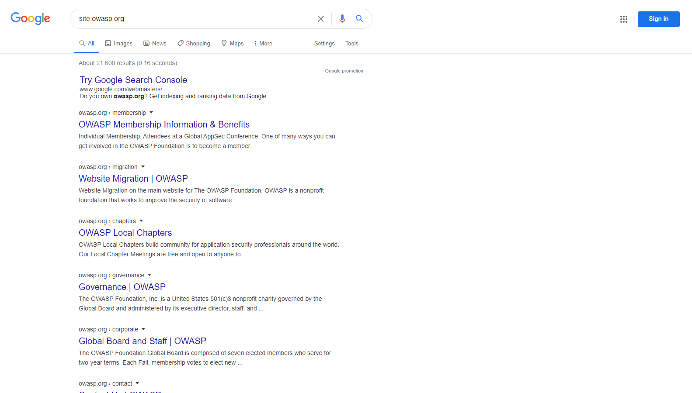
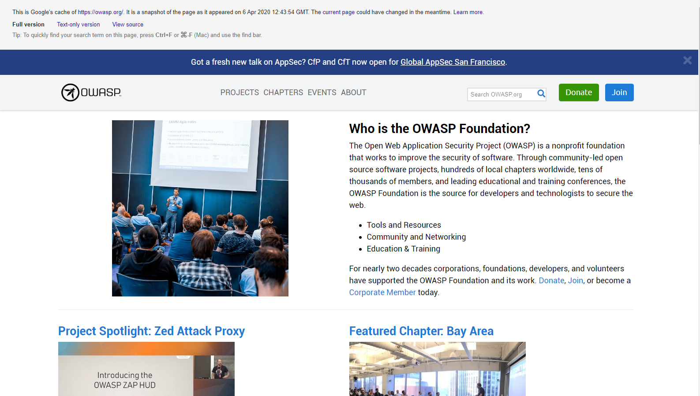

# Effectuer une reconnaissance de découverte de moteur de recherche pour les fuites d'informations

|ID          |
|------------|
|WSTG-INFO-01|

## Sommaire

Pour que les moteurs de recherche fonctionnent, les programmes informatiques (ou "robots") récupèrent régulièrement des données (appelées [exploration](https://en.wikipedia.org/wiki/Web_crawler)) à partir de milliards de pages sur le Web. Ces programmes trouvent du contenu et des fonctionnalités Web en suivant des liens à partir d'autres pages ou en consultant des plans de site. Si un site Web utilise un fichier spécial appelé "robots.txt" pour répertorier les pages qu'il ne souhaite pas que les moteurs de recherche récupèrent, les pages qui y sont répertoriées seront ignorées. Il s'agit d'un aperçu de base. Google propose une explication plus détaillée du [fonctionnement d'un moteur de recherche](https://support.google.com/webmasters/answer/70897?hl=en).

Les testeurs peuvent utiliser des moteurs de recherche pour effectuer des reconnaissances sur des sites Web et des applications Web. Il existe des éléments directs et indirects dans la découverte et la reconnaissance des moteurs de recherche : les méthodes directes concernent la recherche dans les index et le contenu associé à partir des caches, tandis que les méthodes indirectes concernent l'apprentissage d'informations de conception et de configuration sensibles en recherchant des forums, des groupes de discussion et des sites Web d'appel d'offres.

Une fois qu'un robot de moteur de recherche a terminé l'exploration, il commence à indexer le contenu Web en fonction des balises et des attributs associés, tels que `<TITLE>`, afin de renvoyer des résultats de recherche pertinents. Si le fichier `robots.txt` n'est pas mis à jour pendant la durée de vie du site Web et que les balises méta HTML en ligne indiquant aux robots de ne pas indexer le contenu n'ont pas été utilisées, il est possible que les index contiennent du contenu Web non prévu. à inclure par les propriétaires. Les propriétaires de sites Web peuvent utiliser le "robots.txt" mentionné précédemment, les balises méta HTML, l'authentification et les outils fournis par les moteurs de recherche pour supprimer ce contenu.

## Objectifs des tests

- Identifiez les informations sensibles de conception et de configuration de l'application, du système ou de l'organisation qui sont exposées directement (sur le site Web de l'organisation) ou indirectement (via des services tiers).

## Comment tester

Utilisez un moteur de recherche pour rechercher des informations potentiellement sensibles. Cela peut inclure :

- schémas et configurations de réseau ;
- messages et e-mails archivés par des administrateurs ou d'autres membres clés du personnel ;
- procédures de connexion et formats de nom d'utilisateur ;
- noms d'utilisateur, mots de passe et clés privées ;
- fichiers de configuration de services tiers ou cloud ;
- révéler le contenu du message d'erreur ; et
- applications non publiques (développement, test, test d'acceptation par l'utilisateur (UAT) et versions intermédiaires des sites).

### Moteurs de recherche

Ne limitez pas les tests à un seul fournisseur de moteur de recherche, car différents moteurs de recherche peuvent générer des résultats différents. Les résultats des moteurs de recherche peuvent varier de plusieurs manières, en fonction de la date à laquelle le moteur a exploré le contenu pour la dernière fois et de l'algorithme utilisé par le moteur pour déterminer les pages pertinentes. Envisagez d'utiliser les moteurs de recherche suivants (par ordre alphabétique) :

- [Baidu](https://www.baidu.com/), le moteur de recherche [le plus populaire](https://en.wikipedia.org/wiki/Web_search_engine#Market_share) de Chine.
- [Bing](https://www.bing.com/), un moteur de recherche détenu et exploité par Microsoft, et le deuxième [plus populaire](https://en.wikipedia.org/wiki/Web_search_engine#Market_share) à l'échelle mondiale. Prend en charge les [mots clés de recherche avancée] (http://help.bing.microsoft.com/#apex/18/en-US/10001/-1).
- [binsearch.info](https://binsearch.info/), un moteur de recherche pour les newsgroups Usenet binaires.
- [Common Crawl](https://commoncrawl.org/), "un référentiel ouvert de données d'exploration du Web qui peut être consulté et analysé par n'importe qui."
- [DuckDuckGo](https://duckduckgo.com/), un moteur de recherche axé sur la confidentialité qui compile les résultats de nombreuses [sources] différentes(https://help.duckduckgo.com/results/sources/). Prend en charge la [syntaxe de recherche](https://help.duckduckgo.com/duckduckgo-help-pages/results/syntax/).
- [Google](https://www.google.com/), qui propose le moteur de recherche [le plus populaire](https://en.wikipedia.org/wiki/Web_search_engine#Market_share) au monde et utilise un système de classement tenter de renvoyer les résultats les plus pertinents. Prend en charge les [opérateurs de recherche](https://support.google.com/websearch/answer/2466433).
- [Internet Archive Wayback Machine](https://archive.org/web/), "construire une bibliothèque numérique de sites Internet et d'autres artefacts culturels sous forme numérique".
- [Shodan](https://www.shodan.io/), un service de recherche d'appareils et de services connectés à Internet. Les options d'utilisation incluent un plan gratuit limité ainsi que des plans d'abonnement payants.

### Opérateurs de recherche

Un opérateur de recherche est un mot-clé ou une syntaxe spéciale qui étend les capacités des requêtes de recherche régulières et peut aider à obtenir des résultats plus spécifiques. Ils prennent généralement la forme `operator:query`. Voici quelques opérateurs de recherche couramment pris en charge :

- `site:` limitera la recherche au domaine fourni.
- `inurl:` renverra uniquement les résultats qui incluent le mot-clé dans l'URL.
- `intitle:` renverra uniquement les résultats qui ont le mot-clé dans le titre de la page.
- `intext:` ou `inbody:` recherchera uniquement le mot-clé dans le corps des pages.
- `filetype:` correspondra uniquement à un type de fichier spécifique, c'est-à-dire `.png` ou `.php`.

Par exemple, pour trouver le contenu Web de owasp.org tel qu'indexé par un moteur de recherche typique, la syntaxe requise est :

```text
site:owasp.org
```

\
*Figure 4.1.1-1 : Exemple de résultat de recherche d'opération de site Google*

### Affichage du contenu mis en cache

Pour rechercher du contenu qui a déjà été indexé, utilisez l'opérateur `cache:`. Ceci est utile pour afficher le contenu qui peut avoir changé depuis le moment où il a été indexé, ou qui peut ne plus être disponible. Tous les moteurs de recherche ne fournissent pas de contenu mis en cache pour la recherche ; la source la plus utile au moment de la rédaction est Google.

Pour afficher `owasp.org` tel qu'il est mis en cache, la syntaxe est la suivante :

```text
cache:owasp.org
```

\
*Figure 4.1.1-2 : Exemple de résultat de recherche d'opération Google Cache*

### Google Hacking, ou Dorking

La recherche avec les opérateurs peut être une technique de découverte très efficace lorsqu'elle est combinée à la créativité du testeur. Les opérateurs peuvent être enchaînés pour découvrir efficacement des types spécifiques de fichiers et d'informations sensibles. Cette technique, appelée [Google hacking](https://en.wikipedia.org/wiki/Google_hacking) ou Dorking, est également possible en utilisant d'autres moteurs de recherche, tant que les opérateurs de recherche sont pris en charge.

Une base de données de dorks, telle que [Google Hacking Database](https://www.exploit-db.com/google-hacking-database), est une ressource utile qui peut aider à découvrir des informations spécifiques. Certaines catégories de dorks disponibles sur cette base de données incluent:

- Prises de pieds
- Fichiers contenant des noms d'utilisateur
- Répertoires sensibles
- Détection de serveur Web
- Fichiers vulnérables
- Serveurs vulnérables
- Messages d'erreur
- Fichiers contenant des informations juteuses
- Fichiers contenant des mots de passe
- Informations sensibles sur les achats en ligne

## Correction

Examinez attentivement la sensibilité des informations de conception et de configuration avant de les publier en ligne.

Examinez périodiquement la sensibilité des informations de conception et de configuration existantes publiées en ligne.
