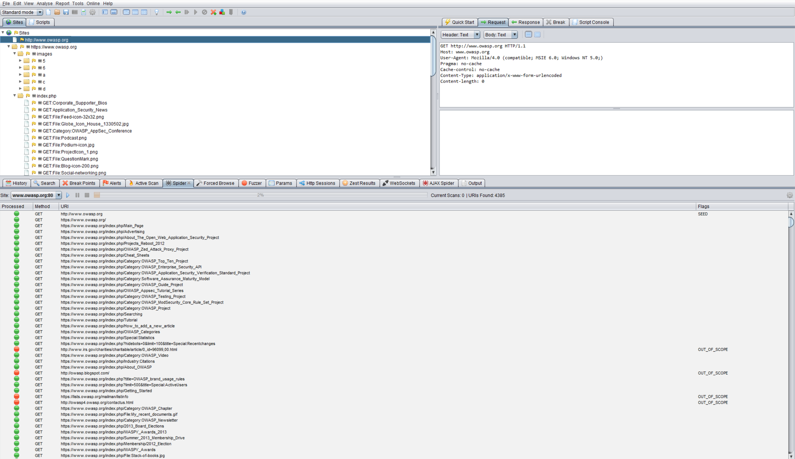

# Mapper les chemins d'exécution via l'application

|ID          |
|------------|
|WSTG-INFO-07|

## Sommaire

Avant de commencer les tests de sécurité, il est primordial de comprendre la structure de l'application. Sans une compréhension approfondie de la disposition de l'application, il est peu probable qu'elle soit testée de manière approfondie.

## Objectifs des tests

- Cartographier l'application cible et comprendre les principaux workflows.

## Comment tester

Dans les tests en boîte noire, il est extrêmement difficile de tester l'intégralité de la base de code. Non seulement parce que le testeur n'a aucune vue sur les chemins de code à travers l'application, mais même s'il le faisait, tester tous les chemins de code prendrait beaucoup de temps. Une façon de concilier cela consiste à documenter les chemins de code découverts et testés.

Il existe plusieurs façons d'aborder le test et la mesure de la couverture de code :

- **Chemin** : testez chacun des chemins via une application qui inclut des tests d'analyse combinatoire et des valeurs limites pour chaque chemin de décision. Bien que cette approche offre de la rigueur, le nombre de chemins testables augmente de façon exponentielle avec chaque branche de décision.
- **Data Flow (or Taint Analysis)** - teste l'affectation de variables via une interaction externe (généralement des utilisateurs). Se concentre sur la cartographie du flux, de la transformation et de l'utilisation des données dans une application.
- **Race** - teste plusieurs instances simultanées de l'application manipulant les mêmes données.

Le compromis quant à la méthode utilisée et à quel degré chaque méthode est utilisée doit être négocié avec le propriétaire de l'application. Des approches plus simples pourraient également être adoptées, notamment en demandant au propriétaire de l'application quelles fonctions ou sections de code le préoccupent particulièrement et comment ces segments de code peuvent être atteints.

Pour démontrer la couverture du code au propriétaire de l'application, le testeur peut commencer avec une feuille de calcul et documenter tous les liens découverts en parcourant l'application (manuellement ou automatiquement). Ensuite, le testeur peut examiner de plus près les points de décision dans l'application et déterminer combien de chemins de code significatifs sont découverts. Ceux-ci doivent ensuite être documentés dans la feuille de calcul avec des URL, des descriptions en texte et en capture d'écran des chemins découverts.

### Spidering automatique

L'araignée automatique est un outil utilisé pour découvrir automatiquement de nouvelles ressources (URL) sur un site Web particulier. Cela commence par une liste d'URL à visiter, appelées graines, qui dépend de la façon dont l'araignée est démarrée. Bien qu'il existe de nombreux outils de Spidering, l'exemple suivant utilise le [Zed Attack Proxy (ZAP)](https://github.com/zaproxy/zaproxy) :

\
*Figure 4.1.7-1 : Écran Proxy Zed Attack*

[ZAP](https://github.com/zaproxy/zaproxy) propose diverses options de spidering automatique, qui peuvent être exploitées en fonction des besoins du testeur :

- [Spider](https://www.zaproxy.org/docs/desktop/start/features/spider/)
- [Spider Ajax](https://www.zaproxy.org/docs/desktop/addons/ajax-spider/)
- [Prise en charge d'OpenAPI](https://www.zaproxy.org/docs/desktop/addons/openapi-support/)

## Outils

- [Zed Attack Proxy (ZAP)](https://github.com/zaproxy/zaproxy)
- [Liste des tableurs](https://en.wikipedia.org/wiki/List_of_spreadsheet_software)
- [Logiciel de création de diagrammes](https://en.wikipedia.org/wiki/List_of_concept-_and_mind-mapping_software)

## Références

- [Couverture de code](https://en.wikipedia.org/wiki/Code_coverage)
