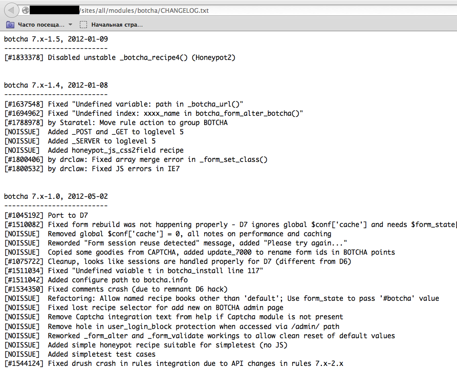
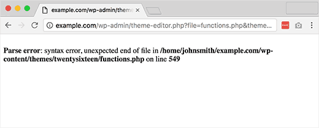

# Empreintes sur les Frameworks Web

|ID          |
|------------|
|WSTG-INFO-08|

## Sommaire

Il n'y a rien de nouveau sous le soleil, et presque toutes les applications Web que l'on peut penser à développer ont déjà été développées. Avec le grand nombre de projets de logiciels libres et Open Source qui sont activement développés et déployés dans le monde, il est très probable qu'un test de sécurité d'application sera confronté à une cible qui dépend entièrement ou partiellement de ces applications ou frameworks bien connus (par exemple, WordPress , phpBB, Mediawiki, etc.). Connaître les composants de l'application Web qui sont testés aide considérablement dans le processus de test et réduira également considérablement l'effort requis pendant le test. Ces applications Web bien connues ont des en-têtes HTML, des cookies et des structures de répertoire connus qui peuvent être énumérés pour identifier l'application. La plupart des frameworks Web ont plusieurs marqueurs à ces emplacements qui aident un attaquant ou un testeur à les reconnaître. C'est essentiellement ce que font tous les outils automatiques, ils recherchent un marqueur à partir d'un emplacement prédéfini, puis le comparent à la base de données des signatures connues. Pour une meilleure précision, plusieurs marqueurs sont généralement utilisés.

## Objectifs des tests

- Empreinte digitale des composants utilisés par les applications Web.

## Comment tester

### Test de la boîte noire

Il existe plusieurs emplacements communs à prendre en compte afin d'identifier les frameworks ou les composants :

- En-têtes HTTP
- Biscuits
-Code source HTML
- Fichiers et dossiers spécifiques
- Extensions de fichiers
- Messages d'erreur

#### En-têtes HTTP

La forme la plus élémentaire d'identification d'un framework Web consiste à examiner le champ `X-Powered-By` dans l'en-tête de réponse HTTP. De nombreux outils peuvent être utilisés pour identifier une cible, le plus simple est netcat.

Considérez la requête-réponse HTTP suivante :

```html
$ nc 127.0.0.1 80
HEAD / HTTP/1.0

HTTP/1.1 200 OK
Server: nginx/1.0.14
[...]
X-Powered-By: Mono
```

D'après le champ `X-Powered-By`, nous comprenons que le cadre de l'application Web est susceptible d'être `Mono`. Cependant, bien que cette approche soit simple et rapide, cette méthodologie ne fonctionne pas dans 100% des cas. Il est possible de désactiver facilement l'en-tête `X-Powered-By` par une configuration appropriée. Il existe également plusieurs techniques qui permettent à un site Web d'obscurcir les en-têtes HTTP (voir un exemple dans la section [Remediation](#remediation)). Dans l'exemple ci-dessus, nous pouvons également noter qu'une version spécifique de `nginx` est utilisée pour diffuser le contenu.

Ainsi, dans le même exemple, le testeur pourrait manquer l'en-tête `X-Powered-By` ou obtenir une réponse comme celle-ci :

```html
HTTP/1.1 200 OK
Server: nginx/1.0.14
Date: Sat, 07 Sep 2013 08:19:15 GMT
Content-Type: text/html;charset=ISO-8859-1
Connection: close
Vary: Accept-Encoding
X-Powered-By: Blood, sweat and tears
```

Parfois, il y a plus d'en-têtes HTTP qui pointent vers un certain framework. Dans l'exemple suivant, selon les informations de la requête HTTP, on peut voir que l'en-tête `X-Powered-By` contient la version PHP. Cependant, l'en-tête `X-Generator` indique que le framework utilisé est en fait `Swiftlet`, ce qui aide un testeur d'intrusion à étendre ses vecteurs d'attaque. Lors de la prise d'empreintes digitales, inspectez soigneusement chaque en-tête HTTP pour détecter de telles fuites.

```html
HTTP/1.1 200 OK
Server: nginx/1.4.1
Date: Sat, 07 Sep 2013 09:22:52 GMT
Content-Type: text/html
Connection: keep-alive
Vary: Accept-Encoding
X-Powered-By: PHP/5.4.16-1~dotdeb.1
Expires: Thu, 19 Nov 1981 08:52:00 GMT
Cache-Control: no-store, no-cache, must-revalidate, post-check=0, pre-check=0
Pragma: no-cache
X-Generator: Swiftlet
```

#### Cookies

Les cookies spécifiques au framework sont un autre moyen similaire et un peu plus fiable de déterminer le cadre Web actuel.

Considérez la requête HTTP suivante :

\
*Figure 4.1.8-7 : Requête HTTP Cakephp*

Le cookie `CAKEPHP` a été automatiquement installé, ce qui donne des informations sur le framework utilisé. Une liste des noms de cookies courants est présentée dans la section [Cookies](#cookies). Des limites existent toujours en s'appuyant sur ce mécanisme d'identification - il est possible de changer le nom des cookies. Par exemple, pour le framework `CakePHP` sélectionné, cela pourrait être fait via la configuration suivante (extrait de `core.php`):

```php
/**
* The name of CakePHP's session cookie.
*
* Note the guidelines for Session names states: "The session name references
* the session id in cookies and URLs. It should contain only alphanumeric
* characters."
* @link http://php.net/session_name
*/
Configure::write('Session.cookie', 'CAKEPHP');
```

Cependant, ces modifications sont moins susceptibles d'être apportées que les modifications apportées à l'en-tête `X-Powered-By`, de sorte que cette approche de l'identification peut être considérée comme plus fiable.

#### Code source HTML

Cette technique est basée sur la recherche de certains modèles dans le code source de la page HTML. Souvent, on peut trouver beaucoup d'informations qui aident un testeur à reconnaître un composant spécifique. L'un des marqueurs courants sont les commentaires HTML qui mènent directement à la divulgation du cadre. Le plus souvent, certains chemins spécifiques au framework peuvent être trouvés, c'est-à-dire des liens vers des dossiers CSS ou JS spécifiques au framework. Enfin, des variables de script spécifiques peuvent également pointer vers un certain cadre.

À partir de la capture d'écran ci-dessous, on peut facilement apprendre le framework utilisé et sa version par les marqueurs mentionnés. Le commentaire, les chemins spécifiques et les variables de script peuvent tous aider un attaquant à déterminer rapidement une instance du framework ZK.

\
*Figure 4.1.8-2 : Exemple de source HTML du cadre ZK*

Souvent, ces informations sont positionnées dans la section `<head>` des réponses HTTP, dans les balises `<meta>` ou à la fin de la page. Néanmoins, les réponses entières doivent être analysées car elles peuvent être utiles à d'autres fins telles que l'inspection d'autres commentaires utiles et des champs masqués. Parfois, les développeurs Web ne se soucient pas beaucoup de cacher des informations sur les frameworks ou les composants utilisés. Il est encore possible de tomber sur quelque chose comme ça en bas de page :

\
*Figure 4.1.8-3 : Page inférieure de Banshee*

### Fichiers et dossiers spécifiques

Il existe une autre approche qui aide grandement un attaquant ou un testeur à identifier des applications ou des composants avec une grande précision. Chaque composant Web a sa propre structure de fichiers et de dossiers sur le serveur. Il a été noté que l'on peut voir le chemin spécifique à partir de la source de la page HTML, mais parfois ils n'y sont pas explicitement présentés et résident toujours sur le serveur.

Afin de les découvrir, une technique connue sous le nom de navigation forcée ou "dirbusting" est utilisée. Le dirbusting consiste à forcer brutalement une cible avec un dossier et des noms de fichiers connus et à surveiller les réponses HTTP pour énumérer le contenu du serveur. Ces informations peuvent être utilisées à la fois pour rechercher des fichiers par défaut et les attaquer, ainsi que pour prendre les empreintes digitales de l'application Web. Le dirbusting peut être effectué de plusieurs manières, l'exemple ci-dessous montre une attaque dirbusting réussie contre une cible alimentée par WordPress à l'aide de la liste définie et de la fonctionnalité d'intrus de Burp Suite.

\
*Figure 4.1.8-4 : Dirbusting avec Burp*

We can see that for some WordPress-specific folders (for instance, `/wp-includes/`, `/wp-admin/` and `/wp-content/`) HTTP responses are 403 (Forbidden), 302 (Found, redirection to `wp-login.php`), and 200 (OK) respectively. This is a good indicator that the target is WordPress powered. The same way it is possible to dirbust different application plugin folders and their versions. In the screenshot below one can see a typical CHANGELOG file of a Drupal plugin, which provides information on the application being used and discloses a vulnerable plugin version.Nous pouvons voir que pour certains dossiers spécifiques à WordPress (par exemple, `/wp-includes/`, `/wp-admin/` et `/wp-content/`) les réponses HTTP sont 403 (Interdit), 302 (Trouvé, redirection vers `wp-login.php`), et 200 (OK) respectivement. C'est un bon indicateur que la cible est propulsée par WordPress. De la même manière, il est possible de gérer différents dossiers de plugins d'application et leurs versions. Dans la capture d'écran ci-dessous, on peut voir un fichier CHANGELOG typique d'un plugin Drupal, qui fournit des informations sur l'application utilisée et divulgue une version vulnérable du plugin.

\
*Figure 4.1.8-5 : Divulgation Drupal Botcha*

Astuce : avant de commencer le dirbusting, vérifiez d'abord le fichier `robots.txt`. Parfois, des dossiers spécifiques à une application et d'autres informations sensibles peuvent également s'y trouver. Un exemple d'un tel fichier `robots.txt` est présenté sur une capture d'écran ci-dessous.

\
*Figure 4.1.8-6 : Divulgation d'informations sur les robots*

Les fichiers et dossiers spécifiques sont différents pour chaque application spécifique. Si l'application ou le composant identifié est Open Source, il peut être utile de configurer une installation temporaire pendant les tests d'intrusion afin de mieux comprendre quelle infrastructure ou fonctionnalité est présentée, et quels fichiers peuvent rester sur le serveur. Cependant, plusieurs bonnes listes de fichiers existent déjà ; un bon exemple est [listes de mots FuzzDB de fichiers/dossiers prévisibles](https://github.com/fuzzdb-project/fuzzdb).

#### Extensions de fichiers

Les URL peuvent inclure des extensions de fichier, qui peuvent également aider à identifier la plate-forme ou la technologie Web.

Par exemple, le wiki OWASP utilisait PHP :

```text
https://wiki.owasp.org/index.php?title=Fingerprint_Web_Application_Framework&action=edit&section=4
```

Voici quelques extensions de fichiers Web courantes et les technologies associées :

- `.php` -- PHP
- `.aspx` -- Microsoft ASP.NET
- `.jsp` -- Pages du serveur Java

#### Messages d'erreur

Comme on peut le voir dans la capture d'écran suivante, le chemin du système de fichiers indiqué pointe vers l'utilisation de WordPress (`wp-content`). Les testeurs doivent également savoir que WordPress est basé sur PHP (`functions.php`).

\
*Figure 4.1.8-7 : Erreur d'analyse WordPress*

## Identificateurs communs

### Biscuits

| Framework    | Nom du cookie                     |
|--------------|-----------------------------------|
| Zope         | zope3                             |
| CakePHP      | cakephp                           |
| Kohana       | kohanasession                     |
| Laravel      | laravel_session                   |
| phpBB        | phpbb3_                           |
| WordPress    | wp-settings                       |
| 1C-Bitrix    | BITRIX_                           |
| AMPcms       | AMP                               |
| Django CMS   | django                            |
| DotNetNuke   | DotNetNukeAnonymous               |
| e107         | e107_tz                           |
| EPiServer    | EPiTrace, EPiServer               |
| Graffiti CMS | graffitibot                       |
| Hotaru CMS   | hotaru_mobile                     |
| ImpressCMS   | ICMSession                        |
| Indico       | MAKACSESSION                      |
| InstantCMS   | InstantCMS[logdate]               |
| Kentico CMS  | CMSPreferredCulture               |
| MODx         | SN4[12symb]                       |
| TYPO3        | fe_typo_user                      |
| Dynamicweb   | Dynamicweb                        |
| LEPTON       | lep[some_numeric_value]+sessionid |
| Wix          | Domain=.wix.com                   |
| VIVVO        | VivvoSessionId                    |

### Code source HTML

| Application | Mot clé                                                                        |
|-------------|--------------------------------------------------------------------------------|
| WordPress   | `<meta name="generator" content="WordPress 3.9.2" />`                          |
| phpBB       | `<body id="phpbb"`                                                             |
| Mediawiki   | `<meta name="generator" content="MediaWiki 1.21.9" />`                         |
| Joomla      | `<meta name="generator" content="Joomla! - Open Source Content Management" />` |
| Drupal      | `<meta name="Generator" content="Drupal 7 (http://drupal.org)" />`             |
| DotNetNuke  | `DNN Platform - [http://www.dnnsoftware.com](http://www.dnnsoftware.com)`      |

#### Marqueurs généraux

- `%framework_name%`
- `powered by`
- `built upon`
- `running`

#### Marqueurs spécifiques

| Framework         | Mot clé                        |
|-------------------|--------------------------------|
| Adobe ColdFusion  | `<!-- START headerTags.cfm`    |
| Microsoft ASP.NET | `__VIEWSTATE`                  |
| ZK                | `<!-- ZK`                      |
| Business Catalyst | `<!-- BC_OBNW -->`             |
| Indexhibit        | `ndxz-studio`                  |

## Correction

Bien que des efforts puissent être faits pour utiliser différents noms de cookies (en modifiant les configurations), en masquant ou en modifiant les chemins de fichiers/répertoires (en réécrivant ou en modifiant le code source), en supprimant les en-têtes connus, etc., ces efforts se résument à la "sécurité par l'obscurité". Les propriétaires/administrateurs de systèmes doivent reconnaître que ces efforts ne font que ralentir les adversaires les plus élémentaires. Le temps/effort peut être mieux utilisé pour les activités de sensibilisation des parties prenantes et de maintenance de la solution.

## Outils

Une liste d'outils généraux et bien connus est présentée ci-dessous. Il existe également de nombreux autres utilitaires, ainsi que des outils d'empreintes digitales basés sur un framework.

### WhatWeb

Site Internet : [https://github.com/urbanadventurer/WhatWeb](https://github.com/urbanadventurer/WhatWeb)

Actuellement l'un des meilleurs outils d'empreintes digitales sur le marché. Inclus dans une version par défaut de [Kali Linux](https://www.kali.org/). Langage : Les correspondances Ruby pour les empreintes digitales sont faites avec :

- Chaînes de texte (sensible à la casse)
- Expressions régulières
- Requêtes Google Hack Database (ensemble limité de mots-clés)
- hachages MD5
- Reconnaissance d'URL
- Modèles de balises HTML
- Code ruby ​​personnalisé pour les opérations passives et agressives

Un exemple de sortie est présenté sur une capture d'écran ci-dessous :

\
*Figure 4.1.8-8 : Exemple de sortie Whatweb*

### Wappalyzer

Site Web : [https://www.wappalyzer.com/](https://www.wappalyzer.com/)

Wappalyzer est disponible dans plusieurs modèles d'utilisation, dont le plus populaire est probablement les extensions Firefox/Chrome. Ils fonctionnent uniquement sur la correspondance d'expressions régulières et n'ont besoin de rien d'autre que la page à charger dans le navigateur. Il fonctionne entièrement au niveau du navigateur et donne des résultats sous forme d'icônes. Bien qu'il y ait parfois de faux positifs, c'est très pratique pour avoir une idée des technologies qui ont été utilisées pour construire un site Web cible immédiatement après avoir parcouru une page.

Un exemple de sortie d'un plug-in est présenté sur une capture d'écran ci-dessous.

\
*Figure 4.1.8-9 : Sortie Wappalyzer pour le site Web OWASP*

## Références

### Papiers blanc

- [Saumil Shah : "Une introduction à l'empreinte HTTP"](https://web.archive.org/web/20190526182734/https://net-square.com/httprint_paper.html)
- [Anant Shrivastava : "Application Web Finger Printing"](https://anantshri.info/articles/web_app_finger_printing.html)
