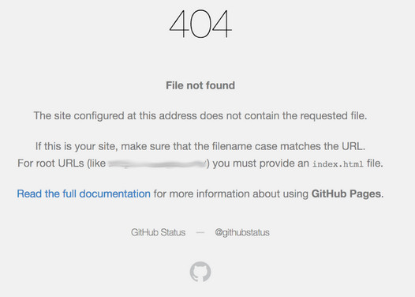

# Test de reprise de sous-domaine

|ID          |
|------------|
|WSTG-CONF-10|

## Sommaire

Une exploitation réussie de ce type de vulnérabilité permet à un adversaire de revendiquer et de prendre le contrôle du sous-domaine de la victime. Cette attaque repose sur les éléments suivants :

1. L'enregistrement de sous-domaine du serveur DNS externe de la victime est configuré pour pointer vers une ressource/un service externe/un point de terminaison inexistant ou inactif. La prolifération des produits XaaS (Anything as a Service) et des services de cloud public offre de nombreuses cibles potentielles à considérer.
2. Le fournisseur de services hébergeant la ressource/le service externe/le point de terminaison ne gère pas correctement la vérification de la propriété du sous-domaine.

Si la prise de contrôle du sous-domaine réussit, une grande variété d'attaques sont possibles (diffusion de contenu malveillant, hameçonnage, vol de cookies de session utilisateur, d'informations d'identification, etc.). Cette vulnérabilité pourrait être exploitée pour une grande variété d'enregistrements de ressources DNS, notamment : `A`, `CNAME`, `MX`, `NS`, `TXT` etc. En termes de gravité d'attaque, une prise de contrôle de sous-domaine `NS` (bien que moins probable) a l'impact le plus élevé, car une attaque réussie pourrait entraîner un contrôle total sur l'ensemble de la zone DNS et le domaine de la victime.

### GitHub

1. La victime (victim.com) utilise GitHub pour le développement et a configuré un enregistrement DNS (`coderepo.victim.com`) pour y accéder.
2. La victime décide de migrer son référentiel de code de GitHub vers une plateforme commerciale et ne supprime pas `coderepo.victim.com` de son serveur DNS.
3. Un adversaire découvre que `coderepo.victim.com` est hébergé sur GitHub et utilise les pages GitHub pour revendiquer `coderepo.victim.com` à l'aide de son compte GitHub.

### Domaine expiré

1. La victime (victim.com) possède un autre domaine (victimotherdomain.com) et utilise un enregistrement CNAME (www) pour référencer l'autre domaine (`www.victim.com` --> `victimotherdomain.com`)
2. À un moment donné, victimotherdomain.com expire et peut être enregistré par n'importe qui. Étant donné que l'enregistrement CNAME n'est pas supprimé de la zone DNS victim.com, toute personne qui enregistre `victimotherdomain.com` a un contrôle total sur `www.victim.com` jusqu'à ce que l'enregistrement DNS soit présent.

## Objectifs des tests

- Énumérer tous les domaines possibles (précédents et actuels).
- Identifiez les domaines oubliés ou mal configurés.

## Comment tester

### Test de la boîte noire

La première étape consiste à énumérer les serveurs DNS victimes et les enregistrements de ressources. Il existe plusieurs façons d'accomplir cette tâche, par exemple l'énumération DNS à l'aide d'une liste de dictionnaires de sous-domaines communs, la force brute DNS ou l'utilisation de moteurs de recherche Web et d'autres sources de données OSINT.

À l'aide de la commande dig, le testeur recherche les messages de réponse du serveur DNS suivants qui justifient une enquête plus approfondie :

- `NXDOMAIN`
- `SERVFAIL`
- `REFUSED`
- `no servers could be reached.`

#### Test de prise de contrôle de sous-domaine d'enregistrement DNS A et CNAME

Effectuez une énumération DNS de base sur le domaine de la victime (`victim.com`) à l'aide de `dnsrecon` :

```bash
$ ./dnsrecon.py -d victim.com
[*] Performing General Enumeration of Domain: victim.com
...
[-] DNSSEC is not configured for victim.com
[*]      A subdomain.victim.com 192.30.252.153
[*]      CNAME subdomain1.victim.com fictioussubdomain.victim.com
...
```

Identifiez les enregistrements de ressources DNS qui sont morts et pointez vers des services inactifs/non utilisés. Utilisation de la commande dig pour l'enregistrement `CNAME` :

```bash
$ dig CNAME fictioussubdomain.victim.com
; <<>> DiG 9.10.3-P4-Ubuntu <<>> ns victim.com
;; global options: +cmd
;; Got answer:
;; ->>HEADER<<- opcode: QUERY, status: NXDOMAIN, id: 42950
;; flags: qr rd ra; QUERY: 1, ANSWER: 2, AUTHORITY: 0, ADDITIONAL: 1
```

Les réponses DNS suivantes justifient une enquête plus approfondie : "NXDOMAIN".

Pour tester l'enregistrement "A", le testeur effectue une recherche dans la base de données whois et identifie GitHub comme fournisseur de services :

```bash
$ whois 192.30.252.153 | grep "OrgName"
OrgName: GitHub, Inc.
```

Le testeur visite `subdomain.victim.com` ou émet une requête HTTP GET qui renvoie une réponse "404 - File not found" qui est une indication claire de la vulnérabilité.

\
*Figure 4.2.10-1 : Réponse GitHub 404 Fichier introuvable*

Le testeur revendique le domaine à l'aide des pages GitHub :

\
*Figure 4.2.10-2 : domaine de réclamation GitHub*

#### Test de la prise de contrôle du sous-domaine de l'enregistrement NS

Identifiez tous les serveurs de noms pour le domaine concerné :

```bash
$ dig ns victim.com +short
ns1.victim.com
nameserver.expireddomain.com
```

Dans cet exemple fictif, le testeur vérifie si le domaine `expireddomain.com` est actif avec une recherche de registrar de domaine. Si le domaine est disponible à l'achat, le sous-domaine est vulnérable.

Les réponses DNS suivantes justifient une enquête plus approfondie : "SERVFAIL" ou "REFUSED".

### Test de la boîte grise

Le testeur dispose du fichier de zone DNS, ce qui signifie que l'énumération DNS n'est pas nécessaire. La méthodologie de test est la même.

## Correction

Pour atténuer le risque de prise de contrôle de sous-domaine, le ou les enregistrements de ressources DNS vulnérables doivent être supprimés de la zone DNS. Une surveillance continue et des contrôles périodiques sont recommandés comme meilleures pratiques.

## Outils

- [dig - page de manuel](https://linux.die.net/man/1/dig)
- [recon-ng - Cadre de reconnaissance Web](https://github.com/lanmaster53/recon-ng)
- [theHarvester - Outil de collecte de renseignements OSINT](https://github.com/laramies/theHarvester)
- [Sublist3r - Outil d'énumération de sous-domaine OSINT](https://github.com/aboul3la/Sublist3r)
- [dnsrecon - Script d'énumération DNS](https://github.com/darkoperator/dnsrecon)
- [Énumération DNS OWASP Amass] (https://github.com/OWASP/Amass)

## Références

- [HackerOne - Un guide pour les prises de contrôle de sous-domaine](https://www.hackerone.com/blog/Guide-Subdomain-Takeovers)
- [Reprise de sous-domaine : principes de base](https://0xpatrik.com/subdomain-takeover-basics/)
- [Reprise de sous-domaine : aller au-delà de CNAME](https://0xpatrik.com/subdomain-takeover-ns/)
- [can-i-take-over-xyz - Une liste de services vulnérables](https://github.com/EdOverflow/can-i-take-over-xyz/)
- [OWASP AppSec Europe 2017 - Frans Rosén : Piratage de DNS à l'aide de fournisseurs de cloud - aucune vérification nécessaire](https://2017.appsec.eu/presos/Developer/DNS%20hijacking%20using%20cloud%20providers%20%E2%80 %93%20aucune%20vérification%20nécessaire%20-%20Frans%20Rosen%20-%20OWASP_AppSec-Eu_2017.pdf)
