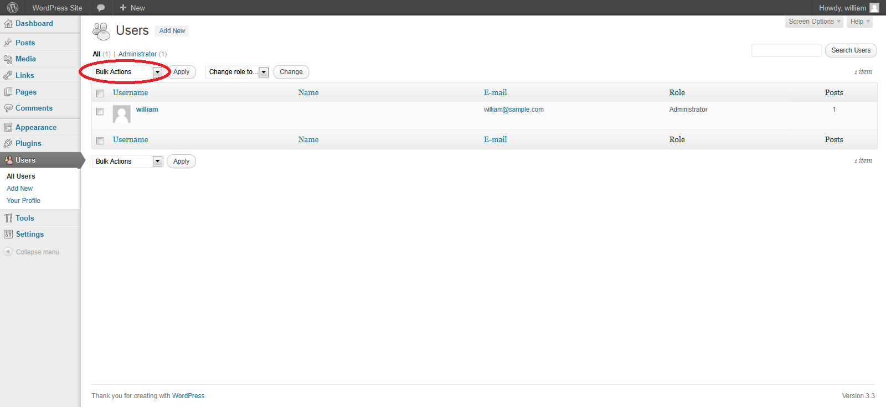

# Tester le processus de provisionnement du compte

|ID          |
|------------|
|WSTG-IDNT-03|

## Sommaire

L'approvisionnement des comptes présente une opportunité pour un attaquant de créer un compte valide sans appliquer le processus d'identification et d'autorisation approprié.

## Objectifs des tests

- Vérifiez quels comptes peuvent approvisionner d'autres comptes et de quel type.

## Comment tester

Déterminez quels rôles peuvent provisionner des utilisateurs et quels types de comptes ils peuvent provisionner.

- Existe-t-il une vérification, un contrôle et une autorisation des demandes de provisionnement ?
- Existe-t-il une vérification, un contrôle et une autorisation des demandes de déprovisionnement ?
- Un administrateur peut-il provisionner d'autres administrateurs ou uniquement des utilisateurs ?
- Un administrateur ou un autre utilisateur peut-il provisionner des comptes avec des privilèges supérieurs aux siens ?
- Un administrateur ou un utilisateur peut-il se déprovisionner lui-même ?
- Comment sont gérés les fichiers ou les ressources appartenant à l'utilisateur déprovisionné ? Sont-ils supprimés ? L'accès est-il transféré ?

### Exemple

Dans WordPress, seuls le nom et l'adresse e-mail d'un utilisateur sont requis pour provisionner l'utilisateur, comme indiqué ci-dessous :

\
*Figure 4.3.3-1 : Ajout d'un utilisateur WordPress*

Le déprovisionnement des utilisateurs nécessite que l'administrateur sélectionne les utilisateurs à déprovisionner, sélectionne Supprimer dans le menu déroulant (encerclé), puis applique cette action. L'administrateur se voit alors présenter une boîte de dialogue lui demandant quoi faire avec les messages de l'utilisateur (les supprimer ou les transférer).

\
*Figure 4.3.3-2 : Authentification et utilisateurs de WordPress*

## Outils

Bien que l'approche la plus approfondie et la plus précise pour effectuer ce test consiste à le mener manuellement, les outils de proxy HTTP pourraient également être utiles.
