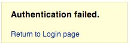

# Test d'énumération de compte et de compte d'utilisateur devinable

|ID          |
|------------|
|WSTG-IDNT-04|

## Sommaire

Le but de ce test est de vérifier s'il est possible de collecter un ensemble d'identifiants valides en interagissant avec le mécanisme d'authentification de l'application. Ce test sera utile pour les tests de force brute, dans lesquels le testeur vérifie si, étant donné un nom d'utilisateur valide, il est possible de trouver le mot de passe correspondant.

Souvent, les applications Web révèlent l'existence d'un nom d'utilisateur sur le système, soit à la suite d'une mauvaise configuration, soit à la suite d'une décision de conception. Par exemple, parfois, lorsque nous soumettons des informations d'identification erronées, nous recevons un message indiquant que le nom d'utilisateur est présent sur le système ou que le mot de passe fourni est erroné. Les informations obtenues peuvent être utilisées par un attaquant pour obtenir une liste d'utilisateurs sur le système. Ces informations peuvent être utilisées pour attaquer l'application Web, par exemple, par une attaque par force brute ou par nom d'utilisateur et mot de passe par défaut.

Le testeur doit interagir avec le mécanisme d'authentification de l'application pour comprendre si l'envoi de requêtes particulières amène l'application à répondre de différentes manières. Ce problème existe car les informations publiées par l'application Web ou le serveur Web lorsque l'utilisateur fournit un nom d'utilisateur valide sont différentes de celles lorsqu'il en utilise un non valide.

Dans certains cas, un message est reçu qui révèle si les informations d'identification fournies sont erronées car un nom d'utilisateur ou un mot de passe non valide a été utilisé. Parfois, les testeurs peuvent énumérer les utilisateurs existants en envoyant un nom d'utilisateur et un mot de passe vides.

## Objectifs des tests

- Examiner les processus relatifs à l'identification de l'utilisateur (*par exemple* inscription, connexion, etc.).
- Énumérer les utilisateurs dans la mesure du possible grâce à l'analyse des réponses.

## Comment tester

Dans les tests de boîte noire, le testeur ne sait rien de l'application spécifique, du nom d'utilisateur, de la logique de l'application, des messages d'erreur sur la page de connexion ou des installations de récupération de mot de passe. Si l'application est vulnérable, le testeur reçoit un message de réponse lui révélant, directement ou indirectement, certaines informations utiles à l'énumération des utilisateurs.

### Message de réponse HTTP

#### Test des informations d'identification valides

Enregistrez la réponse du serveur lorsque vous soumettez un ID utilisateur valide et un mot de passe valide.

> A l'aide d'un proxy web, notez les informations récupérées de cette authentification réussie (réponse HTTP 200, longueur de la réponse).

#### Test pour un utilisateur valide avec un mot de passe erroné

Maintenant, le testeur doit essayer d'insérer un ID utilisateur valide et un mot de passe erroné et enregistrer le message d'erreur généré par l'application.

> Le navigateur doit afficher un message semblable au suivant :
>
> \
> *Figure 4.3.4-1 : Échec de l'authentification*
>
> Contrairement à tout message révélant l'existence de l'utilisateur comme suit :
>
> `Connexion pour l'utilisateur foo : mot de passe invalide`
>
> A l'aide d'un proxy web, notez les informations récupérées de cette tentative d'authentification infructueuse (Réponse HTTP 200, longueur de la réponse).

#### Test d'un nom d'utilisateur inexistant

Maintenant, le testeur doit essayer d'insérer un ID utilisateur invalide et un mot de passe erroné et enregistrer la réponse du serveur (le testeur doit être sûr que le nom d'utilisateur n'est pas valide dans l'application). Enregistrez le message d'erreur et la réponse du serveur.

> Si le testeur saisit un ID utilisateur inexistant, il peut recevoir un message semblable à :
>
> \
> *Figure 4.3.4-3 : Cet utilisateur n'est pas actif*
>
> ou un message comme celui-ci :
>
> `Échec de la connexion pour l'utilisateur foo : compte invalide`
>
> Généralement l'application doit répondre avec le même message d'erreur et la même longueur aux différentes requêtes incorrectes. Si les réponses ne sont pas les mêmes, le testeur doit rechercher et trouver la clé qui crée une différence entre les deux réponses. Par exemple:
>
> 1. Demande client : Utilisateur valide/mot de passe erroné
> 2. Réponse du serveur : Le mot de passe n'est pas correct
> 3. Requête client : Mauvais utilisateur/mauvais mot de passe
> 4. Réponse du serveur : Utilisateur non reconnu
>
> Les réponses ci-dessus permettent au client de comprendre que pour la première requête, il dispose d'un nom d'utilisateur valide. Ainsi, ils peuvent interagir avec l'application en demandant un ensemble d'ID utilisateur possibles et en observant la réponse.
>
> En regardant la deuxième réponse du serveur, le testeur comprend de la même manière qu'il ne détient pas un nom d'utilisateur valide. Ainsi, ils peuvent interagir de la même manière et créer une liste d'ID utilisateur valides en regardant les réponses du serveur.

### Autres façons d'énumérer les utilisateurs

Les testeurs peuvent énumérer les utilisateurs de plusieurs manières, telles que :

#### Analyse du code d'erreur reçu sur les pages de connexion

Certaines applications Web publient un code ou un message d'erreur spécifique que nous pouvons analyser.

#### Analyse des URL et des redirections d'URL

Par exemple:

- `http://www.foo.com/err.jsp?User=baduser&Error=0`
- `http://www.foo.com/err.jsp?User=gooduser&Error=2`

Comme on l'a vu ci-dessus, lorsqu'un testeur fournit un ID utilisateur et un mot de passe à l'application Web, il voit un message indiquant qu'une erreur s'est produite dans l'URL. Dans le premier cas, ils ont fourni un mauvais ID utilisateur et un mauvais mot de passe. Dans le second, un bon ID utilisateur et un mauvais mot de passe, afin qu'ils puissent identifier un ID utilisateur valide.

#### Sondage d'URI

Parfois, un serveur Web répond différemment s'il reçoit ou non une demande pour un répertoire existant. Par exemple, dans certains portails, chaque utilisateur est associé à un répertoire. Si les testeurs tentent d'accéder à un répertoire existant, ils peuvent recevoir une erreur de serveur Web.

Certaines des erreurs courantes reçues des serveurs Web sont :

- 403 Code d'erreur interdit
- 404 Code d'erreur introuvable

Exemple:

- `http://www.foo.com/account1` - nous recevons du serveur Web : 403 Forbidden
- `http://www.foo.com/account2` - nous recevons du serveur Web : fichier 404 introuvable

Dans le premier cas, l'utilisateur existe, mais le testeur ne peut pas afficher la page Web, dans le second cas, l'utilisateur "account2" n'existe pas. En collectant ces informations, les testeurs peuvent énumérer les utilisateurs.

#### Analyse des titres de pages Web

Les testeurs peuvent recevoir des informations utiles sur le titre de la page Web, où ils peuvent obtenir un code d'erreur spécifique ou des messages qui révèlent si les problèmes sont liés au nom d'utilisateur ou au mot de passe.

Par exemple, si un utilisateur ne peut pas s'authentifier auprès d'une application et reçoit une page Web dont le titre ressemble à :

- "Utilisateur non valide"
- "Authentification non valide"

#### Analyse d'un message reçu d'une installation de récupération

Lorsque nous utilisons une fonction de récupération (c'est-à-dire une fonction de mot de passe oublié), une application vulnérable peut renvoyer un message indiquant si un nom d'utilisateur existe ou non.

Par exemple, des messages similaires aux suivants :

- `Nom d'utilisateur non valide : l'adresse e-mail n'est pas valide ou l'utilisateur spécifié n'a pas été trouvé.`
- `Nom d'utilisateur valide : Votre mot de passe a été envoyé avec réussi à l'adresse e-mail avec la quelle vous êtes enregistré .`

#### Message d'erreur convivial 404

Lorsque nous demandons un utilisateur dans le répertoire qui n'existe pas, nous ne recevons pas toujours le code d'erreur 404. Au lieu de cela, nous pouvons recevoir "200 OK" avec une image, dans ce cas nous pouvons supposer que lorsque nous recevons l'image spécifique, l'utilisateur n'existe pas. Cette logique peut être appliquée à d'autres réponses de serveur Web ; l'astuce est une bonne analyse des messages du serveur Web et de l'application Web.

#### Analyse des temps de réponse

En plus d'examiner le contenu des réponses, le temps que prend la réponse doit également être pris en compte. En particulier lorsque la demande provoque une interaction avec un service externe (comme l'envoi d'un e-mail de mot de passe oublié), cela peut ajouter plusieurs centaines de millisecondes à la réponse, qui peuvent être utilisées pour déterminer si l'utilisateur demandé est valide.

### Deviner les utilisateurs

Dans certains cas, les ID utilisateur sont créés avec des politiques spécifiques de l'administrateur ou de l'entreprise. Par exemple, nous pouvons afficher un utilisateur avec un ID utilisateur créé dans un ordre séquentiel :

```text
CN000100
CN000101
...
```

Parfois, les noms d'utilisateur sont créés avec un alias REALM, puis des numéros séquentiels :

- R1001 - utilisateur 001 pour REALM1
- R2001 - utilisateur 001 pour REALM2

Dans l'exemple ci-dessus, nous pouvons créer des scripts shell simples qui composent les ID utilisateur et soumettre une demande avec un outil tel que wget pour automatiser une requête Web afin de discerner les ID utilisateur valides. Pour créer un script, nous pouvons également utiliser Perl et curl.

D'autres possibilités sont : - des identifiants associés à des numéros de carte de crédit, ou en général des numéros avec un motif. - ID utilisateur associés à des noms réels, par ex. si Freddie Mercury a un identifiant d'utilisateur de "fmercury", alors vous pourriez deviner que Roger Taylor a l'identifiant d'utilisateur de "rtaylor".

Encore une fois, nous pouvons deviner un nom d'utilisateur à partir des informations reçues d'une requête LDAP ou de la collecte d'informations Google, par exemple, à partir d'un domaine spécifique. Google peut vous aider à trouver des utilisateurs de domaine via des requêtes spécifiques ou via un simple script ou outil shell.

> En énumérant les comptes d'utilisateurs, vous risquez de verrouiller des comptes après un nombre prédéfini d'échecs de vérification (basé sur la politique de l'application). De plus, parfois, votre adresse IP peut être interdite par des règles dynamiques sur le pare-feu de l'application ou le système de prévention des intrusions.

### Test de la boîte grise

#### Test des messages d'erreur d'authentification

Vérifiez que l'application répond de la même manière pour chaque demande client qui produit un échec d'authentification. Pour ce problème, les tests de boîte noire et les tests de boîte grise ont le même concept basé sur l'analyse des messages ou des codes d'erreur reçus de l'application Web.

> L'application doit répondre de la même manière à chaque échec de tentative d'authentification.
>
> Par exemple : *Les informations d'identification soumises ne sont pas valides*

## Correction

Assurez-vous que l'application renvoie des messages d'erreur génériques cohérents en réponse à un nom de compte, un mot de passe ou d'autres informations d'identification d'utilisateur non valides saisis lors du processus de connexion.

Assurez-vous que les comptes système par défaut et les comptes de test sont supprimés avant de mettre le système en production (ou de l'exposer à un réseau non approuvé).

## Outils

- [Proxy d'attaque Zed OWASP (ZAP)] (https://www.zaproxy.org)
- [curl](https://curl.haxx.se/)
- [PERL](https://www.perl.org)

## Références

- [Vulnérabilités d'énumération de nom d'utilisateur] (https://www.gnucitizen.org/blog/username-enumeration-vulnerabilities/)
- [Empêcher l'énumération du nom d'utilisateur WordPress] (https://www.jinsonvarghese.com/prevent-wordpress-username-enumeration/)
- [Marco Mella, énumération des utilisateurs de Sun Java Access & Identity Manager](https://www.exploit-db.com/exploits/32762)
