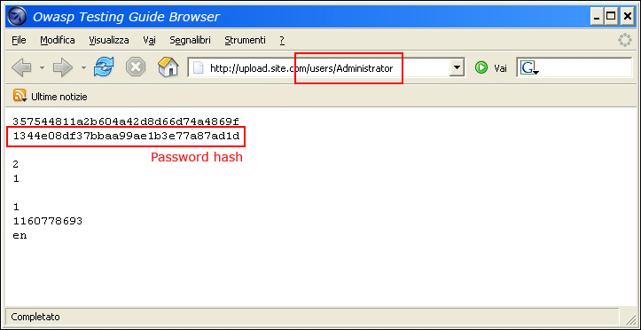
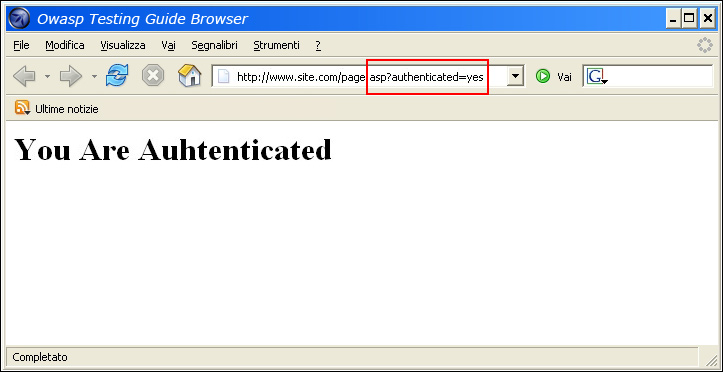
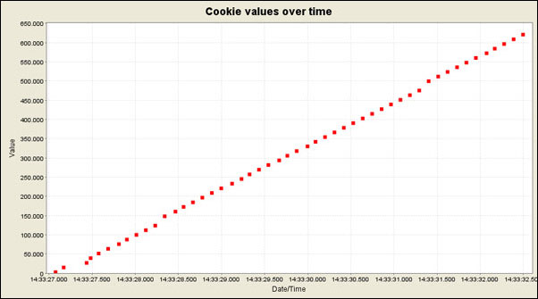

# Test de contournement du schéma d'authentification

|ID          |
|------------|
|WSTG-ATHN-04|

## Sommaire

En sécurité informatique, l'authentification est le processus consistant à tenter de vérifier l'identité numérique de l'expéditeur d'une communication. Un exemple courant d'un tel processus est le processus de connexion. Tester le schéma d'authentification signifie comprendre le fonctionnement du processus d'authentification et utiliser ces informations pour contourner le mécanisme d'authentification.

Alors que la plupart des applications nécessitent une authentification pour accéder à des informations privées ou pour exécuter des tâches, toutes les méthodes d'authentification ne sont pas en mesure de fournir une sécurité adéquate. La négligence, l'ignorance ou la simple sous-estimation des menaces de sécurité entraînent souvent des schémas d'authentification qui peuvent être contournés en sautant simplement la page de connexion et en appelant directement une page interne qui est censée être accessible uniquement après l'authentification.

De plus, il est souvent possible de contourner les mesures d'authentification en falsifiant les requêtes et en faisant croire à l'application que l'utilisateur est déjà authentifié. Cela peut être accompli soit en modifiant le paramètre d'URL donné, soit en manipulant le formulaire, soit en contrefaisant des sessions.

Les problèmes liés au schéma d'authentification peuvent se trouver à différentes étapes du cycle de vie du développement logiciel (SDLC), comme les phases de conception, de développement et de déploiement :

- Dans la phase de conception, les erreurs peuvent inclure une mauvaise définition des sections d'application à protéger, le choix de ne pas appliquer de protocoles de cryptage forts pour sécuriser la transmission des informations d'identification, et bien d'autres.
- Dans la phase de développement, les erreurs peuvent inclure la mise en œuvre incorrecte de la fonctionnalité de validation des entrées ou le non-respect des meilleures pratiques de sécurité pour le langage spécifique.
- Dans la phase de déploiement de l'application, il peut y avoir des problèmes lors de la configuration de l'application (activités d'installation et de configuration) en raison d'un manque de compétences techniques requises ou d'un manque de bonne documentation.

## Objectifs des tests

- Assurez-vous que l'authentification est appliquée à tous les services qui en ont besoin.

## Comment tester

Il existe plusieurs méthodes pour contourner le schéma d'authentification utilisé par une application Web :

- Demande de page directe ([navigation forcée](https://owasp.org/www-community/attacks/Forced_browsing))
- Modification des paramètres
- Prédiction d'ID de session
- Injection SQL

### Demande de page directe

Si une application Web implémente le contrôle d'accès uniquement sur la page de connexion, le schéma d'authentification peut être contourné. Par exemple, si un utilisateur demande directement une autre page via la navigation forcée, cette page peut ne pas vérifier les informations d'identification de l'utilisateur avant d'accorder l'accès. Essayez d'accéder directement à une page protégée via la barre d'adresse de votre navigateur pour tester cette méthode.

\
*Figure 4.4.4-1 : Demande directe à la page protégée*

### Modification des paramètres

Un autre problème lié à la conception de l'authentification est lorsque l'application vérifie une connexion réussie sur la base de paramètres à valeur fixe. Un utilisateur pourrait modifier ces paramètres pour accéder aux zones protégées sans fournir d'informations d'identification valides. Dans l'exemple ci-dessous, le paramètre « authentifié » est remplacé par la valeur « oui », ce qui permet à l'utilisateur d'avoir accès. Dans cet exemple, le paramètre est dans l'URL, mais un proxy peut également être utilisé pour modifier le paramètre, en particulier lorsque les paramètres sont envoyés sous forme d'éléments de formulaire dans une requête POST ou lorsque les paramètres sont stockés dans un cookie.

```html
http://www.site.com/page.asp?authenticated=no

raven@blackbox /home $nc www.site.com 80
GET /page.asp?authenticated=yes HTTP/1.0

HTTP/1.1 200 OK
Date: Sat, 11 Nov 2006 10:22:44 GMT
Server: Apache
Connection: close
Content-Type: text/html; charset=iso-8859-1

<!DOCTYPE HTML PUBLIC "-//IETF//DTD HTML 2.0//EN">
<HTML><HEAD>
</HEAD><BODY>
<H1>You Are Authenticated</H1>
</BODY></HTML>
```

\
*Figure 4.4.4-2 : Requête de modification de paramètre*

### Prédiction d'ID de session

De nombreuses applications Web gèrent l'authentification à l'aide d'identificateurs de session (ID de session). Par conséquent, si la génération d'ID de session est prévisible, un utilisateur malveillant pourrait être en mesure de trouver un ID de session valide et d'obtenir un accès non autorisé à l'application, en se faisant passer pour un utilisateur précédemment authentifié.

Dans la figure suivante, les valeurs à l'intérieur des cookies augmentent de manière linéaire, il pourrait donc être facile pour un attaquant de deviner un ID de session valide.

\
*Figure 4.4.4-3 : Valeurs des cookies au fil du temps*

Dans la figure suivante, les valeurs à l'intérieur des cookies ne changent que partiellement, il est donc possible de restreindre une attaque par force brute aux champs définis indiqués ci-dessous.

\
*Figure 4.4.4-4 : Valeurs de cookies partiellement modifiées*

### Injection SQL (authentification par formulaire HTML)

L'injection SQL est une technique d'attaque largement connue. Cette section ne va pas décrire cette technique en détail car il y a plusieurs sections dans ce guide qui expliquent les techniques d'injection au-delà de la portée de cette section.

\
*Figure 4.4.4-5 : Injection SQL*

La figure suivante montre qu'avec une simple attaque par injection SQL, il est parfois possible de contourner le formulaire d'authentification.

\
*Figure 4.4.4-6 : Attaque par injection SQL simple*

### Comparaison simplifiée de PHP

Si un attaquant a pu récupérer le code source de l'application en exploitant une vulnérabilité précédemment découverte (par exemple, la traversée de répertoires) ou à partir d'un référentiel Web (applications Open Source), il pourrait être possible d'effectuer des attaques raffinées contre la mise en œuvre de l'authentification. traiter.

Dans l'exemple suivant (PHPBB 2.0.12 - Vulnérabilité de contournement d'authentification), à la ligne 2, la fonction `unserialize()` analyse un cookie fourni par l'utilisateur et définit des valeurs dans le tableau `$sessiondata`. À la ligne 7, le hachage du mot de passe MD5 de l'utilisateur stocké dans la base de données principale (`$auto_login_key`) est comparé à celui fourni (`$sessiondata['autologinid']`) par l'utilisateur.

```php
1. if (isset($HTTP_COOKIE_VARS[$cookiename . '_sid'])) {
2.     $sessiondata = isset($HTTP_COOKIE_VARS[$cookiename . '_data']) ? unserialize(stripslashes($HTTP_COOKIE_VARS[$cookiename . '_data'])) : array();
3.     $sessionmethod = SESSION_METHOD_COOKIE;
4. }
5. $auto_login_key = $userdata['user_password'];
6. // We have to login automagically
7. if( $sessiondata['autologinid'] == $auto_login_key )
8. {
9.     // autologinid matches password
10.     $login = 1;
11.     $enable_autologin = 1;
12. }

```

En PHP, une comparaison entre une valeur de chaîne et une valeur booléenne `true` est toujours `true` (car la chaîne contient une valeur), donc en fournissant la chaîne suivante à la fonction `unserialize()`, il est possible de contourner le contrôle d'authentification et connectez-vous en tant qu'administrateur, dont l'`userid` est 2 :

```php
a:2:{s:11:"autologinid";b:1;s:6:"userid";s:1:"2";}  // original value: a:2:{s:11:"autologinid";s:32:"8b8e9715d12e4ca12c4c3eb4865aaf6a";s:6:"userid";s:4:"1337";}
```

Démontons ce que nous avons fait dans cette chaîne :

1. `autologinid` est maintenant un booléen défini sur `true` : cela peut être vu en remplaçant la valeur MD5 du hachage du mot de passe (`s:32:"8b8e9715d12e4ca12c4c3eb4865aaf6a"`) par `b:1`
2. `userid` est maintenant défini sur l'ID administrateur : cela peut être vu dans le dernier morceau de la chaîne, où nous avons remplacé notre ID utilisateur habituel (`s:4:"1337"`) par `s:1:" 2"`

## Outils

- [WebGoat](https://owasp.org/www-project-webgoat/)
- [Proxy d'attaque Zed OWASP (ZAP)] (https://www.zaproxy.org)

## Références

- [Niels Teusink : contournement de l'authentification phpBB 2.0.12](http://blog.teusink.net/2008/12/classic-bug-phpbb-2012-authentication.html)
- [David Endler : "Exploitation et prédiction de la force brute de l'identifiant de session"](https://www.cgisecurity.com/lib/SessionIDs.pdf)
