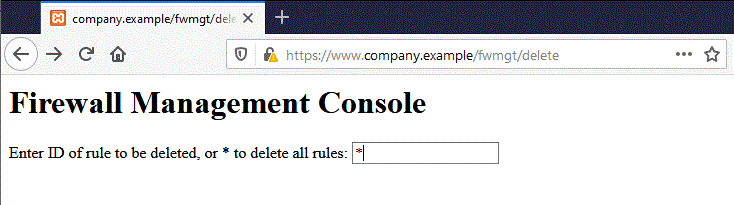

# Test de falsification de requête intersite

|ID          |
|------------|
|WSTG-SESS-05|

## Sommaire

Cross-Site Request Forgery ([CSRF](https://owasp.org/www-community/attacks/csrf)) est une attaque qui oblige un utilisateur final à exécuter des actions involontaires sur une application Web dans laquelle il est actuellement authentifié. Avec un peu d'aide d'ingénierie sociale (comme l'envoi d'un lien par e-mail ou chat), un attaquant peut forcer les utilisateurs d'une application Web à exécuter les actions de son choix. Un exploit CSRF réussi peut compromettre les données et le fonctionnement de l'utilisateur final lorsqu'il cible un utilisateur normal. Si l'utilisateur final ciblé est le compte administrateur, une attaque CSRF peut compromettre l'ensemble de l'application Web.

Le CSRF s'appuie sur :

1. Comportement du navigateur Web concernant le traitement des informations liées à la session telles que les cookies et les informations d'authentification HTTP.
2. La connaissance par un attaquant des URL, requêtes ou fonctionnalités valides des applications Web.
3. Gestion des sessions applicatives reposant uniquement sur les informations connues du navigateur.
4. Existence de balises HTML dont la présence provoque un accès immédiat à une ressource HTTP[S] ; par exemple la balise d'image `img`.

Les points 1, 2 et 3 sont essentiels pour que la vulnérabilité soit présente, tandis que le point 4 facilite l'exploitation réelle, mais n'est pas strictement requis.

1. Les navigateurs envoient automatiquement les informations utilisées pour identifier une session utilisateur. Supposons que *site* est un site hébergeant une application Web et que l'utilisateur *victime* vient de s'authentifier sur *site*. En réponse, *site* envoie à *victime* un cookie qui identifie les requêtes envoyées par *victime* comme appartenant à la session authentifiée de *victime*. Une fois que le navigateur reçoit le cookie défini par *site*, il l'enverra automatiquement avec toute autre demande adressée à *site*.
2. Si l'application n'utilise pas d'informations relatives à la session dans les URL, les URL de l'application, leurs paramètres et leurs valeurs légitimes peuvent être identifiés. Cela peut être accompli par une analyse de code ou en accédant à l'application et en prenant note des formulaires et des URL intégrés dans le code HTML ou JavaScript.
3. "Connu par le navigateur" fait référence à des informations telles que des cookies ou des informations d'authentification basées sur HTTP (telles que l'authentification de base et non l'authentification par formulaire), qui sont stockées par le navigateur et présentes par la suite à chaque requête dirigée vers une zone d'application demandant cette authentification. Les vulnérabilités décrites ci-dessous s'appliquent aux applications qui reposent entièrement sur ce type d'informations pour identifier une session utilisateur.

Par souci de simplicité, considérez les URL accessibles par GET (bien que la discussion s'applique également aux requêtes POST). Si la *victime* s'est déjà authentifiée, la soumission d'une autre demande entraîne l'envoi automatique du cookie avec celle-ci. La figure ci-dessous illustre l'utilisateur accédant à une application sur `www.exemple.com`.

\
*Figure 4.6.5-1 : Séance de conduite*

La requête GET peut être envoyée par l'utilisateur de plusieurs manières différentes :

- Utilisation de l'application Web
- Taper l'URL directement dans le navigateur
- Suite à un lien externe qui pointe vers l'URL

Ces invocations ne peuvent pas être distinguées par l'application. En particulier, le troisième peut être assez dangereux. Il existe un certain nombre de techniques et de vulnérabilités qui peuvent masquer les propriétés réelles d'un lien. Le lien peut être intégré dans un e-mail, apparaître sur un site Web malveillant vers lequel l'utilisateur est attiré ou apparaître dans un contenu hébergé par un tiers (tel qu'un autre site Web ou un e-mail HTML) et pointer vers une ressource de l'application. . Si l'utilisateur clique sur le lien, puisqu'il est déjà authentifié par l'application Web sur *site*, le navigateur émettra une requête GET à l'application Web, accompagnée d'informations d'authentification (le cookie d'identification de session). Cela se traduit par une opération valide effectuée sur l'application Web à laquelle l'utilisateur ne s'attend pas ; par exemple, un virement sur une application web banking.

En utilisant une balise telle que `img`, comme précisé au point 4 ci-dessus, il n'est même pas nécessaire que l'utilisateur suive un lien particulier. Supposons que l'attaquant envoie à l'utilisateur un e-mail l'incitant à visiter une URL renvoyant à une page contenant le code HTML (simplifié) suivant.

```html
<html>
    <body>
...

...
    </body>
</html>
```

Lorsque le navigateur affichera cette page, il essaiera d'afficher également l'image de dimension zéro spécifiée (donc invisible) de `https://www.company.exemple`. Cela se traduit par l'envoi automatique d'une requête à l'application Web hébergée sur *site*. Il n'est pas important que l'URL de l'image ne fasse pas référence à une image appropriée, car sa présence déclenchera de toute façon la requête "action" spécifiée dans le champ "src". Cela se produit à condition que le téléchargement d'images ne soit pas désactivé dans le navigateur. La plupart des navigateurs n'ont pas de téléchargements d'images désactivés car cela paralyserait la plupart des applications Web au-delà de la convivialité.

Le problème ici est une conséquence de:

- Balises HTML sur la page entraînant l'exécution automatique de la requête HTTP (`img` étant l'une d'entre elles).
- Le navigateur n'ayant aucun moyen de dire que la ressource référencée par `img` n'est pas une image légitime.
- Chargement d'image qui se produit quel que soit l'emplacement de la source d'image présumée, c'est-à-dire que le formulaire et l'image elle-même n'ont pas besoin d'être situés sur le même hôte ou même le même domaine.

Le fait que du contenu HTML non lié à l'application web puisse faire référence à des composants de l'application, et le fait que le navigateur compose automatiquement une requête valide vers l'application, permet ce type d'attaque. Il n'existe aucun moyen d'interdire ce comportement à moins qu'il soit rendu impossible pour l'attaquant d'interagir avec les fonctionnalités de l'application.

Dans les environnements de messagerie/navigateur intégrés, le simple affichage d'un message électronique contenant la référence de l'image entraînerait l'exécution de la requête à l'application Web avec le cookie de navigateur associé. Les e-mails peuvent faire référence à des URL d'image apparemment valides, telles que :

```html

```

Dans cet exemple, `[attaquant]` est un site contrôlé par l'attaquant. En utilisant un mécanisme de redirection, le site malveillant peut utiliser `http://[attaquant]/picture.gif` pour diriger la victime vers `http://[tiers]/action` et déclencher l'`action`.

Les cookies ne sont pas le seul exemple impliqué dans ce type de vulnérabilité. Les applications Web dont les informations de session sont entièrement fournies par le navigateur sont également vulnérables. Cela inclut les applications reposant uniquement sur les mécanismes d'authentification HTTP, puisque les informations d'authentification sont connues du navigateur et sont envoyées automatiquement à chaque requête. Cela n'inclut pas l'authentification basée sur un formulaire, qui ne se produit qu'une seule fois et génère une certaine forme d'informations liées à la session, généralement un cookie.

Supposons que la victime soit connectée à une console de gestion Web du pare-feu. Pour se connecter, un utilisateur doit s'authentifier et les informations de session sont stockées dans un cookie.

Supposons que la console de gestion Web du pare-feu dispose d'une fonction permettant à un utilisateur authentifié de supprimer une règle spécifiée par son ID numérique, ou toutes les règles de la configuration si l'utilisateur spécifie `*` (une fonctionnalité dangereuse en réalité, mais qui rend pour un exemple plus intéressant). La page de suppression s'affiche ensuite. Supposons que le formulaire - pour des raisons de simplicité - émette une requête GET. Pour supprimer la règle numéro un :

```text
https://[target]/fwmgt/delete?rule=1
```

Pour supprimer toutes les règles :

```text
https://[target]/fwmgt/delete?rule=*
```

Cet exemple est volontairement naïf, mais montre de manière simplifiée les dangers de CSRF.

\
*Figure 4.6.5-2 : Gestion du pare-feu de session Riding*

En utilisant le formulaire illustré dans la figure ci-dessus, entrez la valeur `*` et cliquez sur le bouton Supprimer pour soumettre la requête GET suivante :

```text
https://www.company.exemple/fwmgt/delete?rule=*
```

Cela supprimerait toutes les règles de pare-feu.

\
*Figure 4.6.5-3 : Session Riding Firewall Management 2*

L'utilisateur peut également avoir obtenu les mêmes résultats en envoyant manuellement l'URL :

```text
https://[target]/fwmgt/delete?rule=*
```

Soit en suivant un lien pointant, directement ou via une redirection, vers l'URL ci-dessus. Ou, encore une fois, en accédant à une page HTML avec une balise "img" intégrée pointant vers la même URL.

Dans tous ces cas, si l'utilisateur est actuellement connecté à l'application de gestion du pare-feu, la requête aboutira et modifiera la configuration du pare-feu. On peut imaginer des attaques ciblant des applications sensibles et faisant des enchères automatiques, des transferts d'argent, des commandes, modifiant la configuration de composants logiciels critiques, etc.

Une chose intéressante est que ces vulnérabilités peuvent être exercées derrière un pare-feu ; c'est-à-dire qu'il suffit que le lien attaqué soit accessible par la victime et non directement par l'attaquant. En particulier, il peut s'agir de n'importe quel serveur Web intranet ; par exemple, dans le scénario de gestion de pare-feu mentionné précédemment, qui est peu susceptible d'être exposé à Internet.

Les applications auto-vulnérables, c'est-à-dire les applications qui sont utilisées à la fois comme vecteur d'attaque et comme cible (telles que les applications de messagerie Web), aggravent les choses. Étant donné que les utilisateurs sont connectés lorsqu'ils lisent leurs messages électroniques, une application vulnérable de ce type peut permettre aux attaquants d'effectuer des actions telles que la suppression de messages ou l'envoi de messages qui semblent provenir de la victime.

## Objectifs des tests

- Déterminer s'il est possible d'initier des demandes au nom d'un utilisateur qui ne sont pas initiées par l'utilisateur.

## Comment tester

Auditez l'application pour déterminer si sa gestion de session est vulnérable. Si la gestion de session repose uniquement sur des valeurs côté client (informations disponibles pour le navigateur), alors l'application est vulnérable. Les "valeurs côté client" font référence aux cookies et aux identifiants d'authentification HTTP (authentification de base et autres formes d'authentification HTTP ; pas l'authentification basée sur un formulaire, qui est une authentification au niveau de l'application).

Les ressources accessibles via les requêtes HTTP GET sont facilement vulnérables, bien que les requêtes POST puissent être automatisées via JavaScript et soient également vulnérables ; par conséquent, l'utilisation de POST seul n'est pas suffisante pour corriger l'occurrence des vulnérabilités CSRF.

En cas de POST, l'exemple suivant peut être utilisé.

1. Créez une page HTML similaire à celle illustrée ci-dessous
2. Héberger le HTML sur un site malveillant ou tiers
3. Envoyez le lien de la page à la ou aux victimes et incitez-les à cliquer dessus.

```html
<html>
<body onload='document.CSRF.submit()'>

<form action='http://targetWebsite/Authenticate.jsp' method='POST' name='CSRF'>
    <input type='hidden' name='name' value='Hacked'>
    <input type='hidden' name='password' value='Hacked'>
</form>

</body>
</html>
```

Dans le cas d'applications Web dans lesquelles les développeurs utilisent JSON pour la communication entre le navigateur et le serveur, un problème peut survenir avec le fait qu'il n'y a pas de paramètres de requête avec le format JSON, qui sont indispensables avec les formulaires à soumission automatique. Pour contourner ce cas, nous pouvons utiliser un formulaire d'auto-soumission avec des charges utiles JSON comprenant une entrée masquée pour exploiter CSRF. Nous devrons changer le type d'encodage (`enctype`) en `text/plain` pour nous assurer que la charge utile est livrée telle quelle. Le code d'exploitation ressemblera à ceci :

```html
<html>
 <body>
  <script>history.pushState('', '', '/')</script>
   <form action='http://victimsite.com' method='POST' enctype='text/plain'>
     <input type='hidden' name='{"name":"hacked","password":"hacked","padding":"'value='something"}' />
     <input type='submit' value='Submit request' />
   </form>
 </body>
</html>
```

La requête POST sera la suivante :

```http
POST / HTTP/1.1
Host: victimsite.com
Content-Type: text/plain

{"name":"hacked","password":"hacked","padding":"=something"}
```

Lorsque ces données sont envoyées sous forme de requête POST, le serveur acceptera volontiers les champs de nom et de mot de passe et ignorera celui avec le rembourrage de nom car il n'en a pas besoin.

## Correction

- Voir le [OWASP CSRF Prevention Cheat Sheet](https://cheatsheetseries.owasp.org/cheatsheets/Cross-Site_Request_Forgery_Prevention_Cheat_Sheet.html) pour les mesures de prévention.

## Outils

- [OWASP ZAP](https://www.zaproxy.org/)
- [Testeur CSRF](https://wiki.owasp.org/index.php/Category:OWASP_CSRFTester_Project)
- [Pinata-csrf-tool](https://code.google.com/archive/p/pinata-csrf-tool/)

## Références

- [Peter W : "Cross-Site Request Forgeries"](https://web.archive.org/web/20160303230910/http://www.tux.org/~peterw/csrf.txt)
- [Thomas Schreiber : "Session Riding"](https://web.archive.org/web/20160304001446/http://www.securenet.de/papers/Session_Riding.pdf)
- [Message connu le plus ancien](https://web.archive.org/web/20000622042229/http://www.zope.org/Members/jim/ZopeSecurity/ClientSideTrojan)
- [FAQ sur la falsification de requêtes intersites](https://www.cgisecurity.com/csrf-faq.html)
- [Un fait le plus négligé concernant la falsification de requête intersite (CSRF)](http://yehg.net/lab/pr0js/view.php/A_Most-Neglected_Fact_About_CSRF.pdf)
- [Multi-POST CSRF](https://www.lanmaster53.com/2013/07/17/multi-post-csrf/)
- [Webcast SANS Pen Test : Complétez le pwnage de l'application via Multi POST XSRF](https://www.youtube.com/watch?v=EOs5PZiiwug)
