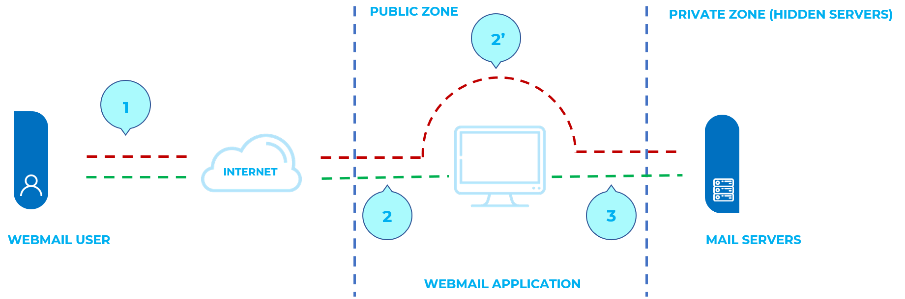

# Test de l'injection IMAP SMTP

|ID          |
|------------|
|WSTG-INPV-10|

## Sommaire

Cette menace affecte toutes les applications qui communiquent avec les serveurs de messagerie (IMAP/SMTP), généralement les applications de messagerie Web. Le but de ce test est de vérifier la capacité à injecter des commandes IMAP/SMTP arbitraires dans les serveurs de messagerie, du fait que les données d'entrée ne sont pas correctement filtrées.

La technique d'injection IMAP/SMTP est plus efficace si le serveur de messagerie n'est pas directement accessible depuis Internet. Lorsqu'une communication complète avec le serveur de messagerie principal est possible, il est recommandé d'effectuer des tests directs.

Une injection IMAP/SMTP permet d'accéder à un serveur de messagerie qui autrement ne serait pas directement accessible depuis Internet. Dans certains cas, ces systèmes internes n'ont pas le même niveau de sécurité et de renforcement de l'infrastructure que celui appliqué aux serveurs Web frontaux. Par conséquent, les résultats du serveur de messagerie peuvent être plus vulnérables aux attaques des utilisateurs finaux (voir le schéma présenté à la figure 1).

\
*Figure 4.7.10-1 : Communication avec les serveurs de messagerie utilisant la technique d'injection IMAP/SMTP*

La figure 1 illustre le flux de trafic généralement observé lors de l'utilisation des technologies de messagerie Web. Les étapes 1 et 2 correspondent à l'interaction de l'utilisateur avec le client de messagerie Web, tandis que l'étape 2 correspond au testeur qui contourne le client de messagerie Web et interagit directement avec les serveurs de messagerie principaux.

Cette technique permet une grande variété d'actions et d'attaques. Les possibilités dépendent du type et de la portée de l'injection et de la technologie de serveur de messagerie testée.

Voici quelques exemples d'attaques utilisant la technique d'injection IMAP/SMTP :

- Exploitation des vulnérabilités du protocole IMAP/SMTP
- Contournement des restrictions d'application
- Évasion des processus anti-automatisation
- Fuites d'informations
- Relais/SPAM

## Objectifs des tests

- Identifier les points d'injection IMAP/SMTP.
- Comprendre le flux de données et la structure de déploiement du système.
- Évaluer les impacts de l'injection.

## Comment tester

### Identification des paramètres vulnérables

Afin de détecter les paramètres vulnérables, le testeur doit analyser la capacité de l'application à gérer les entrées. Les tests de validation des entrées nécessitent que le testeur envoie des requêtes erronées ou malveillantes au serveur et analyse la réponse. Dans une application sécurisée, la réponse doit être une erreur avec une action correspondante indiquant au client que quelque chose s'est mal passé. Dans une application vulnérable, la requête malveillante peut être traitée par l'application dorsale qui répondra par un message de réponse "HTTP 200 OK".

Il est important de noter que les demandes envoyées doivent correspondre à la technologie testée. L'envoi de chaînes d'injection SQL pour le serveur Microsoft SQL lorsqu'un serveur MySQL est utilisé entraînera des réponses faussement positives. Dans ce cas, l'envoi de commandes IMAP malveillantes est un modus operandi puisque IMAP est le protocole sous-jacent testé.

Les paramètres spéciaux IMAP qui doivent être utilisés sont :

| Sur le serveur IMAP | Sur le serveur SMTP |
|----------------------|--------------------|
| Authentification | Courriel de l'émetteur |
| opérations avec les boîtes aux lettres (lister, lire, créer, supprimer, renommer) | E-mail de destination |
| opérations avec des messages (lire, copier, déplacer, supprimer) | Objet |
| Déconnexion | Corps du message |
| | Fichiers joints |

Dans cet exemple, le paramètre `mailbox` est testé en manipulant toutes les requêtes avec le paramètre dans :

`http://<webmail>/src/read_body.php?mailbox=INBOX&passed_id=46106&startMessage=1`

Les exemples suivants peuvent être utilisés.

- Attribuez une valeur nulle au paramètre :

`http://<webmail>/src/read_body.php?mailbox=&passed_id=46106&startMessage=1`

- Remplacez la valeur par une valeur aléatoire :

`http://<webmail>/src/read_body.php?mailbox=NOTEXIST&passed_id=46106&startMessage=1`

- Ajoutez d'autres valeurs au paramètre :

`http://<webmail>/src/read_body.php?mailbox=INBOX PARAMETER2&passed_id=46106&startMessage=1`

- Ajoutez des caractères spéciaux non standard (par exemple : `\`, `'`, `"`, `@`, `#`, ` !`, `|`) :

`http://<webmail>/src/read_body.php?mailbox=INBOX"&passed_id=46106&startMessage=1`

- Supprimer le paramètre :

`http://<webmail>/src/read_body.php?passed_id=46106&startMessage=1`

Le résultat final des tests ci-dessus donne au testeur trois situations possibles :
S1 - L'application renvoie un code/message d'erreur
S2 - L'application ne renvoie pas de code/message d'erreur, mais elle ne réalise pas l'opération demandée
S3 - L'application ne renvoie pas de code/message d'erreur et réalise normalement l'opération demandée

Les situations S1 et S2 représentent une injection IMAP/SMTP réussie.

L'objectif d'un attaquant est de recevoir la réponse S1, car c'est un indicateur que l'application est vulnérable à l'injection et à d'autres manipulations.

Supposons qu'un utilisateur récupère les en-têtes des e-mails à l'aide de la requête HTTP suivante :

`http://<webmail>/src/view_header.php?mailbox=INBOX&passed_id=46105&passed_ent_id=0`

Un attaquant pourrait modifier la valeur du paramètre INBOX en injectant le caractère `"` (%22 utilisant l'encodage URL) :

`http://<webmail>/src/view_header.php?mailbox=INBOX%22&passed_id=46105&passed_ent_id=0`

Dans ce cas, la réponse de l'application peut être :

```txt
ERROR: Bad or malformed request.
Query: SELECT "INBOX""
Server responded: Unexpected extra arguments to Select
```

La situation S2 est plus difficile à tester avec succès. Le testeur doit utiliser l'injection de commande aveugle afin de déterminer si le serveur est vulnérable.

En revanche, la dernière situation (S3) n'est pas pertinente dans ce paragraphe.

> Liste des paramètres vulnérables
>
> - Fonctionnalité affectée
> - Type d'injection possible (IMAP/SMTP)

### Comprendre le flux de données et la structure de déploiement du client

Après avoir identifié tous les paramètres vulnérables (par exemple, `passed_id`), le testeur doit déterminer quel niveau d'injection est possible, puis concevoir un plan de test pour exploiter davantage l'application.

Dans ce cas de test, nous avons détecté que le paramètre `passed_id` de l'application est vulnérable et est utilisé dans la requête suivante :

`http://<webmail>/src/read_body.php?mailbox=INBOX&passed_id=46225&startMessage=1`

En utilisant le cas de test suivant (fournissant une valeur alphabétique lorsqu'une valeur numérique est requise) :

`http://<webmail>/src/read_body.php?mailbox=INBOX&passed_id=test&startMessage=1`

générera le message d'erreur suivant :

```txt
ERROR : Bad or malformed request.
Query: FETCH test:test BODY[HEADER]
Server responded: Error in IMAP command received by server.
```

Dans cet exemple, le message d'erreur renvoyait le nom de la commande exécutée et les paramètres correspondants.

Dans d'autres situations, le message d'erreur ('non contrôlé' par l'application) contient le nom de la commande exécutée, mais la lecture de la [RFC](#references) appropriée permet au testeur de comprendre quelles autres commandes possibles peuvent être exécutées.

Si l'application ne renvoie pas de messages d'erreur descriptifs, le testeur doit analyser la fonctionnalité affectée pour en déduire toutes les commandes (et paramètres) possibles associées à la fonctionnalité mentionnée ci-dessus. Par exemple, si un paramètre vulnérable a été détecté dans la fonctionnalité de création de boîte aux lettres, il est logique de supposer que la commande IMAP affectée est `CREATE`. Selon la RFC, la commande `CREATE` accepte un paramètre qui spécifie le nom de la boîte aux lettres à créer.

> Liste des commandes IMAP/SMTP concernées
>
> - Type, valeur et nombre de paramètres attendus par les commandes IMAP/SMTP concernées

### Injection de commandes IMAP/SMTP

Une fois que le testeur a identifié les paramètres vulnérables et a analysé le contexte dans lequel ils sont exécutés, l'étape suivante consiste à exploiter la fonctionnalité.

Cette étape a deux issues possibles :

1. L'injection est possible dans un état non authentifié : la fonctionnalité concernée ne nécessite pas l'authentification de l'utilisateur. Les commandes injectées (IMAP) disponibles sont limitées à : `CAPABILITY`, `NOOP`, `AUTHENTICATE`, `LOGIN` et `LOGOUT`.
2. L'injection n'est possible que dans un état authentifié : l'exploitation réussie nécessite que l'utilisateur soit complètement authentifié avant que les tests puissent continuer.

Dans tous les cas, la structure typique d'une injection IMAP/SMTP est la suivante :

- En-tête : fin de la commande attendue ;
- Corps : injection de la nouvelle commande ;
- Pied de page : début de la commande attendue.

Il est important de se rappeler que, pour exécuter une commande IMAP/SMTP, la commande précédente doit se terminer par la séquence CRLF (`%0d%0a`).

Supposons qu'à l'étape [Identification des paramètres vulnérables](#Identification-des-paramètres-vulnérables), l'attaquant détecte que le paramètre `message_id` dans la requête suivante est vulnérable :

`http://<webmail>/read_email.php?message_id=4791`

Supposons également que le résultat de l'analyse effectuée à l'étape 2 ("Comprendre le flux de données et la structure de déploiement du client") a identifié la commande et les arguments associés à ce paramètre comme :

`FETCH 4791 BODY[HEADER]`

Dans ce scénario, la structure d'injection IMAP serait :

`http://<webmail>/read_email.php?message_id=4791 BODY[HEADER]%0d%0aV100 CAPABILITY%0d%0aV101 FETCH 4791`

Ce qui générerait les commandes suivantes :

```sql
???? FETCH 4791 BODY[HEADER]
V100 CAPABILITY
V101 FETCH 4791 BODY[HEADER]
```

where:

```sql
Header = 4791 BODY[HEADER]
Body   = %0d%0aV100 CAPABILITY%0d%0a
Footer = V101 FETCH 4791
```

> Liste des commandes IMAP/SMTP concernées
>
> - Injection arbitraire de commandes IMAP/SMTP

## Références

### Papiers blanc

- [RFC 0821 "Protocole de transfert de courrier simple"](https://tools.ietf.org/html/rfc821)
- [RFC 3501 "Protocole d'accès aux messages Internet - Version 4rev1"](https://tools.ietf.org/html/rfc3501)
- [Vicente Aguilera Díaz : " Injection MX : Capturer et exploiter des serveurs de messagerie cachés"](http://www.webappsec.org/projects/articles/121106.pdf)
