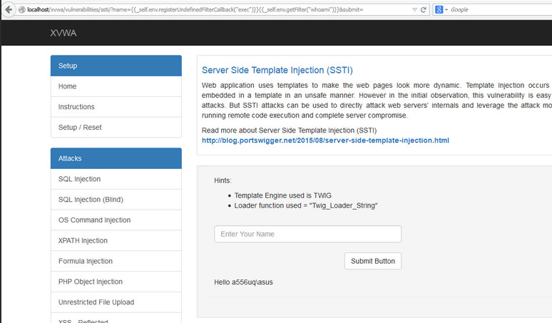

# Test de l'injection de modèle côté serveur

|ID          |
|------------|
|WSTG-INPV-18|

## Sommaire

Les applications Web utilisent couramment des technologies de modélisation côté serveur (Jinja2, Twig, FreeMaker, etc.) pour générer des réponses HTML dynamiques. Les vulnérabilités d'injection de modèle côté serveur (SSTI) se produisent lorsque l'entrée de l'utilisateur est intégrée dans un modèle de manière non sécurisée et entraîne l'exécution de code à distance sur le serveur. Toutes les fonctionnalités prenant en charge le balisage avancé fourni par l'utilisateur peuvent être vulnérables au SSTI, y compris les pages wiki, les critiques, les applications marketing, les systèmes CMS, etc. Certains moteurs de modèles utilisent divers mécanismes (par exemple, bac à sable, autoriser la liste, etc.)

### Exemple - Brindille

L'exemple suivant est un extrait du projet [Extreme Vulnerable Web Application](https://github.com/s4n7h0/xvwa).

```php
public function getFilter($name)
{
        [snip]
        foreach ($this->filterCallbacks as $callback) {
        if (false !== $filter = call_user_func($callback, $name)) {
            return $filter;
        }
    }
    return false;
}
```

Dans la fonction getFilter, `call_user_func($callback, $name)` est vulnérable à SSTI : le paramètre `name` est extrait de la requête HTTP GET et exécuté par le serveur :

\
*Figure 4.7.18-1 : Exemple SSTI XVWA*

### Exemple - Flacon/Jinja2

L'exemple suivant utilise le moteur de template Flask et Jinja2. La fonction `page` accepte un paramètre 'name' d'une requête HTTP GET et affiche une réponse HTML avec le contenu de la variable `name` :

```python
@app.route("/page")
def page():
    name = request.values.get('name')
    output = Jinja2.from_string('Hello ' + name + '!').render()
    return output
```

Cet extrait de code est vulnérable à XSS mais il est également vulnérable à SSTI. Utiliser ce qui suit comme charge utile dans le paramètre `name` :

```bash
$ curl -g 'http://www.target.com/page?name={{7*7}}'
Hello 49!
```

## Objectifs des tests

- Détecter les points de vulnérabilité d'injection de template.
- Identifier le moteur de template.
- Construire l'exploit.

## Comment tester

Les vulnérabilités SSTI existent dans le contexte du texte ou du code. Dans un contexte de texte en clair, les utilisateurs sont autorisés à utiliser du 'texte' libre avec du code HTML direct. Dans le contexte du code, l'entrée de l'utilisateur peut également être placée dans une instruction de modèle (par exemple, dans un nom de variable)

### Identifier la vulnérabilité d'injection de modèle

La première étape du test de SSTI dans un contexte de texte en clair consiste à construire des expressions de modèle communes utilisées par divers moteurs de modèle en tant que charges utiles et à surveiller les réponses du serveur pour identifier quelle expression de modèle a été exécutée par le serveur.

Exemples d'expressions de modèle courantes :

```text
a{{bar}}b
a{{7*7}}
{var} ${var} {{var}} <%var%> [% var %]
```

Dans cette étape, une [chaînes de test d'expression de modèle/liste de charges utiles](https://github.com/swisskyrepo/PayloadsAllTheThings/tree/master/Server%20Side%20Template%20Injection) complète est recommandée.

Le test de SSTI dans le contexte du code est légèrement différent. Tout d'abord, le testeur construit la requête qui aboutit à des réponses vides ou erronées du serveur. Dans l'exemple ci-dessous, le paramètre HTTP GET est inséré dans la variable `personal_greeting` dans une déclaration de modèle :

```text
personal_greeting=username
Hello user01
```

En utilisant la charge utile suivante - la réponse du serveur est vide "Hello":

```text
personal_greeting=username<tag>
Hello
```

L'étape suivante consiste à sortir de l'instruction de modèle et à injecter la balise HTML après celle-ci en utilisant la charge utile suivante

```text
personal_greeting=username}}<tag>
Hello user01 <tag>
```

### Identifier le moteur de template

Sur la base des informations de l'étape précédente, le testeur doit maintenant identifier le moteur de modèle utilisé en fournissant diverses expressions de modèle. Sur la base des réponses du serveur, le testeur déduit le moteur de template utilisé. Cette approche manuelle est décrite plus en détail dans [cet](https://portswigger.net/blog/server-side-template-injection?#Identify) article PortSwigger. Pour automatiser l'identification de la vulnérabilité SSTI et le moteur de template, divers outils sont disponibles, notamment [Tplmap](https://github.com/epinna/tplmap) ou l'[extension Backslash Powered Scanner Burp Suite](https://github. com/PortSwigger/backslash-powered-scanner).

### Construire l'exploit RCE

L'objectif principal de cette étape est d'identifier pour obtenir un contrôle supplémentaire sur le serveur avec un exploit RCE en étudiant la documentation et la recherche du modèle. Les principaux domaines d'intérêt sont :

- Sections **Pour les auteurs de modèles** couvrant la syntaxe de base.
- Sections **Considérations de sécurité**.
- Listes de méthodes, fonctions, filtres et variables intégrés.
- Listes d'extensions/plugins.

Le testeur peut également identifier quels autres objets, méthodes et propriétés peuvent être exposés en se concentrant sur l'objet "soi". Si l'objet `self` n'est pas disponible et que la documentation ne révèle pas les détails techniques, une force brute du nom de la variable est recommandée. Une fois l'objet identifié, l'étape suivante consiste à parcourir l'objet pour identifier toutes les méthodes, propriétés et attributs accessibles via le moteur de modèle. Cela pourrait conduire à d'autres types de résultats de sécurité, notamment des escalades de privilèges, la divulgation d'informations sur les mots de passe d'application, les clés API, les configurations et les variables d'environnement, etc.

## Outils

- [Tplmap] (https://github.com/epinna/tplmap)
- [Extension Backslash Powered Scanner Burp Suite] (https://github.com/PortSwigger/backslash-powered-scanner)
- [Chaînes de test d'expression de modèle/liste de charges utiles] (https://github.com/swisskyrepo/PayloadsAllTheThings/tree/master/Server%20Side%20Template%20Injection)

## Références

- [James Kettle : Injection de modèles côté serveur : RCE pour l'application Web moderne (livre blanc)] (https://portswigger.net/kb/papers/serversidetemplateinjection.pdf)
- [Injection de modèle côté serveur] (https://portswigger.net/blog/server-side-template-injection)
- [Explorer SSTI dans Flask/Jinja2](https://www.lanmaster53.com/2016/03/exploring-ssti-flask-jinja2/)
- [Injection de modèle côté serveur : de la détection au shell distant] (https://www.okiok.com/server-side-template-injection-from-detection-to-remote-shell/)
- [Application Web extrêmement vulnérable] (https://github.com/s4n7h0/xvwa)
- [Divine Selorm Tsa : Exploitation de l'injection de modèle côté serveur avec tplmap](https://owasp.org/www-pdf-archive/Owasp_SSTI_final.pdf)
- [Exploitation de SSTI dans Thymeleaf](https://www.acunetix.com/blog/web-security-zone/exploiting-ssti-in-thymeleaf/)
