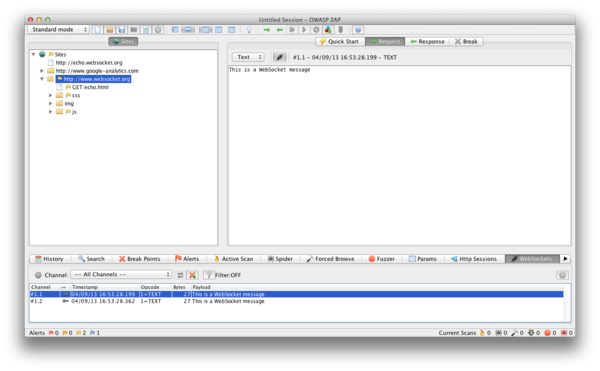

# Tester les WebSockets

|ID |
|------------|
|WSTG-CLNT-10|

## Sommaire

Traditionnellement, le protocole HTTP n'autorise qu'une seule requête/réponse par connexion TCP. JavaScript et XML asynchrones (AJAX) permettent aux clients d'envoyer et de recevoir des données de manière asynchrone (en arrière-plan sans actualisation de page) au serveur, cependant, AJAX exige que le client lance les requêtes et attende les réponses du serveur (semi-duplex).

[WebSockets](https://html.spec.whatwg.org/multipage/web-sockets.html#network) permettent au client ou au serveur de créer un canal de communication "full-duplex" (bidirectionnel), permettant au client et le serveur pour vraiment communiquer de manière asynchrone. Les WebSockets effectuent leur poignée de main initiale de * mise à niveau * sur HTTP et à partir de là, toutes les communications sont effectuées sur des canaux TCP à l'aide de trames. Pour plus d'informations, consultez le [Protocole WebSocket](https://tools.ietf.org/html/rfc6455).

### Origine

Il est de la responsabilité du serveur de vérifier l'[en-tête "Origin"](https://developer.mozilla.org/en-US/docs/Web/HTTP/Headers/Origin) dans la poignée de main HTTP WebSocket initiale. Si le serveur ne valide pas l'en-tête d'origine dans la poignée de main WebSocket initiale, le serveur WebSocket peut accepter des connexions de n'importe quelle origine. Cela pourrait permettre aux attaquants de communiquer avec le domaine interdomaine du serveur WebSocket, ce qui entraînerait des problèmes de type CSRF. Voir aussi [Top 10-2017 A5-Broken Access Control](https://owasp.org/www-project-top-ten/2017/A5_2017-Broken_Access_Control).

### Confidentialité et Intégrité

WebSockets peut être utilisé sur TCP non chiffré ou sur TLS chiffré. Pour utiliser des WebSockets non cryptés, le schéma d'URI `ws://` est utilisé (port par défaut 80), pour utiliser des WebSockets cryptés (TLS), le schéma d'URI `wss://` est utilisé (port par défaut 443). Voir aussi [Top 10-2017 A3-Sensitive Data Exposure](https://owasp.org/www-project-top-ten/2017/A3_2017-Sensitive_Data_Exposure).

### Désinfection des entrées

Comme pour toutes les données provenant de sources non fiables, les données doivent être correctement filtrées et encodées. Voir aussi [Top 10-2017 A1-Injection](https://owasp.org/www-project-top-ten/2017/A1_2017-Injection) et [Top 10-2017 A7-Cross-Site Scripting (XSS)] (https://owasp.org/www-project-top-ten/2017/A7_2017-Cross-Site_Scripting_(XSS)).

## Objectifs des tests

- Identifier l'utilisation de WebSockets.
- Évaluer sa mise en œuvre en utilisant les mêmes tests sur des canaux HTTP normaux.

## Comment tester

### Test de la boîte noire

1. Identifiez que l'application utilise WebSockets.
   - Inspectez le code source côté client pour le schéma d'URI `ws://` ou `wss://`.
   - Utilisez les outils de développement de Google Chrome pour afficher la communication Network WebSocket.
   - Utilisez l'onglet WebSocket de [ZAP](https://www.zaproxy.org).
2. Origine.
   - À l'aide d'un client WebSocket (vous en trouverez un dans la section Outils ci-dessous), essayez de vous connecter au serveur WebSocket distant. Si une connexion est établie, le serveur peut ne pas vérifier l'en-tête d'origine de la poignée de main WebSocket.
3. Confidentialité et intégrité.
   - Vérifiez que la connexion WebSocket utilise TLS pour transporter les informations sensibles `wss://`.
   - Vérifiez l'implémentation HTTPS pour les problèmes de sécurité (certificat valide, BEAST, CRIME, RC4, etc.). Reportez-vous à la section [Testing for Weak Transport Layer Security](../09-Testing_for_Weak_Cryptography/01-Testing_for_Weak_Transport_Layer_Security.md) de ce guide.
4. Authentification.
   - Les WebSockets ne gèrent pas l'authentification, des tests d'authentification normaux en boîte noire doivent être effectués. Reportez-vous aux sections [Test d'authentification](../04-Authentication_Testing/README.md) de ce guide.
5. Autorisation.
   - Les WebSockets ne gèrent pas l'autorisation, des tests d'autorisation normaux en boîte noire doivent être effectués. Reportez-vous aux sections [Tests d'autorisation](../05-Authorization_Testing/README.md) de ce guide.
6. Désinfection des entrées.
   - Utilisez l'onglet WebSocket de [ZAP](https://www.zaproxy.org) pour rejouer et fuzzer les requêtes et réponses WebSocket. Reportez-vous aux sections [Test pour la validation des données](../07-Input_Validation_Testing/README.md) de ce guide.

#### exemple 1

Une fois que nous avons identifié que l'application utilise WebSockets (comme décrit ci-dessus), nous pouvons utiliser [OWASP Zed Attack Proxy (ZAP)](https://www.zaproxy.org) pour intercepter la demande et les réponses WebSocket. ZAP peut ensuite être utilisé pour rejouer et fuzzer les requêtes/réponses WebSocket.

\
*Figure 4.11.10-1 : WebSockets ZAP*

#### exemple 2

À l'aide d'un client WebSocket (vous en trouverez un dans la section Outils ci-dessous), essayez de vous connecter au serveur WebSocket distant. Si la connexion est autorisée, le serveur WebSocket ne vérifie peut-être pas l'en-tête d'origine de la poignée de main WebSocket. Essayez de relire les requêtes précédemment interceptées pour vérifier que la communication WebSocket entre domaines est possible.

\
*Figure 4.11.10-2 : Client WebSocket*

### Test de la boîte grise

Les tests en boîte grise sont similaires aux tests en boîte noire. Dans les tests en boîte grise, le pen-testeur a une connaissance partielle de l'application. La seule différence ici est que vous pouvez avoir une documentation API pour l'application testée qui inclut la demande et les réponses WebSocket attendues.

## Outils

- [Proxy d'attaque Zed OWASP (ZAP)] (https://www.zaproxy.org)
- [Client WebSocket](https://github.com/ethicalhack3r/scripts/blob/master/WebSockets.html)
- [Client Google Chrome Simple WebSocket](https://chrome.google.com/webstore/detail/simple-websocket-client/pfdhoblngboilpfeibdedpjgfnlcodoo?hl=en)

## Références

- [HTML5 Rocks - Présentation de WebSockets : apporter des sockets au Web](https://www.html5rocks.com/en/tutorials/websockets/basics/)
- [W3C - L'API WebSocket](https://html.spec.whatwg.org/multipage/web-sockets.html#network)
- [IETF - Le protocole WebSocket](https://tools.ietf.org/html/rfc6455)
- [Christian Schneider - Piratage WebSocket intersite (CSWSH)](http://www.christian-schneider.net/CrossSiteWebSocketHijacking.html)
- [Robert Koch - Sur WebSockets dans les tests de pénétration] (http://www.ub.tuwien.ac.at/dipl/2013/AC07815487.pdf)
- [DigiNinja - OWASP ZAP et Web Sockets](http://www.digininja.org/blog/zap_web_sockets.php)
