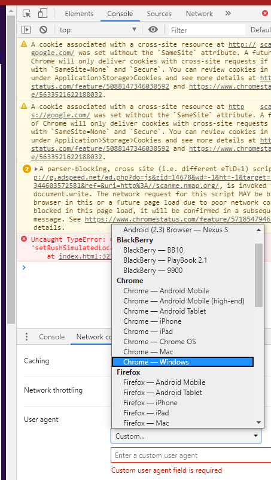

# Tirer parti des outils de développement

Cette annexe décrit divers détails à utiliser dans la fonctionnalité de l'outil de développement du navigateur pour faciliter les activités de test de sécurité.

De toute évidence, la fonctionnalité du navigateur ne remplace pas : les outils DAST (Dynamic Application Security Testing), les outils SAST (Static Application Security Testing) ou l'expérience d'un testeur, cependant, elle peut être exploitée pour certaines activités de test et les tâches liées à la production de rapports.

## Accéder aux outils de développement

L'ouverture des outils de développement peut être accomplie de plusieurs façons.

1. Via le raccourci clavier `F12`.
2. Via le raccourci clavier `ctrl` + `shift` + `i` sous Windows.
3. Via le raccourci clavier `cmd` + `option` + `i` sur Mac.
4. Via le menu contextuel de la page Web, cliquez avec le bouton droit de la souris, puis sélectionnez "Inspecter" dans Google Chrome.
5. Via le menu contextuel de la page Web, cliquez avec le bouton droit de la souris, puis sélectionnez "Inspecter l'élément" dans Mozilla Firefox.
6. Via le menu "kabob" à trois points dans Google Chrome, sélectionnez "Plus d'outils", puis "Outils de développement".
7. Via le menu triple ligne 'hamburger' (ou 'pancake') dans Mozilla Firefox puis en sélectionnant `Web Developer` puis `Toggle Tools`.
8. Via le menu des paramètres de l'icône d'engrenage dans Edge/IE, puis en sélectionnant "Outils de développement".

> REMARQUE : La majorité des instructions ci-dessous supposent que Dev Tools est déjà ouvert ou actif.

## Capacités

| Fonctionnalité        | Chrome* | Firefox | Edge/IE | Safari |
|-----------------------|:-------:|:-------:|:-------:|:------:|
| Commutation utilisateur-agent  | Y       | Y       | Y       | Y      |
| Modifier/Renvoyer les demandes  | Y       | Y       | N       | N      |
| Modification des cookies        | Y       | Y       | Y       | N      |
| Édition du stockage local | Y       | Y       | Y       | N      |
| Désactiver CSS           | Y       | Y       | Y       | Y      |
| Désactiver JavaScript    | Y       | Y       | N       | Y      |
| Affichage des en-têtes HTTP     | Y       | Y       | Y       | Y      |
| Captures d'écran           | Y       | Y       | Y       | N      |
| Mode hors ligne          | Y       | Y       | N       | N      |
| Encodage et décodage | Y       | Y       | Y       | Y      |
| Mode de conception réactif| Y       | Y       | Y       | Y      |

`*` Tout ce qui s'applique à Google Chrome devrait s'appliquer à toutes les applications basées sur Chromium. (Ce qui inclut Microsoft rebadging Edge vers 2019/2020.)

## Commutation utilisateur-agent

### Tests associés

- [Test des faiblesses du cache du navigateur](../4-Web_Application_Security_Testing/04-Authentication_Testing/06-Testing_for_Browser_Cache_Weaknesses.md)

### Google Chrome

1. Cliquez sur le menu "kabob" à trois points sur le côté droit du volet Outils de développement, sélectionnez "Plus d'outils", puis sélectionnez "Conditions réseau".
2. Décochez la case "Sélectionner automatiquement".
3. Sélectionnez l'agent utilisateur dans le menu déroulant ou entrez un agent utilisateur personnalisé

\
*Figure 6.F-1 : Fonctionnalité de changement d'agent utilisateur de Google Chrome Dev Tools*

### Mozilla Firefox

1. Accédez à la page "about:config" de Firefox et cliquez sur "J'accepte le risque !".
2. Entrez `general.useragent.override` dans le champ de recherche.
3. Recherchez `general.useragent.override`, si vous ne voyez pas cette préférence, recherchez-en une qui affiche un ensemble de boutons radio `Boolean, Number, String` sélectionnez `String` puis cliquez sur le signe plus `Add` sur la page `about:config`.
4. Définissez la valeur de `general.useragent.override` sur tout [User-Agent](https://developers.whatismybrowser.com/useragents/explore/) dont vous pourriez avoir besoin.

\
*Figure 6.F-2 : Fonctionnalité de changement d'agent utilisateur de Mozilla Firefox*

Cliquez ensuite sur le bouton de la corbeille `Supprimer` à droite de la préférence `general.useragent.override` pour supprimer le remplacement et revenir à l'agent utilisateur par défaut.

## Modifier/Renvoyer les demandes

### Tests associés

- [Test d'authentification](../4-Web_Application_Security_Testing/04-Authentication_Testing/README.md)
- [Test d'autorisation](../4-Web_Application_Security_Testing/05-Authorization_Testing/README.md)
- [Test de gestion de session](../4-Web_Application_Security_Testing/06-Session_Management_Testing/README.md)
- [Test de validation des entrées](../4-Web_Application_Security_Testing/07-Input_Validation_Testing/README.md)
- [Tests de logique métier](../4-Web_Application_Security_Testing/10-Business_Logic_Testing/README.md)

### Mozilla Firefox

1. Sélectionnez l'onglet `Réseau`.
2. Effectuez toute action dans l'application Web.
3. Cliquez avec le bouton droit sur la requête HTTP dans la liste et sélectionnez `Modifier et renvoyer`.
4. Effectuez les modifications souhaitées et cliquez sur le bouton `Envoyer`.
5. Cliquez avec le bouton droit sur la demande modifiée et sélectionnez `Ouvrir dans un nouvel onglet`.

### Google Chrome

1. Sélectionnez l'onglet `Réseau`.
2. Effectuez toute action dans l'application Web.
3. Cliquez avec le bouton droit sur la requête HTTP dans la liste et sélectionnez `Copier > Copier en tant que récupération`.
4. Collez le code JavaScript fourni dans l'onglet `Console`.
5. Effectuez les modifications requises, puis appuyez sur Entrée pour envoyer la demande.

## Modification des cookies

### Tests associés

- [Test d'authentification](../4-Web_Application_Security_Testing/04-Authentication_Testing/README.md)
- [Test d'autorisation](../4-Web_Application_Security_Testing/05-Authorization_Testing/README.md)
- [Test de gestion de session](../4-Web_Application_Security_Testing/06-Session_Management_Testing/README.md)
- [Test des attributs des cookies](../4-Web_Application_Security_Testing/06-Session_Management_Testing/02-Testing_for_Cookies_Attributes.md)

### Google Chrome

1. Cliquez sur l'onglet `Application`.
2. Développez "Cookies" sous l'en-tête `Stockage`.
3. Sélectionnez le nom de domaine concerné.
4. Double-cliquez dans la colonne `Valeur` pour modifier toute valeur de cookie.

> Remarque : Les cookies peuvent être supprimés une fois sélectionnés en appuyant sur la touche `supprimer` ou à partir du menu contextuel du clic droit.

### Mozilla Firefox

1. Cliquez sur l'onglet `Stockage`.
2. Développez la section `Cookies`.
3. Sélectionnez le nom de domaine concerné.
4. Double-cliquez dans la colonne `Valeur` pour modifier toute valeur de cookie.

> Remarque : Les cookies peuvent être supprimés une fois sélectionnés en appuyant sur la touche `supprimer`, ou avec diverses options du menu contextuel du clic droit.

\
*Figure 6.F-3 : Fonctionnalité d'édition des cookies de Mozilla Firefox*

## Édition du stockage local

### Tests associés

- [Test du stockage du navigateur](../4-Web_Application_Security_Testing/11-Client-side_Testing/12-Testing_Browser_Storage.md)

### Google Chrome

1. Cliquez sur l'onglet `Application`.
2. Développez `Stockage local` sous l'en-tête `Stockage`.
3. Sélectionnez le nom de domaine concerné.
4. Double-cliquez dans la colonne `Valeur` pour modifier toute valeur de cookie.
5. Double-cliquez dans la cellule applicable pour modifier la `clé` ou la `valeur`.

> Remarque : La modification de `Session Storage` ou `Index DB` suit essentiellement les mêmes étapes.
>
> Remarque : Les éléments peuvent être ajoutés ou supprimés via le menu contextuel du clic droit.

### Mozilla Firefox

1. Cliquez sur l'onglet `Stockage`.
2. Développez la section `Stockage local`.
3. Sélectionnez le nom de domaine concerné.
4. Double-cliquez dans la cellule applicable pour modifier la `clé` ou la `valeur`.

> Remarque : La modification de `Session Storage` ou `Index DB` suit essentiellement les mêmes étapes.
>
> Remarque : Les éléments peuvent être ajoutés ou supprimés via le menu contextuel du clic droit.

## Désactiver CSS

### Tests associés

- [Test de la manipulation des ressources côté client](../4-Web_Application_Security_Testing/11-Client-side_Testing/06-Testing_for_Client-side_Resource_Manipulation.md)

### Général

Tous les principaux navigateurs prennent en charge la manipulation de CSS à l'aide de la console Dev Tools et de la fonctionnalité JavaScript :

- Pour supprimer toutes les feuilles de style externes : `$('style,link[rel="stylesheet"]').remove();`
- Pour supprimer toutes les feuilles de style internes : `$('style').remove();`
- Pour supprimer tous les styles en ligne : `Array.prototype.forEach.call(document.querySelectorAll('*'),function(el){el.removeAttribute('style');});`
- Pour tout supprimer de la balise head : `$('head').remove();`

## Désactiver JavaScript

### Google Chrome

1. Cliquez sur le menu à trois points sur le côté droit de la barre d'outils du développeur Web et cliquez sur `Paramètres`.
2. Dans l'onglet `Préférences`, sous la section `Débogueur`, cochez la case `Désactiver JavaScript`.

### Mozilla Firefox

1. Dans l'onglet `Débogueur` des outils de développement, cliquez sur le bouton d'engrenage des paramètres dans le coin supérieur droit de la barre d'outils du développeur.
2. Sélectionnez `Désactiver JavaScript` dans la liste déroulante (il s'agit d'un élément de menu activer/désactiver ; lorsque JavaScript est désactivé, l'élément de menu est coché).

## Afficher les en-têtes HTTP

### Tests associés

- [Collecte d'informations](../4-Web_Application_Security_Testing/01-Information_Gathering/README.md)

### Google Chrome

1. Dans l'onglet `Réseau` des outils de développement, sélectionnez une URL ou une requête.
2. Dans le volet inférieur droit, sélectionnez l'onglet `En-têtes`.

\
*Figure 6.F-4 : Affichage des en-têtes Google Chrome*

### Mozilla Firefox

1. Dans l'onglet `Réseau` des outils de développement, sélectionnez une URL ou une requête.
2. Dans le volet inférieur droit, sélectionnez l'onglet `En-têtes`.

\
*Figure 6.F-5 : Affichage des en-têtes de Mozilla Firefox*

## Captures d'écran

### Tests associés

- [Reporting](../5-Reporting/README.md)

### Google Chrome

1. Appuyez sur le bouton `Toggle Device Toolbar` ou appuyez sur `ctrl` + `shift` + `m`.
2. Cliquez sur le menu à trois points dans la barre d'outils de l'appareil.
3. Sélectionnez `Capture d'écran` ou `Capture d'écran en taille réelle`.

### Mozilla Firefox

1. Appuyez sur le bouton à trois points `points de suspension` dans la barre d'adresse.
2. Sélectionnez `Prendre une capture d'écran`.
3. Sélectionnez l'option `Enregistrer la page entière` ou `Enregistrer la page visible`.

## Mode hors-ligne

### Google Chrome

1. Accédez à l'onglet `Réseau`.
2. Dans la liste déroulante, sélectionnez `Hors ligne`.

\
*Figure 6.F-6 : Option Google Chrome hors ligne*

### Mozilla Firefox

1. Dans le menu à trois lignes "hamburger" (ou "crêpe"), sélectionnez `Développement Web`, puis `Travailler hors ligne`.

\
*Figure 6.F-7 : Option hors ligne de Mozilla Firefox*

## Encodage et décodage

### Tests associés

- De nombreux (peut-être même la plupart) types de [tests de sécurité des applications Web](../4-Web_Application_Security_Testing/README.md) peuvent bénéficier de différents types d'encodage.

### Général

Tous les principaux navigateurs prennent en charge l'encodage et le décodage des chaînes de différentes manières en exploitant la console Dev Tools et la fonctionnalité JavaScript :

- Encodage Base64 : `btoa("chaîne-à-encoder")`
- Décodage Base64 : `atob("string-to-decode")`
- Encodage de l'URL : `encodeURIComponent("string-to-encode")`
- Décodage d'URL : `decodeURIComponent("string-to-decode")`
- Encodage HTML : `escape("string-to-encode")`
- Décodage HTML : `unescape("string-to-decode")`

## Mode de conception réactif

### Tests associés

- [Test des faiblesses du cache du navigateur](../4-Web_Application_Security_Testing/04-Authentication_Testing/06-Testing_for_Browser_Cache_Weaknesses.md)
- [Test pour une authentification plus faible dans un canal alternatif](../4-Web_Application_Security_Testing/04-Authentication_Testing/10-Testing_for_Weaker_Authentication_in_Alternative_Channel.md)
- [Test de détournement de clic](../4-Web_Application_Security_Testing/11-Client-side_Testing/09-Testing_for_Clickjacking.md)

### Google Chrome

1. Cliquez sur le bouton `Basculer la barre d'outils de l'appareil` ou appuyez sur `ctrl` + `shift` + `m`.

\
*Figure 6.F-8 : Mode de conception réactif de Google Chrome*

### Mozilla Firefox

1. Cliquez sur le bouton `Mode de conception réactif` ou appuyez sur `ctrl` + `shift` + `m`.

\
*Figure 6.F-9 : Mode de conception réactif de Mozilla Firefox*

## Références

- [Test de sécurité des applications Web avec les navigateurs](https://getmantra.com/web-app-security-testing-with-browsers/)
- [Black Hills Information Security - Webcast : Outils gratuits ! Comment utiliser les outils de développement et JavaScript dans les Webapp Pentests](https://www.blackhillsinfosec.com/webcast-free-tools-how-to-use-developer-tools-and-javascript-in-webapp-pentests/)
- [Greg Malcolm - Outils de développement Chrome : Raid sur l'armurerie](https://github.com/gregmalcolm/wacky-wandas-wicked-weapons-frontend/blob/fix-it/README.md)
- [Liste des chaînes UserAgent](http://user-agent-string.info/list-of-ua)
